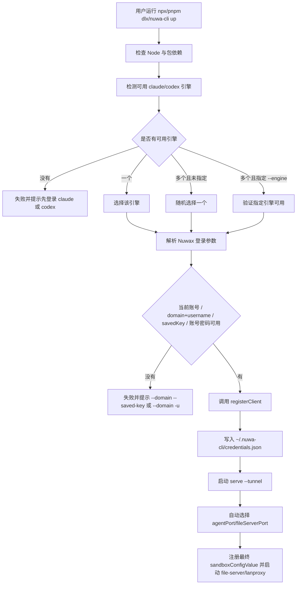

# nuwa-cli 一键安装、注册与启动设计

本文描述 `nuwa-cli up` 能力：让用户从干净环境或已安装环境中，用尽量少的步骤完成 CLI 获取、Nuwax 注册、可用引擎选择、`serve --tunnel` 启动。

> 状态：已实现为 CLI 命令。npm 发布前可通过本地构建产物、`npm link` 或 `pnpm pack` 调试，见 [`local-debugging.md`](./local-debugging.md)。

## 目标

- 支持用户本机尚未安装 `nuwa-cli` 的干净环境。
- 支持通过 `domain + savedKey` 或 `domain + username/password` 完成 CLI 自己的注册。
- 自动检测本机是否有可用的 `claude` 或 `codex` 配置。
- 未显式指定引擎时，如果多个引擎可用，随机选择一个；如果只有一个可用，直接使用它。
- 注册成功后启动 `serve --tunnel`，并复用现有端口自动探测、CLI 数据隔离、file-server/lanproxy 隔离逻辑。

## 非目标

- 不替用户静默安装或登录 Claude Code / Codex。
- 不读取 NuwaClaw Electron 客户端登录数据。
- 不把账号密码写入磁盘。
- 不通过 `--password <value>` 接收密码，避免进入 shell history 或进程列表。
- 不把 Electron 客户端的 `~/.nuwaclaw`、端口、serve lock、file-server PID/lock 与 CLI 混用。

## 用户入口

### 未安装 nuwa-cli

首选零安装入口：

```bash
npx -y @nuwax-ai/nuwa-cli@latest up --domain https://agent.nuwax.com --saved-key <key>
```

或：

```bash
pnpm dlx @nuwax-ai/nuwa-cli@latest up --domain https://agent.nuwax.com --saved-key <key>
```

账号密码首次注册：

```bash
npx -y @nuwax-ai/nuwa-cli@latest up --domain https://agent.nuwax.com -u <username>
```

此时 `up` 交互式提示密码。密码只用于本次注册请求，不落盘。

### 已安装 nuwa-cli

```bash
nuwa-cli up --domain https://agent.nuwax.com --saved-key <key>
nuwa-cli up --domain https://agent.nuwax.com -u <username>
nuwa-cli up --engine codex
nuwa-cli up --engine claude --daemon
nuwa-cli service install --engine claude --now
```

### 自动化/CI

CI 中不适合交互输入密码时，可允许环境变量：

```bash
NUWACLI_PASSWORD='<password>' npx -y @nuwax-ai/nuwa-cli@latest up \
  --domain https://agent.nuwax.com \
  -u <username>
```

`NUWACLI_PASSWORD` 只在 `up` 注册阶段读取，不写入 credentials。优先推荐 CI 使用 `--saved-key`。

## 命令形态

命令：

```bash
nuwa-cli up
```

常用参数：

| 参数 | 含义 |
|---|---|
| `--domain <host>` | Nuwax 后端地址。未传时使用当前默认账号的 domain |
| `--saved-key <key>` | 使用已有 savedKey 注册，并保存到当前账号/多账号 JSON 映射 |
| `-u, --username <username>` | 使用账号密码注册；同一 domain+username 已保存时会复用 savedKey，密码通过交互或 `NUWACLI_PASSWORD` 获取 |
| `--engine <claude\|codex>` | 指定引擎；未传时自动检测并选择 |
| `--daemon` | 后台启动 serve |
| `--port <port>` | HTTP API 优先端口，默认 `60016`，占用时自动后移 |
| `--host <host>` | HTTP API 监听地址，默认 `127.0.0.1` |
| `--approve <auto\|deny>` | 传给 `serve` 的权限策略 |
| `--lanproxy-path <path>` | lanproxy 二进制或资源目录 |
| `--lanproxy-host <host>` | 覆盖注册返回的 lanproxy serverHost |
| `--lanproxy-port <port>` | 覆盖注册返回的 lanproxy serverPort |
| `--lanproxy-ssl <true\|false>` | lanproxy 是否启用 SSL |

常驻/自启动命令：

```bash
nuwa-cli service install --help
nuwa-cli service install --engine claude --now
nuwa-cli service start
nuwa-cli service stop
nuwa-cli service status
nuwa-cli service uninstall
```

`--daemon` 适合“关闭终端后继续跑”，但重启/注销后不会自动恢复。`service install` 适合开机/登录自启动：macOS 写 LaunchAgent，Linux 写 systemd user service，Windows 写当前用户计划任务。启动项不会保存密码、savedKey/configKey 或模型 API key；运行时从 CLI 自己的 `~/.nuwa-cli/credentials.json` 读取当前默认账号。Linux 默认用户登录后启动；未登录也启动需要系统启用 linger。

查看实际帮助：

```bash
nuwa-cli --help
nuwa-cli login --help
nuwa-cli up --help
nuwa-cli account --help
nuwa-cli account switch --help
nuwa-cli service install --help
```

## 流程



## 引擎检测

### Claude

可用条件：

- `claude` 可在 `PATH` 中找到。
- `claude-code-acp-ts` 包依赖可解析。

当前实现不强制执行真实 Claude 登录探测，因为 Claude CLI 的登录状态可能依赖交互式命令输出，容易慢或不稳定。后续可以增加轻量 ACP 初始化探测。

失败提示：

```bash
未找到可用 claude。请先安装并登录 Claude Code CLI：
  claude login
```

### Codex

可用条件：

- `~/.codex/auth.json` 存在。
- `nuwax-codex-acp` 包依赖可解析。

`codex` CLI 是否在 `PATH` 中可作为信息项，不作为硬阻塞项，因为当前 codex ACP 包可通过已安装依赖启动。

失败提示：

```bash
未找到可用 codex 登录态。请先完成一次 Codex 登录：
  codex login
```

## 引擎选择

- 传 `--engine claude`：只接受 claude，可用则继续，否则失败。
- 传 `--engine codex`：只接受 codex，可用则继续，否则失败。
- 未传 `--engine`：
  - 可用列表为空：失败。
  - 可用列表只有一个：使用该引擎。
  - 可用列表多个：随机选择一个，并在日志中打印选择结果。

随机选择的目的是满足“优先使用本地多个中的随机一个”的需求；后续如果需要稳定策略，可增加 `--engine-priority claude,codex`。

## 登录、注册与多账号

nuwa-cli 不使用 SQLite；所有 CLI 登录数据都保存在 `~/.nuwa-cli/credentials.json`。该 JSON 同时保存一个“当前默认账号”和一个轻量账号映射，账号 key 由 `domain + username` 组成，例如：

```text
testagent.xspaceagi.com_18011447397
```

登录解析优先级：

1. `--saved-key`：使用传入 savedKey，并保存为当前账号。
2. `-u/--username`：若 `credentials.json` 里已有同一 `domain + username` 的 savedKey，会随注册请求一起提交，避免后端新建电脑；密码仍通过交互或 `NUWACLI_PASSWORD` 只用于本次请求。
3. 不传 `--domain` / `-u` / `--saved-key`：使用当前默认账号的 domain、username、savedKey 免密重新注册。
4. 都没有：失败并提示提供 `--domain --saved-key` 或 `--domain -u`。

注册成功后：

- 写入 CLI 自己的 `~/.nuwa-cli/credentials.json`。
- `configKey` 与 `savedKey` 使用后端返回的 `configKey`。
- `serverHost` / `serverPort` / `token` / `lastRegAt` 同步更新。
- 若有 username，同步更新 `accounts[domain_username]`，后续同账号登录会复用该 savedKey。
- 密码不落盘。

`up` 不读取：

- `~/.nuwaclaw/nuwaclaw.db`
- `~/.nuwaclaw/cli/credentials.json`
- NuwaClaw Electron 客户端 savedKey

账号查看与切换：

```bash
nuwa-cli account list
nuwa-cli account switch <account-key>
```

`account switch` 会用目标账号保存的 savedKey 重新注册并设为当前默认账号。切换会影响 serve、file-server、lanproxy、后端注册状态，因此不做热切换；如果 `serve` 正在运行，本命令会拒绝执行，请先在运行 `up/serve` 的终端按 `Ctrl-C` 停掉所有服务，再切换并重启。

## 启动与隔离

注册完成后，`up` 内部等价于：

```bash
nuwa-cli serve --tunnel --engine <selected-engine>
```

并沿用现有隔离策略：

- CLI 数据根目录：`~/.nuwa-cli`
- credentials：`~/.nuwa-cli/credentials.json`
- serve lock：`~/.nuwa-cli/serve.lock`
- logs：`~/.nuwa-cli/logs`
- 默认工作空间根目录：`~/.nuwa-cli/workspaces`；云端 `project_id` 映射到 `~/.nuwa-cli/workspaces/<project_id>`，`agent_work_dir` / `session_id` 仅在缺少 `project_id` 时作为兼容 fallback；`user_id` 不参与本地路径。传 `--cwd <dir>` 时，`<dir>` 就是当前项目目录本身，不会再追加 `project_id`。
- file-server PID/lock 临时目录：`~/.nuwa-cli/tmp/file-server-<port>`
- agentPort 默认优先 `60016`，占用时自动后移。
- fileServerPort 默认优先 `60015`，占用时自动后移。
- 与 Electron 客户端的 `60005-60009` 默认端口范围分开。

## 干净环境下的阻塞项

`npx -y @nuwax-ai/nuwa-cli@latest up ...` 可以解决“用户没安装 nuwa-cli”的问题，但不能解决“用户没有任何可用 Agent 登录态”的问题。

如果本机既没有可用 Claude，也没有可用 Codex，`up` 必须失败：

```text
未找到可用 Agent 引擎。

请任选其一完成本地登录后重试：
  claude login
  codex login

然后重新运行：
  npx -y @nuwax-ai/nuwa-cli@latest up --domain https://agent.nuwax.com --saved-key <key>
```

这是有意设计：Claude/Codex 的账号授权必须由用户在对应官方工具中完成，CLI 不应静默代办。

## 测试建议

- `up --engine claude`：claude 可用时选择 claude；不可用时报错。
- `up --engine codex`：codex auth 存在时选择 codex；缺失时报错。
- 未传 `--engine` 且两个都可用：随机选择结果必须属于可用列表。
- 未传 `--engine` 且只有一个可用：自动选择唯一可用项。
- 两个都不可用：失败并提示 `claude login` / `codex login`。
- `--domain --saved-key`：注册成功并写入 `~/.nuwa-cli/credentials.json`。
- `--domain -u`：交互密码注册，密码不落盘。
- `NUWACLI_PASSWORD + -u`：非交互注册。
- 同一 `domain + username` 再次使用账号密码：复用已有 savedKey，不新建电脑。
- 多个账号已保存：`account list` 能列出并标记当前账号。
- `account switch <key>`：serve 停止时可切换并刷新当前账号；serve 运行时拒绝切换。
- 无登录参数但已有当前默认账号：复用当前账号 savedKey 免密注册。
- 无登录参数且无当前默认账号/savedKey：失败并提示登录参数。
- `--daemon`：后台启动；结构化运行日志看 `~/.nuwa-cli/logs/latest.log`（指向 `main.YYYY-MM-DD.log`），原始 stdout/stderr 仍追加到 `serve.log`。
- `service install --now`：安装当前用户级自启动并立即启动；macOS/Linux/Windows 分别使用 LaunchAgent、systemd user service、计划任务。
- 端口被占用：agent/file-server 自动后移，注册上报最终端口。
- `--help`：`login` / `up` / `account switch` / `service install` 帮助里说明默认账号、多账号 JSON、密码环境变量、服务重启要求和自启动机制。
