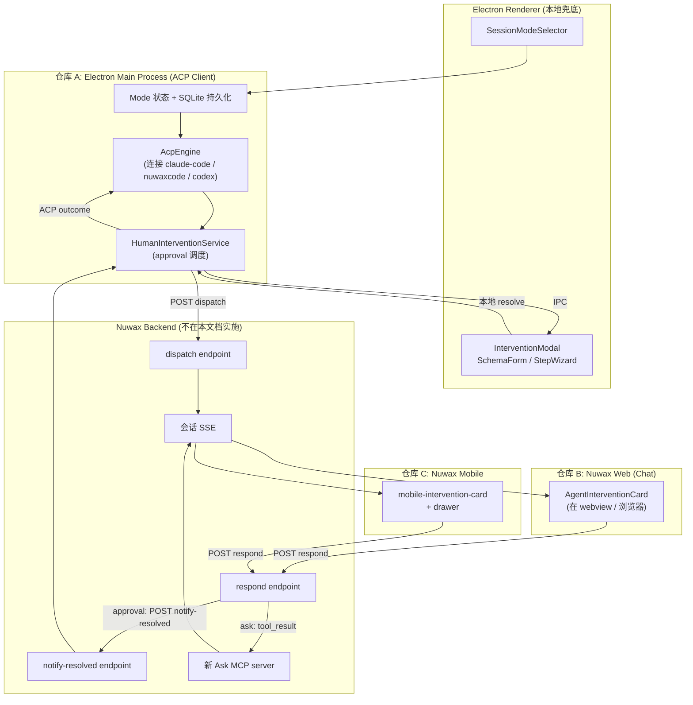
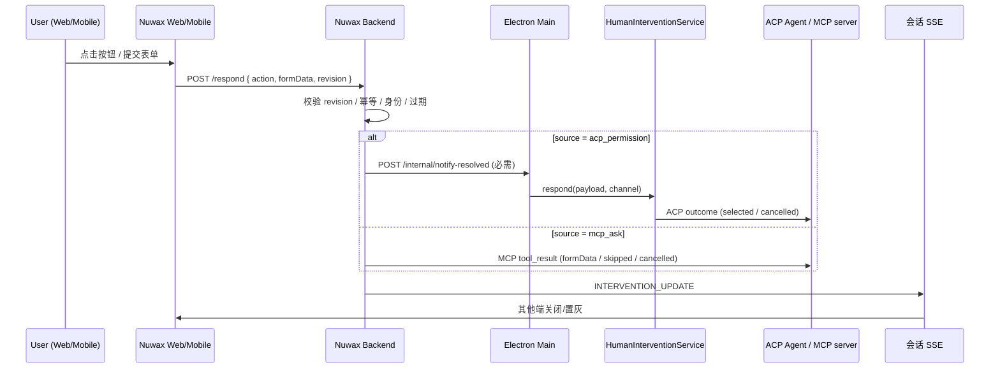
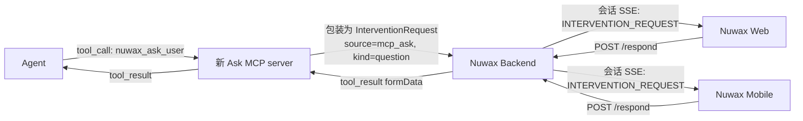
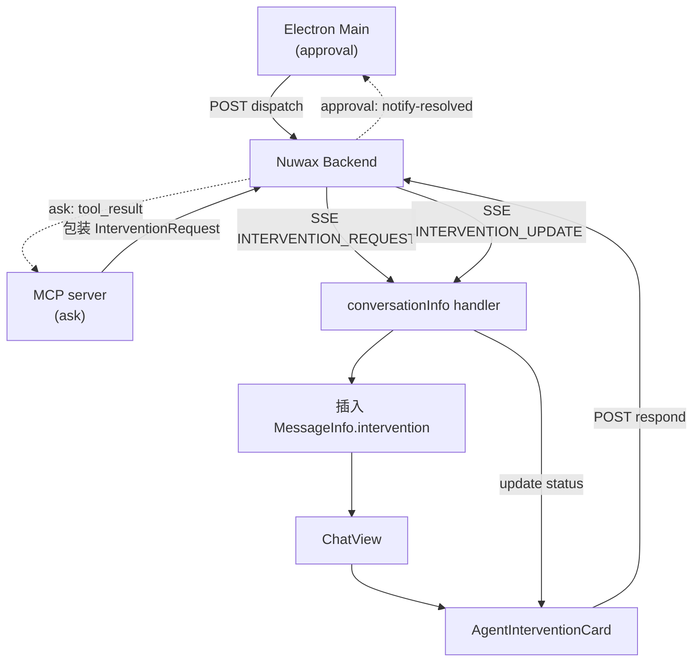

# ACP 模式切换 + 权限审批/Ask 表单 —— 多端落地实施方案 v2

| 项 | 内容 |
|---|---|
| 状态 | **方案唯一权威来源**,等待实施 |
| 版本 | v2(2026-05-13 修订,基于 v1 review 反馈) |
| 覆盖仓库 | A: `crates/agent-electron-client/`(Electron 客户端,本仓库)<br>B: `/projects/nuwax/`(Web 前端)<br>C: `/projects/nuwax-mobile/`(UniApp X 移动端) |
| 关联背景文档 | [universal-agent-acp-hooks-human-intervention-v3.md](./universal-agent-acp-hooks-human-intervention-v3.md);[agent-intervention-channel-calling.md](./agent-intervention-channel-calling.md) |
| 旧版状态 | `acp-mode-and-intervention-cross-end-mvp.md`(v1)**作废**,以本文档为准 |

---

## 0. 概览与交付说明

### 0.1 ACP 协议两侧:Engines 与 Clients

ACP 协议分两端,本文档涉及的角色:

**Engines(ACP Server)**:

| 引擎 ID | 实现 | 说明 |
|---|---|---|
| `claude-code` | Node.js | Anthropic 官方 |
| `nuwaxcode` | Node.js | OpenCode 变体 |
| `codex` | Node.js | 占位,后续接入 |

所有 engine 在 ACP 协议层完全一致,客户端代码**不做引擎特化分支**。

**Clients(ACP Client 实现,两个同级兄弟项目)**:

| 客户端 | 实现 | 部署 | 仓库 | 本文档关系 |
|---|---|---|---|---|
| Electron 客户端 | TypeScript | 桌面应用 | `crates/agent-electron-client/` | **主要交付目标(仓库 A)** |
| rcoder | Rust | 端云电脑 | rcoder 独立仓库 | 设计共识对齐(§4.11),不在本文档实施 |

### 0.2 三端 UI 角色

| 端 | 角色 | 渲染基准 |
|---|---|---|
| Electron 客户端 | ACP 主控 + 本地兜底 UI | Ant Design `Modal`(本地保险) |
| Nuwax Web(Chat) | **完整渲染基准** | 消息流嵌入 `AgentInterventionCard` |
| Nuwax Mobile | 移动端渲染 | M0 fallback + M1 卡片 + M2 drawer(复杂走 H5) |

### 0.3 三端共同遵守的契约

- **数据格式**:`InterventionRequest` + `InteractionUISchema` + `InterventionResponse`(详见 §3.1–§3.3)
- **客户端 mode 硬约定**:`ask` / `auto` / `yolo`(详见 §1.2),**两个 client 必须一致**
- **SSE 事件**(Web/Mobile):`INTERVENTION_REQUEST` / `INTERVENTION_UPDATE`(详见 §3.4)
- **响应 API**:`POST /api/agent-interventions/:interventionId/respond`(详见 §3.5)

### 0.4 不在本期范围

1. IM 渠道(飞书 / 钉钉 / 企业微信 / Telegram / Discord)
2. Mobile M3–M5(独立表单页 / wizard / diff 审阅)— 复杂场景走 webUrl 跳 Web
3. hooks 注入(后端 `nuwax-file-server` 负责)
4. 审计/历史回看 SQLite 表(Electron 本期纯内存)
5. 新 Ask MCP server 的**服务端**实现(独立 MCP 项目,客户端按 §7.4 契约对接)
6. P/ACP Proxy Pipeline
7. revision > 1 的 reissue 场景(本期 revision 恒为 1)

### 0.5 实施前必读

| # | 必读 | 目的 |
|---|---|---|
| 1 | 本文档 §1–§3 | 理解协议与跨端契约 |
| 2 | ACP 官方 https://agentclientprotocol.com/protocol/session-modes 与 /protocol/tool-calls | 协议权威 |
| 3 | 接手仓库对应章节(§4 / §5 / §6) | 具体实施 |
| 4 | `docs/universal-agent-acp-hooks-human-intervention-v3.md`(可选,**有冲突以本文档为准**) | 上层架构背景 |

---

## 1. 背景与核心交付物

### 1.1 改造起因

- hooks 由后端 `nuwax-file-server` 在项目初始化时按 engine 写入(Electron 不注入)
- 客户端职责聚焦:**模式选择** + 权限审批/Ask 表单 UI
- 本期目标 = **放开模式选择**:把当前隐藏的 yolo 行为(`acpEngine.ts:2483-2487` 通过设置 allow 模拟)提升为用户可见、可切换的三档模式

### 1.2 三档模式语义(客户端硬约定)

| modeId | 行为 |
|---|---|
| `ask` | 所有 ACP `session/request_permission` 走 UI 等待用户响应 |
| `auto` | `toolCall.kind ∈ {read,search,think,fetch}` 自动 `allow_once`;其他走 UI |
| `yolo` | `allow_always > allow_once > options[0]` 自动选择 |

- 未知 mode → fail-safe 降级 `ask`
- 出厂默认 mode = **`auto`**
- **`strictSandbox` guard 独立于 mode**:启用且检测到越界写入时无条件 `cancelled`(详见 §4.4)

### 1.3 三端架构



**关键回路**:

- **Approval 源头** = ACP engine 主动发 `session/request_permission` → Electron Main 的 `HumanInterventionService`
- **Ask 源头** = Agent 调用新 MCP 工具 → MCP server → Backend SSE 推送(**不经过 Electron Main**)
- **响应汇聚** = 任一端响应 → Backend 校验 → 路由(approval 回 Electron Main / ask 回 MCP server)→ SSE `INTERVENTION_UPDATE` 通知其他端关闭

---

## 2. ACP 协议约束(实现依据)

来源 https://agentclientprotocol.com/

### 2.1 ACP 原生 mode 机制

- `SessionMode { id, name, description }`
- `SessionModeState { currentModeId, availableModes[] }`
- `session/new` 响应可携带 `modes: SessionModeState | null`
- `session/set_mode { sessionId, modeId }`(Client → Agent)
- `session/update` 的 `current_mode_update { currentModeId }`(Agent → Client)
- 典型语义示例 `ask` / `architect` / `code`,本方案用 `ask` / `auto` / `yolo`

### 2.2 审批闭环时序

```
Agent: session/update(tool_call, status=pending)
Agent: session/request_permission(sessionId, toolCall, options[])
Client: 渲染 UI / 自动决策 → { outcome: "selected", optionId } | { outcome: "cancelled" }
Agent: session/update(tool_call_update, status=in_progress) → completed / failed
```

### 2.3 协议强约束(MUST)

- session/cancel 时,Client **必须**回所有 pending permission `cancelled` + 把未完成 tool call 标记 `cancelled`
- Agent **必须**用 `cancelled` 作为 stopReason 回应原始 prompt
- 客户端自动决策(yolo / auto)有协议背书:`Clients MAY automatically allow or reject permission requests according to user settings`

### 2.4 UI 渲染信息来源

| UI 元素 | 协议字段 | 说明 |
|---|---|---|
| 主标题 | `toolCall.title` | human-readable |
| 工具图标 | `toolCall.kind` | read/edit/delete/move/search/execute/think/fetch/other |
| 详情区 | `toolCall.rawInput` + `locations[]` + `content[]` | 折叠展开 |
| 按钮文案 | `PermissionOption.name` | **协议保证 human-readable,无需翻译** |
| 按钮样式 | `PermissionOption.kind` | allow_always→主蓝;allow_once→次;reject_once→次危险;reject_always→主危险 |
| Severity 标签 | 客户端自生成 | 基于 toolCall.kind + locations 路径推导 |

### 2.5 客户端 mode 与 Agent mode 是双轨

- **Agent 侧 mode**(ACP `session/set_mode`)→ 影响 Agent 是否发 permission
- **客户端侧 mode**(本方案 `currentModeId`)→ 控制收到 permission 后弹不弹窗
- 二者**独立**,客户端不能假设 ask 模式 Agent 必然每次都发 permission

### 2.6 协议没有 `question` ToolKind

ACP ToolKind 枚举:`read / edit / delete / move / search / execute / think / fetch / other`。当前 `acpEngine.ts:2408` 对 `kind === "question"` 的处理是 nuwaxcode 私有扩展,本期保留为 `cancelled` 兼容。

**通用 ask/question 不走 ACP**,走新 MCP 工具(详见 §3.7)。

---

## 3. 跨端数据契约(三端必须严格对齐)

**字段定义单一来源** = Electron `crates/agent-electron-client/src/shared/types/intervention.ts`。Web/Mobile 端复制字段定义到对应类型文件,字段名一字不差。

### 3.1 InterventionRequest

```ts
type InterventionKind = "approval" | "question";

type InterventionStatus =
  | "pending"
  | "approved"   // approval submit
  | "rejected"   // approval reject
  | "answered"   // question submit
  | "cancelled"  // 用户 cancel / session cancel
  | "skipped"    // 用户 skip(可选 UI)
  | "expired"    // 超时
  | "superseded"; // 被 revision 更新

interface InterventionRequest {
  id: string;
  revision: number;          // 本期固定 1,留作后续 reissue
  kind: InterventionKind;
  status: InterventionStatus;
  sessionId: string;
  /**
   * 触发本次 intervention 的 ACP agent engine。
   * approval 时 = 直接发 request_permission 的 engine。
   * ask 时 = 调用新 MCP 工具的那个 engine(同一会话的 agent)。
   */
  engine: "claude-code" | "nuwaxcode" | "codex";
  source: "acp_permission" | "mcp_ask";

  title: string;
  description?: string;
  severity: "info" | "warning" | "danger";

  approval?: {
    acpInternalId?: string;
    toolCall: {
      toolCallId: string;
      name?: string;
      kind: string;          // ACP ToolKind
      rawInput?: unknown;
      locations?: Array<{ uri: string; name?: string; size?: number }>;
    };
    options: Array<{
      optionId: string;
      kind: "allow_once" | "allow_always" | "reject_once" | "reject_always";
      label: string;         // 来自 ACP PermissionOption.name(命名转换)
    }>;
  };

  ui: InteractionUISchema;
  timeoutMs?: number;        // 缺省走客户端默认(Electron = 5 分钟)
  createdAt: number;
}
```

**字段命名转换**:ACP 协议端的 `PermissionOption.name` 在客户端类型中重命名为 `options[].label`,以避免与 `engine.name` 等其他字段语义冲突;转换在 Electron 主进程构造 `InterventionRequest` 时完成,**客户端 UI 层直接消费 `label` 即可**。

### 3.2 InteractionUISchema

```ts
interface InteractionUISchema {
  version: "nuwaclaw.interaction.v1";
  presentation: "modal" | "inline" | "wizard";
  title: string;
  description?: string;
  schema: JsonSchemaObject;                    // JSON Schema 子集
  uiSchema?: UISchema;
  steps?: Array<{ id: string; title: string; description?: string; fields: string[] }>;
  submitLabel?: string;                        // 缺省 "提交" / "Submit"
  cancelLabel?: string;                        // 缺省 "取消" / "Cancel"
  fallback?: { text: string; webUrl?: string; mobileUrl?: string };
}

interface UISchema {
  /** 是否允许 skip 按钮,顶层 key,缺省 false */
  allowSkip?: boolean;
  /** 字段级 ui 配置,key 为 schema property 名 */
  [fieldName: string]: { "ui:widget"?: string; "ui:visibleWhen"?: unknown } | boolean | undefined;
}
```

**`presentation` × 端的渲染矩阵**:

| presentation | Electron 本地 Modal | Web (Chat 消息流) | Mobile |
|---|---|---|---|
| `modal` | Modal(默认) | Card 内嵌(简化为内联) | 卡片或 drawer |
| `inline` | Modal 包裹(本地无消息流) | 消息流内嵌 Card | 卡片 |
| `wizard` | Modal + Steps | Card 折叠 → 展开为 Modal + Steps | 跳转独立页面(M3+,本期降级 webUrl) |

### 3.3 InterventionResponse / Action

```ts
type InterventionAction = "submit" | "cancel" | "skip" | "timeout";

interface InterventionResponse {
  interventionId: string;
  revision: number;
  action: InterventionAction;
  formData?: Record<string, unknown>;
  receivedAt: number;
}

interface ChannelInterventionCallback {
  interventionId: string;
  revision: number;
  channel: "electron-local" | "nuwax-web" | "nuwax-mobile";
  actor?: { platformUserId?: string; displayName?: string };
  action: InterventionAction;
  formData?: Record<string, unknown>;
  receivedAt: number;
  /** 幂等键,Web/Mobile 重发时同 key 不重复处理;Electron 本地可省略 */
  idempotencyKey?: string;
}
```

**Action 语义**:

| action | 语义 | UI 触发 | approval 映射(ACP outcome) | ask 映射(MCP tool_result) |
|---|---|---|---|---|
| `submit` | 提交 formData | 主按钮 | `{ outcome: "selected", optionId }` | `{ ...formData }` |
| `cancel` | 拒绝/中止 | 取消按钮 / 关闭 | `{ outcome: "cancelled" }`+`_meta.reason="cancel"` | `{ cancelled: true }` |
| `skip` | 不参与决策,让 agent 继续 | 跳过按钮(仅 `uiSchema.allowSkip=true` 时渲染) | `{ outcome: "cancelled" }`+`_meta.reason="skipped"` | `{ skipped: true }` |
| `timeout` | 系统超时 | 无 | `{ outcome: "cancelled" }`+`_meta.reason="timeout"` | `{ timeout: true }` |

**skip vs cancel**:`cancel` = 用户拒绝此操作(agent 应停止);`skip` = 用户不参与决策(agent 可继续尝试)。ACP outcome 层都是 `cancelled`,通过 `_meta.reason` 让 Agent 区分;ask 路径直接通过 tool_result payload 区分。

### 3.4 SSE 事件契约

```jsonc
// INTERVENTION_REQUEST
{
  "eventType": "INTERVENTION_REQUEST",
  "sessionId": "session-xxx",
  "timestamp": 1770000000000,
  "data": "<InterventionRequest>"
}

// INTERVENTION_UPDATE
{
  "eventType": "INTERVENTION_UPDATE",
  "sessionId": "session-xxx",
  "timestamp": 1770000000123,
  "data": {
    "interventionId": "int-xxx",
    "revision": 1,
    "status": "approved | rejected | answered | cancelled | skipped | expired | superseded",
    "resolvedBy": { "channel": "nuwax-web", "displayName": "User Name" }
  }
}
```

> **注**:`INTERVENTION_UPDATE.status` 完整枚举与 §3.1 `InterventionStatus` 一致(含 `answered` / `skipped`)。

### 3.5 响应 API 与回流(关键路径,所有端必看)

**响应入口**:`POST /api/agent-interventions/:interventionId/respond`

- Body = `ChannelInterventionCallback`(URL 已含 `interventionId`)
- 后端校验:`revision == 当前 revision` + `idempotencyKey` 幂等 + `actor` 身份 + `expiresAt` 未过期
- 通过后按 `source` 路由

**响应回流时序**(必须闭合):



**Electron Main 本地响应回流**(更简单):

```
User clicks Modal button
  → renderer: window.electronAPI.intervention.respond(payload)
  → IPC: intervention:respond
  → main: HumanInterventionService.respond(payload, "electron-local")
  → Agent: ACP outcome
  → main: notify all deliveries (含 NuwaxWebDelivery → 后端 → SSE update 给其他端)
```

**鉴权要求**(详见 §7.3):

- `/api/internal/agent-interventions/dispatch` 与 `/internal/notify-resolved` 是**内部通道**,只接受 Electron Main 与 Backend 之间的调用,**必须**用共享密钥或 mTLS
- `/api/agent-interventions/:id/respond` 是用户响应通道,沿用既有 Nuwax 用户鉴权

### 3.6 Approval 路径与 Schema 自动生成

**Approval 来源**:ACP `session/request_permission`(Agent → Electron Main)。

**Schema 由 Electron 主进程自动生成**(不需要 Agent 端发 schema):

```ts
function buildApprovalSchema(options: PermissionOption[]): InteractionUISchema {
  return {
    version: "nuwaclaw.interaction.v1",
    presentation: "modal",
    title: toolCall.title,
    severity: deriveSeverity(toolCall.kind, locations),  // 客户端规则
    schema: {
      type: "object",
      required: ["decision"],
      properties: {
        decision: {
          type: "string",
          // 覆盖 ACP 4 种 kind 全部
          oneOf: options.map(o => ({ const: o.kind, title: o.name })),
        },
        reason: { type: "string", maxLength: 500 },
      },
    },
    uiSchema: {
      decision: { "ui:widget": "buttonGroup" },
      reason: {
        "ui:widget": "textarea",
        "ui:visibleWhen": { decision: ["reject_once", "reject_always"] },
      },
    },
  };
}
```

**关键**:`oneOf` 直接从 `options` 数组生成,**支持全部 4 种 kind**(`allow_once / allow_always / reject_once / reject_always`),不硬编码。

**提交按钮文案来源**:

- **Approval**:`uiSchema.decision.ui:widget = "buttonGroup"` → 由 `options[].label`(= ACP `name`)派生横排按钮;**不使用** `submitLabel`
- **Question**:用 `InteractionUISchema.submitLabel`(缺省"提交")+ `cancelLabel`(缺省"取消")

### 3.7 Ask / Question 路径(新 MCP 工具)

**Ask 不走 ACP**,由 Agent 调用新开发的 MCP 工具触发,通过 chat SSE 下发到所有端。



**关键约定**:

| 项 | 约定 |
|---|---|
| MCP 工具名 | 由 MCP 团队最终命名(候选 `nuwax_ask_user`) |
| 工具输入参数 | 即 `InteractionUISchema`(§3.2) |
| 工具输出 | 用户填写的 `formData` 或 `{ cancelled: true }` / `{ skipped: true }` / `{ timeout: true }` |
| 客户端识别 | `InterventionRequest.source = "mcp_ask"` + `kind = "question"` |
| 客户端渲染 | 与 approval 完全复用 SchemaForm / StepWizard |
| 客户端响应 API | 共用 §3.5 的 `/respond` |
| Electron 主进程 | **不感知 ask** —— 不经过 `HumanInterventionService`,只有 webview 内的 Nuwax Web 接收 SSE 并渲染 |

---

## 4. 仓库 A:Electron 客户端(`crates/agent-electron-client/`)

> 行号截至 2026-05-13。实施时以 grep 符号名为准,行号可能偏移。

### 4.1 现状起点

- `acpEngine.ts:2483-2487` auto-select 逻辑 = 当前**唯一且隐藏的 yolo**,无切换入口
- `PermissionModal.tsx` 是孤立组件未挂载,本期标 legacy
- `SessionsPage.tsx` 用 `<webview>` 嵌入 Nuwax Chat,本地无消息流容器 → UI 落点 = 全局 Modal
- `pendingPermissions` Map + `respondPermission()` 已存在(`acpEngine.ts:145, :1723`),本期接入

### 4.2 关键文件清单

| 操作 | 路径 |
|---|---|
| 修改 | `src/main/services/engines/acp/acpEngine.ts`(`newSession`:740 读 `modes` / 新增 `setMode` / `handleSessionUpdate` 增 `current_mode_update` / `handlePermissionRequest`:2399 重写 / `destroy`:783 加 `cancelBySession`) |
| 修改 | `src/main/services/engines/unifiedAgent.ts`(暴露 `setMode`,转发 `mode.updated`) |
| 修改 | `src/main/ipc/*`(新增 mode / intervention IPC handler) |
| 修改 | `src/main/preload.ts`(暴露新 API,详见 §4.7) |
| 修改 | `src/renderer/App.tsx`(挂载 `<InterventionRoot />`) |
| 修改 | `src/renderer/components/pages/SessionsPage.tsx`(顶部挂 `<SessionModeSelector />`) |
| 新增 | `src/main/services/engines/acp/humanInterventionService.ts` |
| 新增 | `src/main/services/engines/acp/interventionDelivery.ts`(channel 抽象) |
| 新增 | `src/main/services/engines/acp/buildApprovalRequest.ts`(§3.6 schema 生成) |
| 新增 | `src/main/db/sessionModes.ts` |
| 新增 | `src/main/ipc/internal/notifyResolvedHandler.ts`(接 Backend 回流) |
| 新增 | `src/shared/types/acpMode.ts` |
| 新增 | `src/shared/types/intervention.ts`(**单一来源**) |
| 新增 | `src/renderer/components/intervention/InterventionRoot.tsx` |
| 新增 | `src/renderer/components/intervention/InterventionModal.tsx` |
| 新增 | `src/renderer/components/intervention/SchemaForm.tsx` |
| 新增 | `src/renderer/components/intervention/StepWizard.tsx` |
| 新增 | `src/renderer/components/intervention/SessionModeSelector.tsx` |
| 处置 | `src/renderer/components/modals/PermissionModal.tsx` 加 `@deprecated` JSDoc,**不删除** |

### 4.3 ACP mode 接入

```ts
// newSession
const newSessionResult = await connection.newSession({ cwd, mcpServers, _meta });
const sessionModes: SessionModeState | null = (newSessionResult as any).modes ?? null;
session.currentModeId = sessionModes?.currentModeId ?? null;
session.availableModes = sessionModes?.availableModes ?? null;

// 新增 setMode
async setMode(sessionId: string, modeId: string): Promise<void> {
  const session = /* 查找 */;
  if (this.acpConnection && session.availableModes) {
    await this.acpConnection.setSessionMode({ sessionId: session.acpSessionId, modeId });
  }
  session.localMode = modeId;
  await persistSessionMode(sessionId, modeId);
  this.emit("mode.updated", {
    sessionId,
    modeId,
    source: session.availableModes ? "acp" : "local",
  });
}

// handleSessionUpdate
case "current_mode_update":
  session.currentModeId = update.currentModeId;
  this.emit("mode.updated", { sessionId, modeId: update.currentModeId, source: "acp" });
  break;
```

**mode 解析优先级**(`resolveSessionMode`):

```
session.currentModeId (ACP 设置过)
  └─ ?? session.localMode (用户切换并持久化)
       └─ ?? settings.intervention.defaultMode (全局默认)
            └─ ?? "auto" (硬编码)
```

### 4.4 handlePermissionRequest 重写(strict guard + 三档分流)

```ts
private async handlePermissionRequest(
  params: AcpPermissionRequest,
): Promise<AcpPermissionResponse> {
  const session = this.sessions.get(params.sessionId);
  if (!session) return { outcome: { outcome: "cancelled" } };

  // === 层 1: strict-sandbox guard (独立于 mode,fail closed) ===
  // 参数与现有 acpEngine.ts:2415-2429 调用一致,见现状代码
  const strictCheck = evaluateStrictWritePermission(params, /* same args as current */);
  if (strictCheck.blocked) return { outcome: { outcome: "cancelled" } };

  // === 层 2: nuwaxcode 私有 question kind 兼容 ===
  if (params.toolCall.kind === "question") {
    return { outcome: { outcome: "cancelled" } };
  }

  // === 层 3: 按 mode 分流 ===
  const mode = this.resolveSessionMode(session);

  // strict 启用时,写入操作即使是 yolo / auto 也必须走审批 UI
  const strictWriteMode =
    this.isStrictSandboxActiveForNuwaxcode() && strictCheck.isWriteRequest;

  if (mode === "yolo" && !strictWriteMode) {
    const selected =
      params.options.find(o => o.kind === "allow_always") ||
      params.options.find(o => o.kind === "allow_once") ||
      params.options[0];
    return selected
      ? { outcome: { outcome: "selected", optionId: selected.optionId } }
      : { outcome: { outcome: "cancelled" } };
  }

  if (mode === "auto" && !strictWriteMode) {
    const lowRisk = new Set(["read", "search", "think", "fetch"]);
    if (lowRisk.has(params.toolCall.kind)) {
      const selected = params.options.find(o => o.kind === "allow_once") || params.options[0];
      if (selected) return { outcome: { outcome: "selected", optionId: selected.optionId } };
    }
  }

  // === 层 4: 走 InterventionService ===
  const req = buildApprovalRequest(params, { engine: this.engineName, sessionId: session.id });
  const response = await this.humanInterventionService.create(req);

  if (response.action === "cancel" || response.action === "skip" || response.action === "timeout") {
    return { outcome: { outcome: "cancelled" } };
  }
  const decision = response.formData?.decision as PermissionOptionKind | undefined;
  if (!decision) return { outcome: { outcome: "cancelled" } };
  const option = params.options.find(o => o.kind === decision);
  return option
    ? { outcome: { outcome: "selected", optionId: option.optionId } }
    : { outcome: { outcome: "cancelled" } };
}
```

**关键决策**:

- **strict-sandbox guard 是独立的安全网**,在 mode 分流之前;无论 mode 是什么,越界写入 fail closed
- **strict 启用 + 写入操作**:即使 mode = yolo / auto 也走审批 UI(保留用户最后控制权)
- **skip / timeout 在 ACP outcome 层都映射为 cancelled**,语义差异通过 `_meta.reason` 传递(本期 Agent 端是否消费 `_meta` 由 engine 团队决定)

### 4.5 HumanInterventionService(多 channel 调度)

```ts
const DEFAULT_TIMEOUT_MS = 5 * 60 * 1000;

interface PendingEntry {
  req: InterventionRequest;
  resolve: (resp: InterventionResponse) => void;
  timer: NodeJS.Timeout;
}

interface InterventionDelivery {
  name: string;
  deliver(req: InterventionRequest): Promise<void>;
  notifyResolved(payload: InterventionResponse, resolvedBy: string): Promise<void>;
}

export class HumanInterventionService extends EventEmitter {
  private pending = new Map<string, PendingEntry>();
  private deliveries: InterventionDelivery[] = [];

  registerDelivery(d: InterventionDelivery) { this.deliveries.push(d); }

  async create(req: InterventionRequest): Promise<InterventionResponse> {
    const timeoutMs = req.timeoutMs ?? DEFAULT_TIMEOUT_MS;
    return new Promise((resolve) => {
      const timer = setTimeout(() => {
        const entry = this.pending.get(req.id);
        if (!entry) return;
        this.pending.delete(req.id);
        const payload: InterventionResponse = {
          interventionId: req.id, revision: req.revision,
          action: "timeout", receivedAt: Date.now(),
        };
        for (const d of this.deliveries) d.notifyResolved(payload, "system").catch(() => {});
        entry.resolve(payload);
      }, timeoutMs);
      this.pending.set(req.id, { req, resolve, timer });
      for (const d of this.deliveries) {
        d.deliver(req).catch(err => log.warn(`delivery ${d.name} failed`, err));
      }
    });
  }

  respond(payload: InterventionResponse, channel: string): { ok: boolean; reason?: string } {
    const entry = this.pending.get(payload.interventionId);
    if (!entry) return { ok: false, reason: "not_found" };
    if (payload.revision !== entry.req.revision) return { ok: false, reason: "revision_mismatch" };
    clearTimeout(entry.timer);
    this.pending.delete(payload.interventionId);
    for (const d of this.deliveries) d.notifyResolved(payload, channel).catch(() => {});
    entry.resolve(payload);
    return { ok: true };
  }

  cancelBySession(sessionId: string): void {
    for (const [id, entry] of this.pending) {
      if (entry.req.sessionId !== sessionId) continue;
      clearTimeout(entry.timer);
      this.pending.delete(id);
      const payload: InterventionResponse = {
        interventionId: id, revision: entry.req.revision,
        action: "cancel", receivedAt: Date.now(),
      };
      for (const d of this.deliveries) d.notifyResolved(payload, "session-cancel").catch(() => {});
      entry.resolve(payload);
    }
  }
}
```

**两个 channel 实现**:

1. `LocalRendererDelivery`:IPC `intervention:request` → 渲染进程 Modal;`notifyResolved` 走 `intervention:updated` 通知 Modal 关闭
2. `NuwaxWebDelivery`:HTTP POST `/api/internal/agent-interventions/dispatch` → Backend SSE 推送到 Web/Mobile;`notifyResolved` 走 `/api/internal/agent-interventions/:id/notify-update` 通知 Backend 同步 SSE INTERVENTION_UPDATE

**注**:`NuwaxWebDelivery` 在后端未就绪时,可注册为 **noop stub** 占位(deliver 直接 resolve,notifyResolved 直接 resolve);Electron 本地 Modal 仍然完整工作。

### 4.6 渲染进程组件

| 文件 | 职责 |
|---|---|
| `InterventionRoot.tsx` | 顶层挂载,IPC 监听 + pending 队列(并发多个时依次渲染) |
| `InterventionModal.tsx` | Ant Design `Modal` 容器,按 `presentation` 路由内部布局(本地始终用 Modal 外壳) |
| `SchemaForm.tsx` | JSON Schema 子集 → 控件树(详见下表) |
| `StepWizard.tsx` | 多步 wizard(Ant `Steps` + SchemaForm) |
| `SessionModeSelector.tsx` | Ant `Segmented` 三档选择器,挂在 SessionsPage 顶部 |

**SchemaForm 控件覆盖**(全做):

| schema 表达 | 控件 |
|---|---|
| `decision: oneOf + ui:widget=buttonGroup`(approval 主用) | `Space` + `Button` 横排,按 `option.kind` 着色 |
| `string + enum/oneOf` | `Radio.Group` |
| `array + items.enum + uniqueItems` | `Checkbox.Group` |
| `string + maxLength` | `Input` |
| `string + ui:widget=textarea` | `Input.TextArea` |
| `number / integer` | `InputNumber` |
| `boolean` | `Switch` |
| `ui:visibleWhen: { field: value\|values[] }` | 渲染时判断 |
| top-level `steps[]` | `StepWizard` 外壳 + Steps |

**自研约束**:单文件 < 400 行,不引入 `@rjsf/*`。

**Modal 状态同步**:收到 IPC `intervention:updated` 且 status ≠ pending → Modal 关闭并显示"已由 X 处理"(`resolvedBy.channel` / `resolvedBy.displayName`)。

### 4.7 IPC 通道

| IPC | 方向 | Payload |
|---|---|---|
| `agent:setSessionMode` | renderer → main | `{ sessionId, modeId }` |
| `agent:getSessionModes` | renderer → main | `{ sessionId }` → `{ acpModes: SessionModeState\|null, localMode: string\|null, effectiveMode: string }` |
| `agent:mode.updated` | main → renderer | `{ sessionId, modeId, source: "acp"\|"local" }` |
| `intervention:request` | main → renderer | `InterventionRequest` |
| `intervention:respond` | renderer → main | `InterventionResponse` → `{ ok, reason? }` |
| `intervention:cancel` | renderer → main | `{ interventionId }` |
| `intervention:updated` | main → renderer | `{ interventionId, status, resolvedBy }` |

### 4.8 SQLite

```sql
CREATE TABLE IF NOT EXISTS agent_session_modes (
  session_id TEXT PRIMARY KEY,
  local_mode TEXT NOT NULL,
  updated_at INTEGER NOT NULL
);
```

`settings` 表 `INSERT OR IGNORE` 一条 `intervention.defaultMode = "auto"`。

### 4.9 i18n 范围

**需要 i18n 的客户端文案**(4 个 locale 文件 + `I18N_KEYS` 常量同步):

| 类型 | key 命名空间 | 示例 |
|---|---|---|
| 模式选择器 | `Claw.Intervention.Mode.*` | `ask` / `auto` / `yolo` 三档的本地化名称 + hover 描述 |
| 模式 description fallback | `Claw.Intervention.Mode.descAsk` 等 | 后端未声明 description 时的兜底 |
| 系统文案 | `Claw.Intervention.System.*` | `submit / cancel / skip` 缺省按钮、`已超时` / `已由 X 处理` / `已取消` 等 |
| Severity 标签 | `Claw.Intervention.Severity.*` | info / warning / danger 三档本地化 |

**不需要 i18n**(直接来自后端/Agent):

- `toolCall.title` / `description` / `PermissionOption.label`(=ACP `name`)
- `InteractionUISchema.title` / `description` / `submitLabel` / `cancelLabel`(由 Agent 端按当前语言提供)

### 4.10 实施步骤

| Phase | 内容 |
|---|---|
| A1 | 类型 + ACP mode 接入(`acpMode.ts` / `intervention.ts` / `setMode` / `current_mode_update`) |
| A2 | `HumanInterventionService` + `LocalRendererDelivery` + `handlePermissionRequest` 三档分流 + strict guard |
| A3 | IPC + preload + SQLite + i18n |
| A4 | 渲染组件 + 挂载 |
| A5 | `NuwaxWebDelivery`(noop stub OK)+ `/internal/notify-resolved` IPC handler |
| A6 | 端到端验证 |

### 4.11 与 rcoder(兄弟 ACP 客户端)的设计共识

rcoder 是端云电脑里的 **ACP Client 实现**(Rust),与本仓库 Electron 客户端**同级**,共用同样的 ACP engines。两个客户端面向不同使用场景(本地桌面 vs 云端工作站),用户体验和协议行为应一致。

**本文档不实施 rcoder 代码**,rcoder 团队按以下共识在 Rust 实现:

| 维度 | 共识 |
|---|---|
| Mode 系统 | 客户端硬约定 `ask` / `auto` / `yolo`(§1.2);出厂默认 `auto`;解析优先级与 §4.3 一致 |
| handlePermissionRequest 分流 | strict guard 独立 + 三档分流(§4.4),逻辑等价 |
| 数据契约 | `InterventionRequest` / `InteractionUISchema` / `InterventionResponse` 字段与 §3.1–§3.3 严格一致 |
| Action 集合 | `submit` / `cancel` / `skip` / `timeout` 四种,语义对齐 |
| Ask/Question 路径 | 走 §3.7 新 MCP 工具,客户端只负责渲染与回传 |
| 协议遵循 | 严格按官方 spec |
| UI 表达 | 控件覆盖与 §4.6 一致,具体 UI 组件库自选(egui / tauri webview 等) |

**不需要对齐的部分**:UI 组件库、持久化方案、内部模块划分、与 Backend 的具体传输形式。

**协调机制**:本文档作为设计基线;数据格式 source-of-truth = Electron `src/shared/types/intervention.ts`;后续 schema 演进走 versioned `InteractionUISchema.version`。

---

## 5. 仓库 B:Nuwax Web(`/projects/nuwax/`)

### 5.1 现状起点

- 技术栈:React + Ant Design 5 + CSS Modules
- Chat 页面:`src/pages/Chat/index.tsx`(三列,L1255–1268 渲染消息列表)
- 消息组件:`src/components/ChatView/index.tsx`(按 `role` 分发)
- 类型:`src/types/interfaces/conversationInfo.ts`(`MessageInfo` / `ConversationInfo`)
- 枚举:`src/types/enums/agent.ts`(`ConversationEventTypeEnum`)
- SSE 处理:`src/models/conversationInfo.ts`
- 无 intervention 字段、无 JSON Schema 表单库

### 5.2 关键文件清单

| 操作 | 路径 |
|---|---|
| 修改 | `src/types/interfaces/conversationInfo.ts`(`MessageInfo.intervention?`) |
| 修改 | `src/types/enums/agent.ts`(`ConversationEventTypeEnum` 加 INTERVENTION_REQUEST / UPDATE) |
| 修改 | `src/models/conversationInfo.ts`(SSE handler) |
| 修改 | `src/pages/Chat/index.tsx`(消息列表渲染分支) |
| 修改 | `src/components/ChatView/index.tsx`(检测 intervention 优先渲染) |
| 新增 | `src/pages/Chat/components/AgentInterventionCard/index.tsx` |
| 新增 | `src/pages/Chat/components/AgentInterventionCard/SchemaForm.tsx` |
| 新增 | `src/pages/Chat/components/AgentInterventionCard/StepWizard.tsx` |
| 新增 | `src/services/agentIntervention.ts`(`respondAgentIntervention()` API) |
| 新增 | `src/types/interfaces/intervention.ts`(复制自 Electron,字段严格一致) |

### 5.3 数据流



### 5.4 AgentInterventionCard 渲染

- 默认 `presentation = "inline"`:卡片在消息流内联展开
- `presentation = "wizard"`:卡片折叠摘要,点"展开"打开 Modal + StepWizard
- 头部:severity Tag(info/warning/danger)+ 工具图标(`approval.toolCall.kind`)+ `title`
- 详情区:折叠展示 `rawInput` / `locations[]`(uri 高亮 + size)
- 表单区:`SchemaForm`(渲染 `ui.schema` + `ui.uiSchema`)
- 提交按钮:**approval 用 `options[].label` 派生 buttonGroup;question 用 `submitLabel / cancelLabel`**
- 状态:`pending` 可操作;`approved/rejected/answered` 禁用 + 显示处理人 + 渠道 + 时间;`expired/cancelled/skipped/superseded` 禁用 + 对应提示

**Mode 状态展示(只读)**:Web 端 Chat 页面顶部或工具栏**只展示当前 mode 状态**(从 SSE 或会话 metadata 拿),不提供切换 UI;切换权在 Electron 客户端。

### 5.5 SchemaForm 控件覆盖

与 Electron §4.6 一致。用 Ant Design 5 同名组件实现,**优先使用 `Form.Item` + Form 校验**。

### 5.6 SSE 事件处理

```ts
function handleChangeMessageList(event: SSEEvent, conversation: ConversationInfo) {
  switch (event.eventType) {
    case "INTERVENTION_REQUEST": {
      const req: InterventionRequest = event.data;
      conversation.messageList.push({
        id: `intervention-${req.id}`,
        role: AssistantRoleEnum.ASSISTANT,
        messageType: MessageTypeEnum.ASSISTANT,
        type: MessageModeEnum.INTERVENTION,  // 新增枚举值
        intervention: req,                    // status 已是 "pending"
        status: MessageStatusEnum.complete,
      });
      break;
    }
    case "INTERVENTION_UPDATE": {
      const update = event.data;  // { interventionId, revision, status, resolvedBy }
      const msg = conversation.messageList.find(m => m.intervention?.id === update.interventionId);
      if (msg?.intervention) {
        msg.intervention.status = update.status;
        msg.intervention.resolvedBy = update.resolvedBy;
      }
      break;
    }
    // ... existing cases
  }
}
```

**SSE 处理逻辑不区分 approval / ask**,统一按 `InterventionRequest` 处理。

### 5.7 响应 API

```ts
export async function respondAgentIntervention(
  interventionId: string,
  payload: {
    revision: number;
    action: "submit" | "cancel" | "skip";
    formData?: Record<string, unknown>;
    idempotencyKey?: string;
  }
): Promise<{ ok: boolean }> {
  return request(`/api/agent-interventions/${interventionId}/respond`, {
    method: "POST",
    body: { ...payload, channel: "nuwax-web", receivedAt: Date.now() },
  });
}
```

### 5.8 实施步骤

| Phase | 内容 |
|---|---|
| B1 | 类型 + 枚举扩展 |
| B2 | conversationInfo SSE 识别 + 消息列表插入/更新 |
| B3 | AgentInterventionCard + SchemaForm + StepWizard |
| B4 | respondAgentIntervention API |
| B5 | ChatView 渲染分支 |
| B6 | 历史回放:resolved/expired 卡片不可提交 |
| B7 | 端到端验证 |

---

## 6. 仓库 C:Nuwax Mobile(`/projects/nuwax-mobile/`)

### 6.1 现状起点

- 技术栈:UniApp X(UTS / UVue),H5 + 微信小程序 + App
- 会话页:`subpackages/pages/chat-conversation-component/chat-conversation-component.uvue`
- 业务层:`AgentDetailService.uts`(SSE 解析、消息列表)
- 类型:`types/interfaces/conversationInfo.uts`
- SSE 事件:`PROCESSING / MESSAGE / FINAL_RESULT / ERROR`
- 已有 `type=QUESTION + ext[]` 快捷按钮(参考但重做)
- 现有控件:`drawer-popup` / `modal-popup` / `lime-button` / `lime-checkbox` / `radio-list-drawer`
- 无 JSON Schema 表单渲染能力

### 6.2 本期目标:M0 + M1 + M2

| 阶段 | 范围 |
|---|---|
| M0 | fallback:后端额外推 `MESSAGE` + webUrl,未识别 INTERVENTION_REQUEST 安全忽略 |
| M1 | approval 卡片:`allow_once / allow_always / reject_once / reject_always` + 可选 reason |
| M2 | question drawer:单选 / 多选 / 短文本 |

**M3+(独立表单页 / wizard / diff)** → 触发时显示"请打开 Web 处理" + webUrl 跳转。

### 6.3 MobileInterventionInfo 字段定义(扁平化)

UTS 不擅长深嵌套对象,在 Mobile 端把 `InterventionRequest` 扁平化为:

```typescript
type MobileInterventionInfo = {
  // 基础
  id: string;
  revision: number;
  kind: "approval" | "question";
  status: "pending" | "approved" | "rejected" | "answered" | "cancelled" | "skipped" | "expired" | "superseded";
  sessionId: string;
  engine: string;
  source: "acp_permission" | "mcp_ask";
  title: string;
  description: string;       // 默认空串
  severity: "info" | "warning" | "danger";
  createdAt: number;
  timeoutMs: number;         // 默认 5 * 60 * 1000

  // approval 扁平字段
  toolCallId: string;        // 默认空
  toolKind: string;          // 默认 "other"
  toolTitle: string;         // 默认空
  approvalOptionsJson: string; // JSON 序列化的 options[](runtime 解析)

  // ui 扁平字段
  uiPresentation: "modal" | "inline" | "wizard";
  uiSchemaJson: string;      // JSON 序列化的完整 InteractionUISchema(M3+ 用)
  uiSubmitLabel: string;
  uiCancelLabel: string;
  uiAllowSkip: boolean;

  // 状态扩展
  resolvedByChannel: string; // 空 = 未 resolve
  resolvedByDisplayName: string;
  fallbackText: string;      // M0 普通 MESSAGE 同步推送的兜底文案
  fallbackWebUrl: string;
};
```

JSON 序列化字段用 `JSON.parse` 在 runtime 解析,UTS 不感知具体子结构。

### 6.4 关键文件清单

| 操作 | 路径 |
|---|---|
| 修改 | `types/interfaces/conversationInfo.uts`(`MessageInfo.intervention?: MobileInterventionInfo`) |
| 修改 | `types/enums/agent.uts`(`ConversationEventTypeEnum` / `MessageModeEnum` 扩展) |
| 修改 | `subpackages/pages/chat-conversation-component/layers/AgentDetailService.uts`(SSE 识别) |
| 修改 | `subpackages/pages/chat-conversation-component/chat-conversation-component.uvue`(assistant 分支加 intervention 卡片) |
| 新增 | `subpackages/components/mobile-intervention-card/mobile-intervention-card.uvue`(M1 主卡片) |
| 新增 | `subpackages/components/checkbox-list-drawer/checkbox-list-drawer.uvue`(M2 多选) |
| 新增 | `subpackages/components/text-input-drawer/text-input-drawer.uvue`(M2 短文本) |
| 复用 | `components/radio-list-drawer/radio-list-drawer.uvue`(M2 单选) |
| 新增 | `servers/agentIntervention.uts`(响应 API) |

### 6.5 M0 fallback

- 后端在推 `INTERVENTION_REQUEST` 时,**额外推**一条 `MESSAGE` 给移动端,内容含 `fallbackText` + `webUrl`
- 移动端 `AgentDetailService.uts` 的 switch default **安全忽略未识别事件**(`return` 而非 `throw`)
- 用户点 webUrl → 跳 H5 完成响应

### 6.6 M1 approval 卡片

- 头部:图标 + 标题 + severity 标签
- 摘要:`toolKind` + 命令/路径(从 `approvalOptionsJson` 与扁平字段派生)
- 按钮:解析 `approvalOptionsJson`,按 `kind` 渲染 4 种按钮(`allow_once / allow_always / reject_once / reject_always`)
- reject 弹 `text-input-drawer` 输入 reason
- skip 按钮:仅 `uiAllowSkip = true` 时显示
- 状态:pending 可点;非 pending 全部禁用

### 6.7 M2 question drawer

支持的 schema 子集(M2 严格限制):

```json
{
  "type": "object",
  "properties": {
    "choice": { "type": "string", "oneOf": [...] },
    "items": { "type": "array", "uniqueItems": true, "items": { "type": "string", "enum": [...] } },
    "note": { "type": "string", "maxLength": 500 }
  }
}
```

| schema 形态 | 组件 |
|---|---|
| `string + enum/oneOf` | `radio-list-drawer`(复用) |
| `array + items.enum + uniqueItems` | `checkbox-list-drawer`(新增) |
| `string + maxLength` | `text-input-drawer`(新增) |

复杂 schema(嵌套对象 / 数组对象 / 动态联动) → 显示"请打开 Web 处理" + `fallbackWebUrl` 按钮。

### 6.8 SSE 处理

```typescript
// AgentDetailService.uts handleChangeMessageList 内
if (event.eventType == "INTERVENTION_REQUEST") {
  const req = parseMobileInterventionInfo(event.data);
  this.messageList.push({
    id: `intervention-${req.id}`,
    role: AssistantRoleEnum.ASSISTANT,
    type: MessageModeEnum.INTERVENTION,
    intervention: req,
    // ...
  } as MessageInfo);
  return;
}
if (event.eventType == "INTERVENTION_UPDATE") {
  const update = event.data;
  const msg = this.messageList.find(m => m.intervention?.id == update.interventionId);
  if (msg != null && msg.intervention != null) {
    msg.intervention.status = update.status;
    msg.intervention.resolvedByChannel = update.resolvedBy?.channel ?? "";
    msg.intervention.resolvedByDisplayName = update.resolvedBy?.displayName ?? "";
  }
  return;
}
// default: 安全忽略
```

### 6.9 实施步骤

| Phase | 内容 |
|---|---|
| C0 | M0 fallback + 扁平化类型 + 事件忽略保护 |
| C1 | M1 approval 卡片 + respondAgentIntervention API |
| C2 | M2 三个 drawer(单/多/短文本) |
| C3 | INTERVENTION_UPDATE 状态同步 |
| C4 | 复杂 schema 降级 webUrl |
| C5 | 三端验证(H5 + 小程序 + App) |

---

## 7. 后端协作契约(不在本文档实施,但必须告知后端团队)

### 7.1 必需 endpoint

| Endpoint | 方向 | 必需 | 说明 |
|---|---|---|---|
| `POST /api/internal/agent-interventions/dispatch` | Electron Main → 后端 | ✓ | approval `InterventionRequest`,后端通过 SSE 分发 |
| `POST /api/agent-interventions/:interventionId/respond` | Web/Mobile → 后端 | ✓ | 用户响应入口,后端按 source 路由 |
| `POST /api/internal/agent-interventions/:interventionId/notify-resolved` | 后端 → Electron Main | **✓**(approval 闭环必需) | 把 Web/Mobile 响应回流到 Electron Main `HumanInterventionService.respond` |
| `POST /api/internal/agent-interventions/:interventionId/notify-update` | Electron Main → 后端 | ✓ | 本地 Modal 响应后通知后端同步 SSE INTERVENTION_UPDATE 给其他端 |
| 会话 SSE 新增 eventType | 后端 → Web/Mobile/webview | ✓ | `INTERVENTION_REQUEST` / `INTERVENTION_UPDATE` |

### 7.2 后端职责

- 响应校验:`revision == 当前 revision` + `idempotencyKey` 幂等 + `actor` 身份 + `expiresAt`
- 同一 intervention 只接受一次有效响应,后续重复 → 返回"已处理"
- 多端竞态:DB unique constraint 保证一致性,通过 `INTERVENTION_UPDATE` 同步其他端
- **source 路由**:`acp_permission` → POST `/internal/notify-resolved` 给 Electron;`mcp_ask` → tool_result 给 MCP server
- Mobile M0:推 `INTERVENTION_REQUEST` 时**同步**推一条普通 `MESSAGE`(text + webUrl)

### 7.3 鉴权要求

| 通道 | 鉴权 |
|---|---|
| `/api/agent-interventions/:id/respond` | 复用 Nuwax 既有用户登录鉴权(cookie/JWT) |
| `/api/internal/*`(Electron Main ↔ Backend) | **必须**用共享 secret 或 mTLS,具体由 Electron 与 Backend 双方对齐;不能裸跑 |

### 7.4 新 Ask MCP server(独立交付)

| 项 | 约定 |
|---|---|
| 工具名 | 由 MCP 团队最终命名(候选 `nuwax_ask_user`) |
| 工具输入 | `InteractionUISchema`(§3.2) |
| 工具行为 | 包装为 `InterventionRequest { kind: "question", source: "mcp_ask", ui: <input>, engine: <agent>, ... }`,通过 Backend 会话 SSE 下发 |
| 工具输出 | 来自 `/respond` 的 `formData`(submit)/ `{ cancelled: true }` / `{ skipped: true }` / `{ timeout: true }` |
| 注入挂载 | 由 Backend 在 Agent session 启动时注入 MCP server URL |

**对客户端实施 Agent 的提醒**:

- Web/Mobile 端 SSE 处理**不区分** approval / ask,统一按 `InterventionRequest` 处理
- Electron 主进程**不实现** ask 路径任何逻辑(它不经过 Electron Main);Electron 本地 Modal 也**不渲染** ask(ask 只在 webview 内的 Nuwax Web 渲染)

### 7.5 Engine adapter 推荐

ACP engine adapter(claude-code / nuwaxcode / codex)**推荐**在 `session/new` 响应中返回 `modes: { currentModeId, availableModes }`,使用 `ask` / `auto` / `yolo` 三个 id。

若 engine 不返回 modes 或返回非约定 id,客户端 SessionModeSelector 仍展示内置三档,本地切换照样生效(不阻塞客户端)。

---

## 8. 验收清单(三端联调)

### 8.1 Electron 客户端(仓库 A)

**Mode 系统**:

1. SessionModeSelector 可见,默认 `auto`
2. 切换 `ask` / `auto` / `yolo` 持久化,重启保持
3. ACP `current_mode_update` 通知正确同步 UI
4. mode 解析优先级(ACP > local > settings > 硬编码)生效

**审批分流**:

5. ask 模式 → 触发写操作 → 本地 Modal 弹出
6. auto 模式 → read 类操作直通 / edit 类弹 Modal
7. yolo 模式 → 维持现状无弹窗
8. strict-sandbox 启用 + 越界写入 → 无视 mode,fail closed
9. strict-sandbox 启用 + yolo + 写操作 → 仍弹审批(strictWriteMode 路径)

**Action 四态**:

10. submit → ACP `selected/optionId`
11. cancel → ACP `cancelled` + meta reason=cancel
12. skip(`uiSchema.allowSkip=true`)→ ACP `cancelled` + meta reason=skipped
13. timeout(超过 timeoutMs)→ ACP `cancelled` + meta reason=timeout

**取消语义**:

14. session/cancel → 所有 pending Modal 关闭,Agent 收到 cancelled

**控件覆盖**:

15. 表单控件全覆盖:buttonGroup / Radio / Checkbox / Input / TextArea / InputNumber / Switch / wizard / visibleWhen

### 8.2 Nuwax Web(仓库 B)

16. Chat 页面收 SSE INTERVENTION_REQUEST → 消息流插入 AgentInterventionCard
17. approval 卡片提交 → POST `/respond` → SSE INTERVENTION_UPDATE → 卡片置 disabled + 显示处理人
18. ask(`source=mcp_ask`)表单提交 → MCP tool_result 回到 Agent
19. wizard 多步骤分步校验
20. 历史回放:resolved 卡片不可提交
21. 同会话多 pending intervention 顺序显示
22. **mode 只展示不切换**:Web 端展示当前 mode 状态(只读)
23. 渲染代码不区分 approval / ask(共用 SchemaForm)

### 8.3 Nuwax Mobile(仓库 C)

24. M0:fallback MESSAGE + webUrl 链接可见,未知事件不报错
25. M1:approval 4 种 kind 按钮可点(allow_once / allow_always / reject_once / reject_always)
26. M2:单选 / 多选 / 短文本 drawer 可提交
27. INTERVENTION_UPDATE 同步:其他端响应后卡片置灰显示"已由 X 处理"
28. 复杂 schema → 显示"请打开 Web 处理" + webUrl
29. H5 + 小程序 + App 三端均可用
30. Mobile **不提供** mode 切换 UI

### 8.4 跨端竞态

31. 多端同时 pending,任一端先响应 → 其他端 Modal/卡片自动关闭或置灰
32. revision 不匹配 → 后端拒绝并返回 `superseded`
33. 后端宕机(`NuwaxWebDelivery` noop)→ Electron 本地 Modal 仍正常,审批链路不中断

---

## 9. 风险与注意事项

| 风险 | 影响 | 缓解 |
|---|---|---|
| ACP SDK 可能缺 `setSessionMode` 方法 | A | 用 `connection.connection.sendRequest("session/set_mode", ...)` 兜底 |
| `newSession` 响应类型未声明 `modes` | A | `(result as any).modes` 临时绕过,SDK 升级后清理 |
| Engine `availableModes` 语义与客户端三档不同 | A | fail-safe 降级 `ask`,UI 显示原始 modeId 文本 |
| Electron / rcoder 两 client 设计漂移 | A + rcoder | 本文档作基线,定期对照(schema version / action / mode 语义) |
| 后端 endpoint 未就绪 | A/B/C | A 先发布 `NuwaxWebDelivery` 为 noop,本地 Modal 闭环;B/C 等后端就绪联调 |
| 数据格式三端漂移 | A/B/C | 单一来源 = Electron `intervention.ts`,B/C 复制时严格对齐 |
| Mobile UTS 类型严格 | C | 用扁平 `MobileInterventionInfo`(§6.3) |
| 微信小程序 SSE 长连接易断 | C | 接 fallback webUrl 跳 H5 |
| revision 冲突 | A/B/C | 后端 unique constraint;前端校验失败显示 superseded |
| Mobile 暴露 yolo 误导 | C | Mobile 只展示不切换 |
| `auto` 低风险白名单偏激进/保守 | A | 起步 `{read,search,think,fetch}`,**不允许**加 execute/edit |
| `notify-resolved` 鉴权缺失 | A/Backend | 共享 secret 或 mTLS,§7.3 |
| Agent 端是否消费 `_meta.reason` | A/Backend | 本期客户端只负责发,Agent 是否区分 cancel/skip/timeout 由 engine 团队决定 |

---

## 10. 提交前自查 checklist

### 仓库 A(Electron)

- [ ] §4.2 文件清单完成
- [ ] strict guard 独立于 mode(§4.4 层 1)
- [ ] 三档分流逻辑与 §4.4 一致
- [ ] mode 解析优先级与 §4.3 一致
- [ ] IPC 名与 §4.7 一致
- [ ] SQLite `agent_session_modes` 表 + `intervention.defaultMode = "auto"` 默认
- [ ] `HumanInterventionService.deliveries` 多 channel 注册
- [ ] `LocalRendererDelivery` + `NuwaxWebDelivery`(noop stub OK)就位
- [ ] `/internal/notify-resolved` IPC handler 就位
- [ ] `InterventionRequest.engine` 仅 ACP engines,UI/Service 不做引擎特化
- [ ] `InterventionResponse.action` 四态(submit/cancel/skip/timeout)
- [ ] skip 按钮仅 `uiSchema.allowSkip=true` 时渲染
- [ ] approval schema 自动生成覆盖 ACP 4 种 PermissionOption.kind(含 `reject_always`)
- [ ] `timeoutMs` 类型为 `optional`,缺省走 5 分钟默认
- [ ] i18n 4 个 locale 文件同步(§4.9 范围)
- [ ] 旧 `PermissionModal.tsx` 标 `@deprecated` 不删除
- [ ] 单测:三档分流 + service 超时/cancel/skip/revision
- [ ] 端到端 §8.1 全部通过

### 仓库 B(Nuwax Web)

- [ ] §5.2 文件完成
- [ ] `MessageInfo.intervention` 字段与 §3.1 一致
- [ ] `ConversationEventTypeEnum` 加两值
- [ ] `MessageModeEnum.INTERVENTION` 新增
- [ ] AgentInterventionCard 支持 inline + wizard
- [ ] SchemaForm 覆盖全部控件
- [ ] approval 按钮文案 = `options[].label`,question 按钮 = `submitLabel/cancelLabel`
- [ ] respondAgentIntervention API 接入,含 idempotencyKey
- [ ] Web 端展示当前 mode 状态(只读)
- [ ] 历史回放:resolved 不可提交
- [ ] 渲染不区分 approval/ask
- [ ] 端到端 §8.2 通过

### 仓库 C(Mobile)

- [ ] §6.4 文件完成
- [ ] `MobileInterventionInfo` 扁平类型与 §6.3 一致
- [ ] M0 fallback:未知事件 switch default 静默 return
- [ ] M1 approval 卡片 4 种按钮 kind
- [ ] M2 三 drawer(radio/checkbox/text-input)
- [ ] INTERVENTION_UPDATE 同步
- [ ] 复杂 schema 降级 webUrl
- [ ] **不提供** mode 切换 UI
- [ ] H5 + 小程序 + App 跑过
- [ ] 端到端 §8.3 通过

### 跨端联调

- [ ] §8.4 多端竞态通过
- [ ] 数据格式三端字段一字不差
- [ ] §7 后端契约已告知后端团队并确认实现路径
- [ ] §7.3 鉴权方案与后端对齐

---

## 11. 交付次序建议

1. **A1–A4**(Electron 本地闭环)→ 可独立发布,`NuwaxWebDelivery` 走 noop stub
2. **后端契约对齐**(§7)→ 后端实现 4 个 endpoint + SSE eventType + 鉴权
3. **A5**(NuwaxWebDelivery 接入)+ **B1–B7**(Web)并行 → 联调
4. **C0–C5**(Mobile)→ 联调
5. **§8.4 跨端竞态**整体验证
