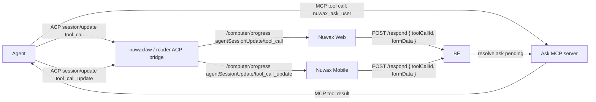

# MCP Ask / Question over ACP ToolCall 实施方案 v1

| 项 | 内容 |
|---|---|
| 状态 | **v1 草案** |
| 版本 | v1(2026-05-13) |
| 关联主文档 | [`acp-mode-and-intervention-cross-end-v3.md`](./acp-mode-and-intervention-cross-end-v3.md) |
| UI schema | [`interaction-ui-schema-v1.md`](./interaction-ui-schema-v1.md) |
| ACP schema | <https://github.com/agentclientprotocol/agent-client-protocol/blob/main/schema/schema.json> |
| 覆盖范围 | Nuwax Web、Nuwax Mobile、Backend、MCP ask server、nuwaclaw/rcoder ACP progress bridge |

---

## 1. 结论

Ask/question 不走 ACP `session/request_permission`,也不走 `/computer/notify-resolved`。它由 MCP ask server 实现 pending/response/tool result,但前端下发复用 ACP 官方工具调用事件:

- `session/update` + `SessionUpdate.sessionUpdate = "tool_call"`
- `session/update` + `SessionUpdate.sessionUpdate = "tool_call_update"`

nuwaclaw/rcoder 只把 ACP `session/update` 桥接到现有 `/computer/progress/{session_id}`:

```ts
interface AgentSessionUpdateProgressMessage extends UnifiedSessionMessage {
  messageType: "agentSessionUpdate";
  subType: "tool_call" | "tool_call_update";
  data: (ToolCall & { sessionUpdate: "tool_call" })
    | (ToolCallUpdate & { sessionUpdate: "tool_call_update" });
}
```

禁止新增 `mcpAskQuestion` / `mcpAskQuestionUpdate` 自定义 message type。

---

## 2. 端到端流程



边界:

| 项 | 结论 |
|---|---|
| 触发源 | Agent 调用 MCP ask 工具 |
| MCP 协议 | MCP tool call/tool result |
| ACP 下发 | ACP `session/update` 的 `tool_call` / `tool_call_update` |
| pending owner | MCP ask server / Backend |
| Host 职责 | 只桥接 progress,不创建 pending,不 resolve |
| UI schema | 放在 MCP 工具输入,即 ACP `ToolCall.rawInput.ui` |
| 回答回流 | Web/Mobile -> Backend -> MCP ask server -> Agent |

---

## 3. MCP Ask 工具输入

ACP `ToolCall.rawInput` 是工具原始输入参数,可以承载我们自定义的业务字段。Ask 工具必须把识别字段和交互式 UI schema 放在 `rawInput` 中,不要依赖 ACP `_meta`。

```ts
type McpAskToolName = "nuwaclaw_ask_user" | "nuwax_ask_user";

interface McpAskUserToolInput {
  toolName: McpAskToolName;
  schemaVersion: "nuwaclaw.mcp_ask.v1";
  requestId: string;
  revision: number;
  sessionId: string;
  title: string;
  description?: string;
  ui: InteractionUISchema;
  business?: Record<string, unknown>;
  timeoutMs?: number;
  priority?: "normal" | "high";
}

interface McpAskUserToolResult {
  status: "answered" | "cancelled" | "skipped" | "expired";
  formData?: Record<string, unknown>;
  answeredBy?: {
    kind: "web" | "mobile";
    userId?: string;
    clientId?: string;
  };
  answeredAt?: number;
}
```

约束:

- `rawInput.schemaVersion` 固定为 `"nuwaclaw.mcp_ask.v1"`。
- `rawInput.ui.version` 本期固定为 `"nuwaclaw.interaction.v1"`。
- `rawInput.business` 只放业务上下文,不得放 secret、token、完整 env 或未经脱敏的敏感文件内容。
- MCP ask server 不接收 ACP `RequestPermissionRequest`。
- Agent 要问用户问题时调用 MCP ask 工具,不要伪造 ACP permission。

---

## 4. 交互式 UI Schema

`InteractionUISchema` 是 Nuwax Web/Mobile 渲染会话交互组件的内部 schema,由 MCP ask 工具输入携带。

`InteractionUISchema` 的唯一权威定义见 [`interaction-ui-schema-v1.md`](./interaction-ui-schema-v1.md)。MCP ask 工具只在 `ToolCall.rawInput.ui` 中携带该 schema。

渲染规则:

- `presentation="inline"`:会话内卡片。
- `presentation="modal"`:端上可弹窗时弹窗,否则降级 inline。
- `presentation="wizard"`:按 `steps` 分步。
- `presentation="table"`:按 `table.columns` / `table.rows` 渲染交互式表格。
- 未知 `ui.version`:显示 fallback,不要提交猜测数据。
- Mobile M2 只承诺单选、多选、短文本;复杂 schema 或表格编辑可 fallback 到 `webUrl`。

---

## 5. Progress 识别与渲染

Web/Mobile 只从 `/computer/progress/{session_id}` 读取标准 ACP tool call / update:

```ts
type AcpToolCallSessionUpdate =
  | (ToolCall & { sessionUpdate: "tool_call" })
  | (ToolCallUpdate & { sessionUpdate: "tool_call_update" });
```

识别 question 的条件:

`tool_call`:

1. `messageType === "agentSessionUpdate"`。
2. `subType === "tool_call"`。
3. `data.toolCallId` 存在。
4. `data.rawInput.schemaVersion === "nuwaclaw.mcp_ask.v1"`。
5. `data.rawInput.toolName` 是 `nuwaclaw_ask_user` 或 `nuwax_ask_user`。
6. `data.rawInput.ui.version === "nuwaclaw.interaction.v1"`。

`tool_call_update`:

1. `messageType === "agentSessionUpdate"`。
2. `subType === "tool_call_update"`。
3. `data.toolCallId` 已在本地 ask tool call map 中。
4. 如果 update 自带 `rawInput`,也可以按 `schemaVersion/toolName/ui.version` 补建映射。

处理规则:

- `tool_call`:创建或更新 question 卡片,`interventionId = rawInput.requestId`,保存 `toolCallId`。
- `tool_call_update`:按 `toolCallId` 更新卡片状态、content、rawOutput。
- `status = completed | failed`:卡片进入 terminal UI。
- `rawOutput.status` 如存在,展示业务状态:`answered` / `cancelled` / `skipped` / `expired`。
- 缺少 `rawInput.ui` 时,按普通工具调用展示,不得猜测为 question。

---

## 6. 用户响应

Web/Mobile 对 question 的响应走 Backend,不调用 Host `/computer/notify-resolved`。

```ts
interface McpAskRespondRequest {
  interventionId: string; // rawInput.requestId
  toolCallId: string;
  revision: number;
  source: "mcp_ask";
  protocol: "mcp";
  action: "submit" | "cancel" | "skip" | "timeout";
  formData?: Record<string, unknown>;
}
```

Backend 处理:

1. 校验用户有权限操作该 session/project。
2. 校验 `interventionId`、`toolCallId`、`revision`、pending 状态。
3. 用 `InteractionUISchema.schema` 校验 `formData`。
4. first-writer-wins 写入 terminal 状态。
5. 把结果回给 MCP ask server 的 pending tool call。
6. 后续卡片状态优先通过 ACP `tool_call_update` 同步;额外多端广播不能替代 `tool_call_update` 契约。

---

## 7. MCP Ask Pending 状态机

```ts
interface PendingMcpAsk {
  interventionId: string; // requestId
  toolCallId?: string;
  revision: number;
  sessionId: string;
  ui: InteractionUISchema;
  status: "pending" | "answered" | "cancelled" | "skipped" | "expired";
  resolve: (result: McpAskUserToolResult) => void;
  timer?: NodeJS.Timeout;
  createdAt: number;
}
```

| 输入 | pending 状态 | MCP tool result |
|---|---|---|
| `submit` | `answered` | `{ status: "answered", formData }` |
| `cancel` | `cancelled` | `{ status: "cancelled" }` |
| `skip` | `skipped` | `{ status: "skipped" }` |
| timeout | `expired` | `{ status: "expired" }` |

幂等规则:

- 同一 `interventionId + revision` 只接受第一次 terminal response。
- 已 terminal 后相同 response 可返回当前状态。
- 已 terminal 后不同 response 返回 `superseded`。

---

## 8. 失败处理

- Backend 找不到 MCP ask pending:返回 `gone`,Web/Mobile 禁用卡片。
- MCP ask server 超时:resolve MCP tool result `{ status: "expired" }`,Agent/Host 后续通过 ACP `tool_call_update` 同步 terminal 状态。
- Agent session cancel:所有关联 question pending resolve `{ status: "cancelled" }`。
- Backend 与 MCP ask server 连接中断:保留 pending,恢复后按 `interventionId` / `toolCallId` 对账;超时后统一 expired。

---

## 9. 验收

- 不存在 `mcpAskQuestion` / `mcpAskQuestionUpdate` 自定义 progress message。
- Question 下发只走 `agentSessionUpdate/tool_call` 与 `agentSessionUpdate/tool_call_update`。
- `rawInput.schemaVersion`、`rawInput.toolName`、`rawInput.requestId`、`rawInput.revision`、`rawInput.ui` 都存在。
- Web/Mobile 能从 `rawInput.ui` 渲染 inline/modal/wizard/table。
- Web/Mobile 响应只 POST Backend,不直接调用 MCP ask server 或 ACP Host。
- `/computer/notify-resolved` 不处理 question。
- Terminal 状态通过 MCP tool result 与 ACP `tool_call_update` 闭环。
