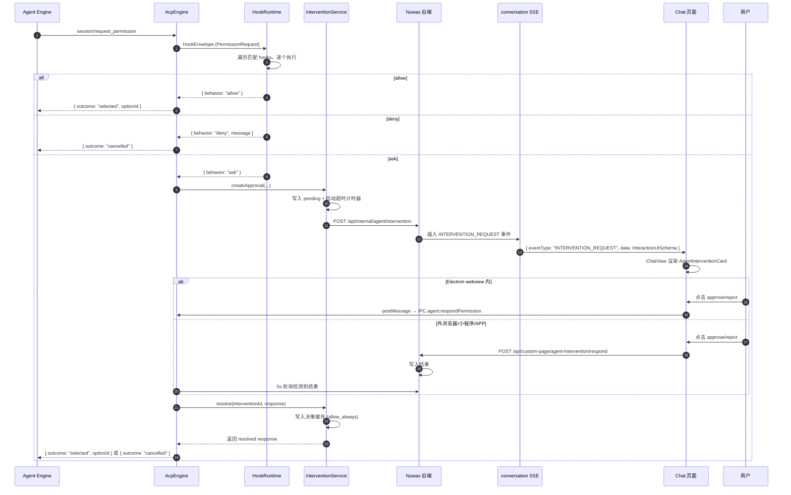
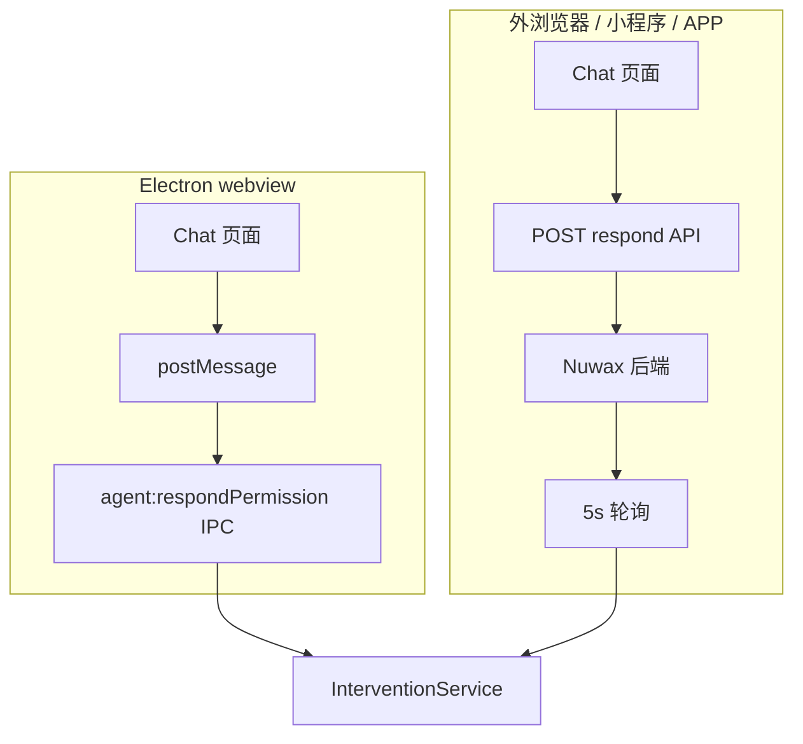

# 通用智能体人类介入支持方案 v2

调研日期：2026-05-11
决策日期：2026-05-12

## 目录

1. [决策记录](#1-决策记录)
2. [当前代码缺口](#2-当前代码缺口)
   - 2.1 [handlePermissionRequest — 伪闭环](#21-handlepermissionrequest--伪闭环)
   - 2.2 [nuwaxcode question: deny 硬编码](#22-nuwaxcode-question-deny-硬编码)
   - 2.3 [engineHooks 只有注入点](#23-enginehooks-只有注入点)
3. [目标架构](#3-目标架构)
   - 3.1 [分层](#31-分层)
   - 3.2 [Approval 闭环](#32-approval-闭环)
   - 3.3 [响应路径](#33-响应路径)
4. [ACP Hooks 策略层](#4-acp-hooks-策略层)
   - 4.1 [定位](#41-定位)
   - 4.2 [通用事件模型](#42-通用事件模型)
   - 4.3 [事件来源与能力等级](#43-事件来源与能力等级)
   - 4.4 [Hook 配置](#44-hook-配置)
   - 4.5 [HookRuntime 与 InterventionService 的关系](#45-hookruntime-与-interventionservice-的关系)
   - 4.6 [Hook 执行 Envelope](#46-hook-执行-envelope)
5. [P/ACP Proxy Pipeline（中长期演进）](#5-pacp-proxy-pipeline中长期演进)
6. [InterventionService 接口](#6-interventionservice-接口)
7. [数据模型](#7-数据模型)
   - 7.1 [InterventionRequest](#71-interventionrequest)
   - 7.2 [InteractionUISchema（SSE 推送负载）](#72-interactionuischemasse-推送负载)
   - 7.3 [InterventionMessageInfo（MessageInfo 扩展字段）](#73-interventionmessageinfomessageinfo-扩展字段)
   - 7.4 [决策缓存](#74-决策缓存)
   - 7.5 [数据库表](#75-数据库表)
8. [handlePermissionRequest 改造逻辑](#8-handlepermissionrequest-改造逻辑)
9. [Nuwax 前端改造点](#9-nuwax-前端改造点)
   - 9.1 [Chat 页面](#91-chat-页面)
   - 9.2 [干预卡片交互状态](#92-干预卡片交互状态)
10. [Electron IPC 新增](#10-electron-ipc-新增)
11. [Nuwax 后端新增 API](#11-nuwax-后端新增-api)
12. [落地步骤](#12-落地步骤)
13. [风险](#13-风险)

---

## 1. 决策记录

经过架构讨论确认以下关键决策：

| # | 决策 | 选项 |
|---|------|------|
| 1 | 协议基础 | ACP，不考虑非 ACP 引擎接入 |
| 2 | 等待模型 | 同步——`handlePermissionRequest` 阻塞等待用户响应或超时 |
| 3 | 前端落点 | Nuwax Chat 页面（`pages/Chat/`），与 AppDev 无关 |
| 4 | MVP 范围 | approval 优先，question 后续 |
| 5 | 事件投递 | 复用现有 conversation SSE，新增 `INTERVENTION_REQUEST` 事件类型 |
| 6 | 消息渲染 | `MessageInfo` 扩展 `intervention` 字段，`ChatView` 条件渲染卡片 |
| 7 | 响应路径 | 双通道——Electron webview 走 postMessage+IPC，外浏览器/小程序/APP 走 HTTP API+轮询 |
| 8 | 后端→Electron 回推 | 5 秒轮询 |
| 9 | 超时配置 | 全局默认值 + settings 可覆盖 |
| 10 | allow_always 缓存 | SQLite 持久化，按 `optionId` 匹配 |
| 11 | Service→后端通信 | InterventionService 通过 HTTP API 写入 Nuwax 后端 |
| 12 | SSE 事件负载 | 一次推送完整 `InteractionUISchema`，不额外拉取 |
| 13 | InterventionService 接口 | 最小接口：createApproval / waitForResponse / resolve / cancelBySession |

---

## 2. 当前代码缺口

### 2.1 `handlePermissionRequest` — 伪闭环

`acpEngine.ts:2378`：

- `question` → 直接 `cancelled`
- strict sandbox 越界 → `cancelled`
- 其余 → `allow_always` > `allow_once` > 第一个 option，全自动批准

`respondPermission()` 和 `pendingPermissions` Map 存在但从未被 `handlePermissionRequest` 使用。`PermissionModal.tsx` 和 `permissions.ts` 是旧的本地规则引擎，与 ACP 权限流完全脱节。

### 2.2 nuwaxcode `question: deny` 硬编码

`acpEngine.ts:404-445`：`OPENCODE_CONFIG_CONTENT` 写死 `question: "deny"`，直接阻断引擎提问能力。

### 2.3 engineHooks 只有注入点

`engineHooks.ts` 仅提供 `registerEnvProvider()` 和 `registerPromptEnhancer()`，没有 lifecycle hooks。

---

## 3. 目标架构

### 3.1 分层

```text
Nuwax Chat 页面 (pages/Chat) / Nuwax Mobile / IM
  └─ 人类介入 UI（会话内卡片）
       ├─ approval: approve once / approve always / reject
       └─ question: 单选 / 多选 / 自由文本（后续）

Electron Main
  ├─ UnifiedAgentService
  │   └─ AcpEngine
  │       ├─ ACP transport (session/new, prompt, update, request_permission, cancel)
  │       ├─ HookRuntime: 遍历 hooks，allow/deny 直接返回，ask 走 InterventionService
  │       ├─ InterventionService: 创建 pending、等待响应、超时控制
  │       └─ 决策缓存: optionId → allow_always/reject_always
  │
  └─ SQLite
      ├─ agent_intervention_requests（pending 记录）
      └─ agent_permission_decisions（allow_always 缓存）
```

### 3.2 Approval 闭环



### 3.3 响应路径



---

## 4. ACP Hooks 策略层

### 4.1 定位

ACP 本身没有标准 hook 机制——`session/request_permission` 是最接近"策略决策点"的协议能力，但它只能请求客户端选择 `optionId`或`cancelled`，无法表达"执行前修改工具输入"或"执行后审计"。

因此 NuwaClaw 需要在 ACP 之上构建自己的 hooks 策略层：

```
ACP Event Stream (session/update, session/request_permission, ...)
  │
  ▼
HookRuntime ───────────────────────────────────────────┐
  │ 遍历匹配的 hooks，逐个执行                            │
  │                                                     │
  ▼                                                     ▼
HookDecision                                     审计日志
  ├─ allow ──→ 直接返回 agent（不创建 intervention）     │
  ├─ deny ───→ 直接返回 agent（不创建 intervention）     │
  ├─ ask ────→ InterventionService（人类介入闭环）       │
  └─ observe → 仅记录，不阻断                            │
```

**核心原则**：hooks 回答"要不要让用户介入"，InterventionService 回答"用户介入后怎么做"。两者解耦，hooks 可以先内置、后续可配置化。

### 4.2 通用事件模型

不绑定 Claude Code / OpenCode / Codex 的字段，NuwaClaw 定义自己的事件语义：

```ts
type UniversalHookEvent =
  | "SessionStart"
  | "UserPromptSubmit"
  | "PermissionRequest"
  | "QuestionRequest"
  | "PreToolUse"
  | "PostToolUse"
  | "Stop"
  | "SessionEnd";

type HookDecision =
  | { behavior: "allow"; updatedInput?: unknown; reason?: string }
  | { behavior: "deny"; message: string }
  | { behavior: "ask"; reason?: string }
  | { behavior: "observe" };
```

### 4.3 事件来源与能力等级

HookRuntime 的事件来源有两类：

| 来源 | 触发时机 | 事件类型 |
|------|----------|----------|
| ACP 协议 | `session/request_permission` → `PermissionRequest` | 通用 |
| ACP 协议 | `session/prompt` 调用前 → `UserPromptSubmit` | 通用 |
| ACP 协议 | `session/update` 中 `tool_call` → `PreToolUse` / `PostToolUse`（观察） | 通用 |
| NuwaClaw MCP | `nuwaclaw_ask_user` 被调用 → `QuestionRequest` | 通用（后续） |
| 引擎原生 | Claude Code settings hooks / OpenCode plugins → 映射为 UniversalHookEvent | 引擎增强（后续） |

能力等级：

| 等级 | 含义 | 例子 |
|------|------|------|
| `universal` | ACP + NuwaClaw 自身可稳定实现 | `PermissionRequest`、`UserPromptSubmit`、`QuestionRequest`（MCP） |
| `engine_native` | 特定引擎才可完整实现 | Claude Code `PreToolUse.updatedInput`、OpenCode `tool.execute.before` |
| `degraded` | 通用层只能观测或取消 | ACP `tool_call_update` 后 audit 发现违规 → 只能 `session/cancel` |

### 4.4 Hook 配置

#### 作用域

四层合并，从高到低：

1. **managed/org**：企业策略，`locked: true` 时不可被低层覆盖。
2. **app/global**：用户全局配置，存 SQLite 或 `~/.nuwaclaw/hooks.json`。
3. **project**：工作区配置（`<workspace>/.nuwaclaw/hooks.json`）。
4. **session**：会话临时配置，随会话销毁。

合并规则：`deny > ask > allow`。

#### 配置格式

```json
{
  "version": 1,
  "hooks": {
    "PermissionRequest": [
      {
        "id": "deny-rm-root",
        "matcher": { "tool": "bash", "input.command": "rm -rf /*" },
        "handlers": [
          {
            "type": "command",
            "command": "node .nuwaclaw/hooks/deny-dangerous-command.js",
            "timeoutSec": 5
          }
        ],
        "onError": "fail_closed"
      }
    ],
    "UserPromptSubmit": [
      {
        "id": "inject-context",
        "matcher": { "any": true },
        "handlers": [
          { "type": "builtin", "name": "inject-memory-context" }
        ]
      }
    ]
  }
}
```

Handler 类型：

| 类型 | 说明 |
|------|------|
| `builtin` | NuwaClaw 内置处理器（如 inject-memory-context、notify-im） |
| `command` | 执行本地脚本，stdin 接收 envelope JSON，stdout 返回 decision JSON |
| `http` | POST envelope JSON 到 URL，等待 JSON response |

约束：
- command/http handler 必须设置 `timeoutSec`，默认 10s，最大 60s。
- `onError`：`fail_closed`（视为 deny）或 `fail_open`（视为 allow，仅限低风险事件）。
- 同一事件多个 hook 默认并发执行；需要串行时显式 `serial: true`。

### 4.5 HookRuntime 与 InterventionService 的关系

```
handlePermissionRequest(params)
  │
  ├─ 1. 构建 HookEnvelope
  ├─ 2. HookRuntime.evaluate(envelope)
  │     ├─ allow → 直接返回 { outcome: "selected", optionId }
  │     ├─ deny  → 直接返回 { outcome: "cancelled" }
  │     └─ ask   → 继续步骤 3
  │
  ├─ 3. 查 decision 缓存 (optionId 匹配)
  │     ├─ allow_always 命中 → 返回 selected
  │     └─ reject_always 命中 → 返回 cancelled
  │
  └─ 4. InterventionService.createApproval() + waitForResponse()
        └─ 超时 → cancelled
```

**Phase 1 最小实现**：HookRuntime 先只有内置 builtin handler（strict sandbox 越界检查），不做配置文件读取。command/http handler 在后续 HookRuntime 增强阶段补。

### 4.6 Hook 执行 Envelope

```ts
interface HookEnvelope {
  event: UniversalHookEvent;
  engine: "claude-code" | "nuwaxcode";
  sessionId: string;
  requestId?: string;
  cwd: string;
  tool?: {
    id?: string;
    name?: string;
    kind?: string;
    input?: unknown;
  };
  prompt?: string;
  source: "acp" | "nuwaclaw_mcp" | "engine_native";
}
```

---

## 5. P/ACP Proxy Pipeline（中长期演进）

### 5.1 概念

ACP rust-sdk 仓库的 `proxying-acp.md` 提出了 P/ACP（Proxying ACP）扩展：

- Conductor/orchestrator 对上层（编辑器/客户端）表现为普通 ACP agent
- 内部管理一条 **proxy chain**，每个 proxy 可拦截、转换、转发 ACP messages
- proxy 之间通过 `_proxy/successor/*` 扩展消息通信

```
Editor <--ACP--> Conductor <--_proxy/successor/*--> PolicyProxy <--> HumanInterventionProxy <--> McpInjectionProxy <--ACP--> Base Agent
```

### 5.2 对 NuwaClaw 的意义

| 阶段 | 形式 | 内容 |
|------|------|------|
| **当前** | 内聚在 AcpEngine | HookRuntime + InterventionService + MCP 注入全在一个进程里 |
| **短期** | 接口对齐 | HookRuntime/InterventionService 的内部接口设计向 ACP message envelope 靠拢 |
| **中期** | In-process pipeline | `AcpProxyPipeline` 管理内置 proxy 链（Policy → HumanIntervention → McpInjection），不启外部进程 |
| **长期** | 外部 proxy 进程 | 支持独立 proxy 进程，团队可维护各自的 policy proxy、human proxy、MCP proxy |

### 5.3 不建议过早落地

P/ACP 是提案形态，不是所有 ACP agent/editor 的基础能力。NuwaClaw 短期内应保持普通 ACP client/server 兼容，不暴露 P/ACP 兼容承诺。P/ACP 在架构中作为**内部可演进接口**方向，不进入近期关键路径。

---

## 6. InterventionService 接口

```ts
class InterventionService {
  /**
   * 创建 pending approval。由 handlePermissionRequest 调用。
   * 返回 interventionId，同时通过 API 写入 Nuwax 后端使其在 SSE 中下发事件。
   */
  createApproval(params: {
    sessionId: string;
    acpPermissionId: string;
    options: AcpPermissionOption[];
    toolCall: {
      toolCallId: string;
      title?: string;
      kind?: string;
      rawInput?: unknown;
    };
    title: string;
    severity?: "info" | "warning" | "danger";
    timeoutMs: number;
  }): string;

  /**
   * 同步阻塞等待用户响应。由 handlePermissionRequest 调用。
   * 超时自动返回 cancelled。
   */
  waitForResponse(interventionId: string): Promise<InterventionResponse>;

  /**
   * 从 IPC 或轮询回调解锁 waitForResponse。
   * 返回 true 表示成功 resolve，false 表示 interventionId 不存在或已处理。
   */
  resolve(interventionId: string, response: InterventionResponse): boolean;

  /** session 销毁 / app 退出时取消所有 pending */
  cancelBySession(sessionId: string): void;
}
```

---

## 7. 数据模型

### 7.1 InterventionRequest

```ts
type InterventionKind = "approval" | "question";

interface InterventionRequest {
  id: string;
  kind: InterventionKind;
  engine: string;
  sessionId: string;
  acpPermissionId: string;
  title: string;
  severity: "info" | "warning" | "danger";
  toolCall: {
    toolCallId: string;
    title?: string;
    kind?: string;
    rawInput?: unknown;
  };
  options: AcpPermissionOption[];
  timeoutMs: number;
  createdAt: number;
  status: "pending" | "answered" | "cancelled" | "expired";
}
```

### 7.2 InteractionUISchema（SSE 推送负载）

由 InterventionService 构造，通过后端 SSE 完整推送到前端，前端无需额外拉取：

```ts
interface InteractionUISchema {
  interventionId: string;
  kind: "approval" | "question";
  title: string;
  severity: "info" | "warning" | "danger";
  toolCall: {
    toolCallId: string;
    title?: string;
    kind?: string;
    rawInput?: unknown;
  };
  options: Array<{
    optionId: string;
    label: string;
    description?: string;
    isDefault?: boolean;
  }>;
  timeoutMs: number;
  createdAt: number;
}
```

### 7.3 InterventionMessageInfo（MessageInfo 扩展字段）

Chat 页面 `MessageInfo` 中新增的 `intervention` 字段类型：

```ts
interface InterventionMessageInfo {
  interventionId: string;
  kind: "approval" | "question";
  status: "pending" | "submitting" | "answered" | "expired" | "cancelled";
  schema: InteractionUISchema;
  response?: {
    optionId: string;
    decision: "allow_once" | "allow_always" | "reject";
  };
}
```

### 7.4 决策缓存

```ts
interface PermissionDecision {
  id: string;
  optionId: string;           // ACP optionId，精确匹配
  decision: "allow_always" | "reject_always";
  engine: string;
  toolKind?: string;
  createdAt: number;
}
```

匹配规则：`optionId` 完全相等即命中。

### 7.5 数据库表

```sql
CREATE TABLE agent_intervention_requests (
  id TEXT PRIMARY KEY,
  session_id TEXT NOT NULL,
  acp_permission_id TEXT NOT NULL,
  engine TEXT NOT NULL,
  kind TEXT NOT NULL DEFAULT 'approval',
  payload_json TEXT NOT NULL,
  status TEXT NOT NULL DEFAULT 'pending',
  response_json TEXT,
  expires_at INTEGER,
  created_at INTEGER NOT NULL,
  resolved_at INTEGER
);

CREATE TABLE agent_permission_decisions (
  id TEXT PRIMARY KEY,
  option_id TEXT NOT NULL,
  decision TEXT NOT NULL,
  engine TEXT NOT NULL,
  tool_kind TEXT,
  created_at INTEGER NOT NULL,
  UNIQUE(engine, option_id)
);
```

---

## 8. `handlePermissionRequest` 改造逻辑

与 Section 4.5 的流程保持一致：

```
handlePermissionRequest(params)
  │
  ├─ 1. 构建 HookEnvelope
  ├─ 2. HookRuntime.evaluate(envelope)
  │     ├─ allow → 直接返回 { outcome: "selected", optionId }
  │     ├─ deny  → 直接返回 { outcome: "cancelled" }
  │     └─ ask   → 继续步骤 3
  │
  ├─ 3. strict sandbox 越界检查（Phase 1 builtin handler 已做，此处兜底）
  │
  ├─ 4. 查 decision 缓存 → optionId 命中 allow_always → 直接返回 selected
  ├─ 5. 查 decision 缓存 → optionId 命中 reject_always → 直接返回 cancelled
  │
  └─ 6. InterventionService.createApproval()
         → await InterventionService.waitForResponse()
         → 超时则 cancelled
         → 用户 allow_always 则写缓存
         → 返回 selected/cancelled
```

Phase 1 的 HookRuntime 仅包含内置 builtin handler（strict sandbox 越界检查等），后续再补 command/http handler。

---

## 9. Nuwax 前端改造点

### 9.1 Chat 页面（`src/pages/Chat/`）

| 改动 | 位置 | 说明 |
|------|------|------|
| 类型扩展 | `src/types/interfaces/conversationInfo.ts` | `MessageInfo` 新增 `intervention?: InterventionMessageInfo` |
| SSE 事件类型 | `src/types/enums/agent.ts` | `ConversationEventTypeEnum` 新增 `INTERVENTION_REQUEST`、`INTERVENTION_UPDATE` |
| Model 处理 | `src/models/conversationInfo.ts` | `handleChangeMessageList` 处理新事件类型，构建 intervention 消息 |
| 卡片组件 | `src/pages/Chat/components/AgentInterventionCard/` | 新增，渲染 approval 按钮组 |
| 消息渲染 | `src/components/ChatView/index.tsx` | 检测 `intervention` 字段，渲染卡片替代 Markdown |
| 响应发送 | 现有 `onMessageSend` 或新增方法 | Electron 内走 postMessage，外浏览器调 respond API |

### 9.2 干预卡片交互状态

| 状态 | 渲染 |
|------|------|
| `pending` | 展示按钮组，可操作 |
| `submitting` | 按钮 loading，禁止重复提交 |
| `answered` | 展示选择结果，不可操作 |
| `expired / cancelled` | 展示不可操作状态和原因 |

---

## 10. Electron IPC 新增

| Channel | 方向 | 用途 |
|---------|------|------|
| `agent:respondPermission` | Renderer → Main | 已有，复用。payload 改为 `{ interventionId, response } ` |
| `intervention:request` | Main → Renderer | 已有 `permission.updated` 事件，可复用或新增 |

---

## 11. Nuwax 后端新增 API

### 认证方式

`/api/internal/*` 端点供 Electron 主进程内部调用，使用注册时返回的 `token`（见 [CLAUDE.md 登录状态同步](#)），通过 `Authorization: Bearer <token>` 头传递。`/api/custom-page/*` 端点供外浏览器/小程序/APP 使用，走现有 session cookie 认证。

### 端点

| 端点 | 方法 | 认证 | 调用方 | 用途 |
|------|------|------|--------|------|
| `/api/internal/agent/intervention` | POST | Bearer token | Electron InterventionService | 写入 pending intervention，触发 SSE 下发 |
| `/api/custom-page/agent-intervention/respond` | POST | Session cookie | Chat 页面（外浏览器/小程序/APP） | 提交用户审批结果 |
| `/api/internal/agent/intervention/poll` | GET | Bearer token | Electron 主进程（5s 轮询） | 查询已响应的 intervention 列表 |

---

## 12. 落地步骤

### Phase 1：NuwaClaw 侧最小闭环

1. 新增 `HookRuntime`（内置 builtin handler 仅，不含文件配置读取）
2. 新增 `InterventionService`（`src/main/services/engines/interventionService.ts`）
3. 新建 DB 表 `agent_intervention_requests`、`agent_permission_decisions`
4. 改造 `handlePermissionRequest`：
   - HookRuntime 先跑 builtin handler（strict sandbox 越界拒绝）
   - decision 缓存查询（optionId 匹配）
   - 未命中 → createApproval + waitForResponse
5. `cancelBySession` 接入 session destroy / engine destroy / agent:destroy IPC
6. 新增 `POST /api/internal/agent/intervention` 调用（向 Nuwax 后端推送）
7. 新增 5s 轮询（复用或扩展现有轮询机制）

### Phase 2：Nuwax Chat 页面卡片

1. 扩展类型和常量
2. conversationInfo model 处理 `INTERVENTION_REQUEST` / `INTERVENTION_UPDATE`
3. 新增 `AgentInterventionCard` 组件
4. ChatView 集成
5. 响应路径：Electron 内走 postMessage + IPC，外浏览器走 respond API

### Phase 3：超时与缓存管理

1. 全局默认超时可配置（settings）
2. `allow_always` 缓存可查看
3. 超时/expire 审计日志

### 后续

- `nuwaclaw-human` MCP + question 闭环
- HookRuntime 增强：command/http handler 支持、配置文件读取（Phase 1 仅 builtin handler）
- IM 渠道
- 移动端

### 多 Tab 场景

同一 session 可能在多个 tab/设备上同时打开（如 Electron webview + 手机浏览器）。干预卡片的状态同步策略：

- **SSE 广播**：`INTERVENTION_REQUEST` 事件通过 conversation SSE 下发到所有连接的客户端，每个客户端独立渲染卡片
- **响应幂等**：InterventionService.resolve() 对同一 interventionId 只接受第一次响应，后续调用返回 false
- **状态同步**：第一个客户端响应后，后端通过 SSE 下发 `INTERVENTION_UPDATE` 事件，其余客户端收到后更新卡片为 `answered` 状态
- **竞态处理**：如果两个客户端几乎同时提交，后端/interventionService 以先到达的为准，另一个收到 `INTERVENTION_UPDATE` 后展示"已被其他设备处理"

---

## 13. 风险

1. **Nuwax 后端不可达**：`InterventionService` 推送失败时 intervention 仍被创建，但 SSE 无法下发，用户看不到卡片 → 超时后 cancelled。可接受，但需要日志告警。
2. **5 秒轮询延迟**：用户操作后 agent 最多等 5 秒，当前可接受。后续可按需优化为长轮询或 WebSocket。
3. **ACP 进程 crash**：pending intervention 随 `cancelBySession` 清理。但 recover 后 intervention 状态丢失，用户看到的是过期卡片 → 需要 revision 校验（Phase 2 加入）。
4. **allow_always 安全性**：按 `optionId` 精确匹配，不按 tool name 全放开。如果 agent 给的 optionId 粒度过粗，安全性依赖 agent 实现。后续可补充 input pattern 匹配。