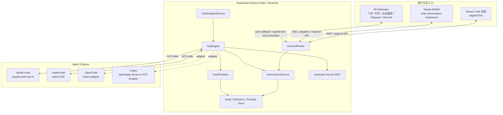
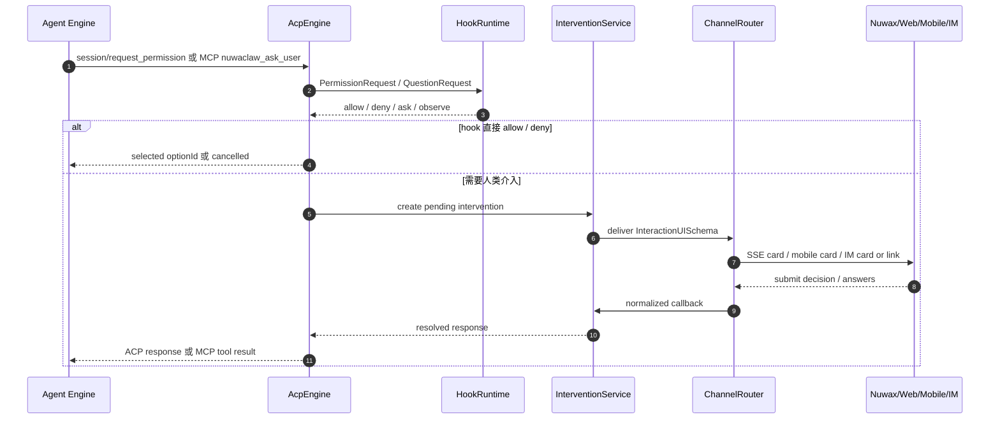

# 通用智能体 ACP 架构：Hooks 与人类介入支持方案

调研日期：2026-05-11

## 1. 结论摘要

NuwaClaw 应把 **ACP 作为最小通用协议层**，把 hooks、人类介入、引擎差异封装在 NuwaClaw 自己的 **Agent Orchestrator + Engine Adapter** 层。

核心判断：

1. **ACP 能通用承载权限审批**：标准 `session/request_permission` 已定义由 Agent 向 Client 请求授权，Client 返回选择的 `optionId` 或 `cancelled`。这适合实现 `approve / reject / allow_once / allow_always`。
2. **ACP 不能完整通用承载所有 hook 语义**：ACP 可观察 `session/update` 中的 tool call/progress，但没有标准的“任意工具执行前修改输入/阻断”的通用 hook。对不发 `request_permission` 的工具，通用层最多观察、审计或通过 `session/cancel` 中止。
3. **“ask/question”不是 ACP 标准能力**：Claude Code 的 `AskUserQuestion`、OpenCode 的 `question` 都是引擎专有工具。要稳定支持跨引擎提问，建议注入 NuwaClaw 自有 MCP 工具 `nuwaclaw_ask_user`，由 NuwaClaw UI/IM 收集答案并返回。
4. **当前仓库还没有真正的人类介入闭环**：`AcpEngine.handlePermissionRequest()` 目前对 question 直接取消，对多数非 question 权限请求自动选择 allow；`respondPermission()` IPC 存在，但 pending permission 没有被 `handlePermissionRequest()` 挂起使用。
5. **人类介入 UI 应落在 Nuwax Chat 页面（pages/Chat）**：这里不是泛指 `workspace/nuwax` 项目里的所有聊天能力，而是 `/Users/apple/workspace/nuwax` 前端项目里的 Chat 页面 `pages/Chat/`。confirmation、approval、ask/question、表单、步骤流应作为 Chat 页面的会话消息组件实现，NuwaClaw 负责协议、状态、SSE/IM 分发。
6. **移动端和 IM 需要按渠道能力分阶段降级**：移动端在 `/Users/apple/workspace/nuwax-mobile` 分阶段从 fallback 链接、approval 卡片、单选/多选/短文本、轻量表单到 wizard；IM 国内优先，先飞书、钉钉、企业微信，再兼容 Telegram/Discord。详细调用与降级方案见 [`agent-intervention-channel-calling.md`](./agent-intervention-channel-calling.md)。
7. **实施顺序应先闭环、再增强**：第一阶段先打通最小 approval/question 闭环，不依赖完整 HookRuntime；HookRuntime、引擎原生 hooks、P/ACP proxy pipeline 都应作为后续增强，避免阻塞人工介入的基础可用性。
8. **推荐路线**：先做 NuwaClaw 统一 InterventionService + Nuwax Chat/Nuwax Mobile/IM 调用闭环，再补 HookRuntime 和 `nuwaclaw-human` MCP，最后按引擎适配 Claude Code / Nuwaxcode(OpenCode) / Codex 的原生 hooks 与权限配置。P/ACP 只作为中长期演进参考，不进入近期关键路径。

## 2. 当前仓库状态

### 2.1 已有 ACP 引擎抽象

当前主链路：

- `UnifiedAgentService`：`crates/agent-electron-client/src/main/services/engines/unifiedAgent.ts`
- `AcpEngine`：`crates/agent-electron-client/src/main/services/engines/acp/acpEngine.ts`
- `AcpClient`：`crates/agent-electron-client/src/main/services/engines/acp/acpClient.ts`
- 支持引擎类型：`claude-code | nuwaxcode`，定义在 `crates/agent-electron-client/src/main/services/engines/types.ts`

当前使用 `@agentclientprotocol/sdk@0.14.1`，但本地 `AcpClientSideConnection` 和 `AcpSessionUpdate` 是手写接口，没有完整跟进 SDK schema 中的 `configOptions`、`plan`、`current_mode_update`、`config_option_update`、`session/set_mode`、`session/set_config_option` 等新能力。

### 2.2 已有隔离与注入能力

`createAcpConnection()` 会为 ACP 子进程创建隔离 HOME，并注入：

- `HOME` / `USERPROFILE`
- `XDG_CONFIG_HOME` / `XDG_DATA_HOME` / `XDG_CACHE_HOME`
- `CLAUDE_CONFIG_DIR`
- `NUWAXCODE_CONFIG_DIR`
- `ANTHROPIC_API_KEY` / `ANTHROPIC_BASE_URL` / `ANTHROPIC_MODEL`
- Nuwaxcode 相关 `OPENCODE_MODEL`、`OPENAI_API_KEY`、`OPENCODE_CONFIG_CONTENT`

这给“按 session/project 动态生成 hooks 配置、权限配置、引擎专用配置”提供了合适落点。

### 2.3 当前权限处理差距

当前 ACP permission handler 的行为：

- `toolCall.kind === "question"`：直接 `cancelled`
- strict sandbox 下的写入：本地做路径判断，越界则 `cancelled`
- 其他请求：优先选择 `allow_always`，否则 `allow_once`，等于自动批准

`AcpEngine.respondPermission(permissionId, response)` 与 IPC `agent:respondPermission` 已存在，但当前 `handlePermissionRequest()` 没有创建 pending request、没有投递给 ChannelRouter/Chat/Mobile/IM、也没有等待用户响应。

现有 renderer `PermissionModal.tsx` 和 `renderer/services/agents/permissions.ts` 更像旧的本地权限管理 UI，未接入 ACP `session/request_permission`。

### 2.4 当前 hook 机制

`engineHooks.ts` 只有两个轻量扩展点：

- `registerEnvProvider()`
- `registerPromptEnhancer()`

这不是用户可配置的 agent lifecycle hooks，只适合内部模块注入 env 和 system prompt。

## 3. 外部能力调研

### 3.1 ACP 标准能力

ACP 的定位是连接编辑器/客户端与 coding agent。官方 schema 当前包含：

- `session/new`：创建会话，可返回 `configOptions`
- `session/prompt`：处理一个用户 turn
- `session/update`：agent 发送消息、思考、tool call、plan、usage 等进度
- `session/request_permission`：agent 请求客户端授权敏感工具调用
- `session/cancel`：客户端取消当前 prompt turn
- `terminal/*`：客户端提供终端能力

对 NuwaClaw 的含义：

| 需求 | ACP 原生支持 | 说明 |
| --- | --- | --- |
| approve/reject | 支持 | 用 `session/request_permission` 返回 selected/cancelled |
| allow once/always | 支持 | 由 agent 提供 `PermissionOptionKind`，客户端选择 optionId |
| question/ask | 不标准化 | 只能通过引擎专有工具、MCP 工具或 `_meta` 扩展 |
| PreToolUse 修改输入 | 不通用 | ACP 没有标准 hook response 可修改工具输入 |
| PostToolUse 审计 | 部分支持 | 可通过 `session/update` 的 tool call/update 观察 |
| 强制阻断任意工具 | 部分支持 | 可在 permission 请求时拒绝；无 permission 的工具只能 cancel session 或依赖引擎原生 hook |

### 3.2 Claude Code

Claude Code 具备很强的原生 hooks 与人类介入能力：

- hooks 配置在 settings 中，可用 command 或 HTTP hook。
- `PreToolUse` 支持 `allow / deny / ask / defer`，并可 `updatedInput` 修改工具输入。
- `PermissionRequest` 在即将展示权限弹窗时触发，可 allow/deny。
- `AskUserQuestion` 可通过 `canUseTool` 或 hook `updatedInput` 返回 answers。
- TypeScript Agent SDK 支持 `defer`，适合 UI 进程先退出/暂停，稍后 resume。

对 NuwaClaw 的含义：

1. 如果通过 `claude-code-acp-ts` 继续走 ACP，需要确认 wrapper 是否把 Claude Code 的 `AskUserQuestion`、defer、hooks 配置完整暴露。
2. 可以在隔离 `CLAUDE_CONFIG_DIR` 下生成 `.claude/settings.json`，注入 NuwaClaw 管理的 hooks/permissions。
3. Claude Code 原生 hook 能力强于 ACP，应作为 `ClaudeCodeAdapter` 的增强能力，而不是污染通用 ACP 抽象。

### 3.3 Nuwaxcode / OpenCode

Nuwaxcode 基于 OpenCode 思路，当前通过 `OPENCODE_CONFIG_CONTENT` 注入权限与 MCP。OpenCode 官方文档显示：

- `permission` 配置支持 `allow / ask / deny`
- 可按工具和输入 pattern 做细粒度规则
- `question` 是内置工具，用于向用户提问
- approval UI 通常有 `once / always / reject`
- plugins 支持 `tool.execute.before`、`tool.execute.after`、`permission.asked`、`permission.replied`、`shell.env` 等事件

对 NuwaClaw 的含义：

1. Nuwaxcode/OpenCode 的 permission 配置可直接映射 NuwaClaw 的策略。
2. 当前代码把 `permission.question = "deny"`，会阻断 ask/question。若要支持，需要改成 `ask` 或使用 NuwaClaw MCP ask 工具替代。
3. 对 OpenCode 原生 plugin hook 的支持应通过隔离 config dir 或 `OPENCODE_CONFIG_CONTENT`/`OPENCODE_CONFIG` 注入，不应写用户全局配置。
4. `tool.execute.before` 能做比 ACP 更早的阻断/修改，但这是 OpenCode 适配层能力。

### 3.4 Codex

Codex 当前官方文档显示：

- CLI 可本地运行，支持 sandbox 和 approvals。
- `approval_policy` 与 `sandbox_mode` 一起决定是否需要用户审批。
- 可通过 rules/exec policy 对 shell 命令做 allow/prompt/forbidden。
- hooks 需要启用 `codex_hooks` feature，支持 `PreToolUse`、`PermissionRequest`、`PostToolUse`、`UserPromptSubmit`、`Stop` 等。
- 当前 Codex hooks 文档说明 `PermissionRequest` 可 allow/deny；`PreToolUse` 的部分高级字段如 `permissionDecision: "allow"/"ask"`、`updatedInput` 仍未完全支持，部分行为会 fail open。

对 NuwaClaw 的含义：

1. 不应假设 Codex 天然是 ACP agent。需要确认未来接入方式：官方 ACP server、Codex App Server/SDK，或 NuwaClaw 自研 ACP wrapper。
2. Codex approval 事件应映射为 NuwaClaw `InterventionRequest(type=approval)`。
3. Codex hooks 可以作为 `CodexAdapter` 原生增强；但在 PreToolUse 语义上要按官方当前限制降级，不要承诺完整 allow/ask/modify。

### 3.5 后续演进参考：P/ACP / Proxying ACP

ACP rust-sdk 仓库的 `proxying-acp.md` 提出 P/ACP（Proxying ACP）扩展，核心思想是：

- 引入 Conductor/orchestrator，对编辑器表现为普通 ACP agent。
- Conductor 管理一条 proxy chain，proxy 可以拦截、转换、转发 ACP request/response/notification。
- Proxy 与下游 proxy/agent 通过 `_proxy/successor/*` 扩展消息通信。
- 通过 `_meta` 做 proxy capability 双向握手；非最后组件必须声明自己能处理 proxy 协议，最后一个组件仍是普通 ACP agent。
- 支持 MCP Bridge：组件可声明 `acp:<id>` 形式的 MCP transport，Conductor 在 agent 不支持 MCP-over-ACP 时桥接到传统 stdio/TCP。

这对 NuwaClaw 的中长期意义：

1. **通用 hook 更适合 proxy 化**：`UserPromptSubmit`、`PermissionRequest`、`QuestionRequest`、审计、prompt 增强、MCP 注入，都可以先在 NuwaClaw 内部实现，后续再拆成独立 ACP proxy。
2. **降低引擎侵入**：对 claude-code、nuwaxcode、未来 opencode/codex，proxy chain 可以在不改 agent 的情况下插入安全策略、初始化 prompt、MCP server、观测与人类介入。
3. **比单一 HookRuntime 更可组合**：不同团队可以维护不同 proxy，比如 policy proxy、memory proxy、human-intervention proxy、mcp-injection proxy。
4. **短期不能当标准依赖**：P/ACP 是 ACP 扩展/提案形态，不是所有 agent/editor 的基础能力。NuwaClaw 短期仍应保持普通 ACP client/server 兼容，把 P/ACP 作为内部可演进接口。

建议把它作为后续演进，不进入近期关键路径：

- 短期：在现有 `AcpEngine` 内实现 HookRuntime/InterventionService，但接口命名和 envelope 设计向 ACP message proxy 靠拢。
- 中期：新增 `AcpProxyPipeline`，把内置 hook、permission、人类介入、MCP 注入实现成 in-process proxy。
- 长期：支持外部 P/ACP proxy 进程，形成类似 `conductor agent policy-proxy human-proxy claude-code-acp` 的组合。

## 4. 推荐目标架构

### 4.1 分层

```text
Renderer / IM Gateways
  └─ Human Intervention UI
       ├─ approval: approve once / approve always / reject
       └─ question: option answer / free text answer

Electron Main
  ├─ UnifiedAgentService
  │   ├─ AcpEngine
  │   │   ├─ ACP transport: session/new, prompt, update, request_permission, cancel
  │   │   ├─ HookRuntime: NuwaClaw-managed hook execution
  │   │   ├─ InterventionService: pending approvals/questions
  │   │   └─ EngineAdapter
  │   │       ├─ ClaudeCodeAdapter
  │   │       ├─ NuwaxcodeAdapter
  │   │       ├─ OpenCodeAdapter
  │   │       └─ CodexAdapter
  │   └─ MCP injection
  │       └─ nuwaclaw-human MCP server
  │
  ├─ Future AcpProxyPipeline / Conductor-compatible layer
  │   ├─ PolicyProxy
  │   ├─ HumanInterventionProxy
  │   ├─ McpInjectionProxy
  │   └─ MemoryContextProxy
  └─ SQLite
      ├─ hook configs
      ├─ permission/intervention decisions
      └─ audit log
```

`AcpProxyPipeline` 是中长期演进层，不影响第一阶段落地。第一阶段可以把这些 proxy 作为普通 TypeScript 服务内聚在 `AcpEngine` 里；当 P/ACP 或自研 conductor 成熟后，再把它们外置成进程级 proxy。

### 4.2 架构图示

#### 当前推荐架构



#### Approval / Ask 闭环



#### 中长期 P/ACP Proxy 演进

```mermaid
flowchart LR
  Editor["Nuwax / NuwaClaw Client"]
  Conductor["Conductor\n普通 ACP agent facade"]
  Policy["PolicyProxy\n权限与 sandbox 策略"]
  Human["HumanInterventionProxy\napproval / ask"]
  MCPProxy["McpInjectionProxy\nnuwaclaw-human / MCP bridge"]
  Memory["MemoryContextProxy\n偏好 / 长记忆 / prompt 增强"]
  Base["Base ACP Agent\nclaude-code / nuwaxcode / opencode / codex wrapper"]

  Editor <-->|ACP| Conductor
  Conductor <-->|_proxy/successor/*| Policy
  Policy <-->|_proxy/successor/*| Human
  Human <-->|_proxy/successor/*| MCPProxy
  MCPProxy <-->|_proxy/successor/*| Memory
  Memory <-->|ACP| Base

  MCPProxy -. "_mcp/* bridge" .-> Base
```



### 4.3 通用能力模型

定义 NuwaClaw 自己的事件与决策模型，不直接绑定 Claude/OpenCode/Codex 的字段。

```ts
type UniversalHookEvent =
  | "SessionStart"
  | "UserPromptSubmit"
  | "PreToolUse"
  | "PermissionRequest"
  | "QuestionRequest"
  | "PostToolUse"
  | "PostToolBatch"
  | "Stop"
  | "SessionEnd";

type HookDecision =
  | { behavior: "allow"; updatedInput?: unknown; reason?: string }
  | { behavior: "deny"; message: string }
  | { behavior: "ask"; reason?: string }
  | { behavior: "defer"; reason?: string }
  | { behavior: "inject_context"; context: string }
  | { behavior: "observe" };
```

通用层按能力等级执行：

| 能力等级 | 含义 | 例子 |
| --- | --- | --- |
| `universal` | ACP 或 NuwaClaw 自己可稳定实现 | UserPromptSubmit、PermissionRequest、Question MCP |
| `engine_native` | 只有特定引擎可完整实现 | Claude PreToolUse updatedInput、OpenCode tool.execute.before |
| `degraded` | 通用层只能观测或取消 | ACP tool_call_update 后发现违规，只能 cancel |
| `unsupported` | 当前引擎无法保证 | Codex PreToolUse ask/updatedInput 的完整语义 |

## 5. Hook 配置支持方案

### 5.1 配置作用域

建议支持四层，从高到低合并：

1. managed/org：企业或管理员策略，只能更严格。
2. app/global：用户全局配置，存 SQLite 或 `~/.nuwaclaw/hooks.json`。
3. project：工作区配置，例如 `<workspace>/.nuwaclaw/hooks.json`。
4. session：会话临时配置，随会话销毁。

合并规则：

- deny 优先于 ask，ask 优先于 allow。
- managed hook 可设置 `locked: true`，阻止低优先级配置覆盖。
- 同一事件多个 hook 默认并发执行；需要顺序时显式 `serial: true`。
- command/http hook 必须设置 timeout，默认 10s，最大 60s。

### 5.2 配置格式

```json
{
  "version": 1,
  "hooks": {
    "PermissionRequest": [
      {
        "id": "deny-rm-root",
        "matcher": { "tool": "bash", "input.command": "rm -rf /*" },
        "handlers": [
          {
            "type": "command",
            "command": "node .nuwaclaw/hooks/deny-dangerous-command.js",
            "timeoutSec": 5
          }
        ],
        "onError": "fail_closed"
      }
    ],
    "QuestionRequest": [
      {
        "id": "route-to-im",
        "matcher": { "any": true },
        "handlers": [
          { "type": "builtin", "name": "notify-im" }
        ]
      }
    ]
  }
}
```

### 5.3 HookRuntime 执行原则

输入统一 envelope：

```ts
interface HookEnvelope {
  event: UniversalHookEvent;
  engine: "claude-code" | "nuwaxcode" | "opencode" | "codex";
  sessionId: string;
  requestId?: string;
  cwd: string;
  tool?: {
    id?: string;
    name?: string;
    kind?: string;
    input?: unknown;
    output?: unknown;
    status?: string;
  };
  prompt?: string;
  source: "acp" | "engine_native" | "nuwaclaw_mcp";
  capabilities: string[];
}
```

输出按 `HookDecision` 归一化，再由 adapter 翻译：

- ACP `session/request_permission`：`allow` -> selected optionId；`deny` -> cancelled；`ask` -> 进入 InterventionService。
- Claude native：翻译为 settings hook JSON 输出。
- OpenCode native：翻译为 plugin hook 或 permission config。
- Codex native：翻译为 Codex hooks/rules/approval policy 支持的子集。

### 5.4 通用 hooks 能力边界

| Event | 通用实现方式 | 可阻断 | 可改输入 | 备注 |
| --- | --- | --- | --- | --- |
| SessionStart | before `newSession` | 是 | 是 | 可改 `_meta`、MCP、systemPrompt |
| UserPromptSubmit | before `session/prompt` | 是 | 是 | 最稳定的通用 hook |
| PermissionRequest | ACP handler | 是 | 否 | ACP 只能选择 optionId/cancelled |
| QuestionRequest | NuwaClaw MCP tool | 是 | 是 | 推荐自有 MCP 工具实现 |
| PreToolUse | engine native 优先 | 视引擎 | 视引擎 | ACP 本身不完整支持 |
| PostToolUse | ACP `session/update` 观察 | 否 | 否 | 可审计、可触发后续上下文 |
| Stop | prompt 完成前后 | 部分 | 可追加 follow-up | 不同引擎语义不同 |

## 6. 人类介入支持方案

### 6.1 统一数据模型

```ts
type InterventionKind = "approval" | "question";

interface InterventionRequest {
  id: string;
  kind: InterventionKind;
  engine: string;
  sessionId: string;
  requestId?: string;
  title: string;
  description?: string;
  tool?: {
    id?: string;
    name?: string;
    kind?: string;
    input?: unknown;
  };
  approvalOptions?: Array<{
    id: string;
    kind: "allow_once" | "allow_always" | "reject_once" | "reject_always";
    label: string;
  }>;
  questions?: Array<{
    question: string;
    header?: string;
    options?: Array<{ label: string; description?: string; preview?: string }>;
    multiSelect?: boolean;
    allowFreeText?: boolean;
  }>;
  timeoutMs?: number;
  createdAt: number;
  status: "pending" | "answered" | "cancelled" | "expired";
}

type InterventionResponse =
  | { id: string; decision: "allow"; optionId?: string; remember?: boolean; updatedInput?: unknown }
  | { id: string; decision: "reject"; reason?: string; remember?: boolean }
  | { id: string; decision: "answer"; answers: Record<string, string | string[]> };
```

### 6.2 Approval 流程

```text
Agent -> ACP session/request_permission
  -> AcpEngine.handlePermissionRequest()
  -> HookRuntime(PermissionRequest)
     ├─ hook allow/deny: 直接返回 ACP response
     └─ hook ask/no decision: create InterventionRequest
         -> ChannelRouter 投递到 Nuwax Chat SSE / Mobile / IM
          -> 用户 approve once / approve always / reject
          -> InterventionService.resolve()
          -> AcpEngine 返回 selected optionId 或 cancelled
```

改造点：

1. `handlePermissionRequest()` 不再默认 auto-approve。
2. 创建 `pendingPermissions` 时使用 `permissionId` 作为 `InterventionRequest.id`。
3. 创建标准化 `intervention_request`，交给 ChannelRouter 投递到 Nuwax Chat SSE、Nuwax Mobile、IM。
4. `agent:respondPermission` 调用 `InterventionService.resolve()`。
5. `session/cancel`、engine destroy、timeout 时统一返回 `cancelled`。
6. `allow_always/reject_always` 写入 session/project 级缓存，供后续 hook/permission 判断使用。

### 6.3 Question / Ask 流程

推荐使用 NuwaClaw MCP 工具作为跨引擎标准入口：

```ts
tool: nuwaclaw_ask_user
input: {
  questions: [...],
  timeoutMs?: number,
  allowFreeText?: boolean
}
output: {
  answers: Record<string, string | string[]>,
  cancelled?: boolean
}
```

流程：

```text
Agent 调用 nuwaclaw_ask_user MCP tool
  -> MCP handler 创建 InterventionRequest(kind=question)
  -> Renderer/IM 展示问题
  -> 用户选择或输入答案
  -> MCP tool 返回 answers
  -> Agent 继续执行
```

策略：

- 对 Claude Code：优先可用原生 `AskUserQuestion` 时 adapter 映射；否则用 MCP 工具。
- 对 Nuwaxcode/OpenCode：不要默认 `permission.question = deny`；短期建议引导模型使用 `nuwaclaw_ask_user`，避免依赖 OpenCode TUI question UI。
- 对 Codex：如果 native SDK/App Server 有 elicitation/approval 事件，则映射；否则使用 MCP 工具。

### 6.4 超时与远程 IM

默认建议：

| 场景 | timeout | 默认行为 |
| --- | --- | --- |
| 高风险 approval | 30 分钟 | fail closed，返回 reject/cancelled |
| 普通 approval | 5 分钟 | fail closed |
| question | 24 小时可配置 | agent turn 保持 pending 或 defer/resume |
| session cancel | 立即 | 取消所有 pending intervention |

IM 支持：

- 国内 IM 优先：先飞书、钉钉、企业微信，再兼容 Telegram/Discord。
- 支持可靠回调的平台可用消息按钮映射 `approve once / approve always / reject`。
- 不支持可靠回调的平台使用签名链接跳转 Nuwax Chat / Nuwax Mobile H5。
- 文本命令只作为低风险 question 的最后兜底，不用于直接批准高风险 approval。
- 所有 IM 回调必须校验 request id、session id、revision、用户身份、过期时间和一次性 token。
- 详细能力矩阵和降级算法见 [`agent-intervention-channel-calling.md`](./agent-intervention-channel-calling.md)。

## 7. Nuwax Chat 页面会话交互 UI 方案

Chat 页面、移动端和 IM 的调用链路、降级规则、移动端分阶段实现、国内 IM 优先级，详见配套文档：[`agent-intervention-channel-calling.md`](./agent-intervention-channel-calling.md)。本章只保留 Nuwax Chat 页面与 NuwaClaw 标准 schema 的架构落点。

### 7.1 现有 Chat 页面渲染链路

当前 Chat 页面由 `/Users/apple/workspace/nuwax/src/pages/Chat/` 实现，关键路径如下：

- `src/pages/Chat/index.tsx`：Chat 页面主入口（1547 行），组合 `ChatView`、`ChatInputHome`、`ConversationStatus`、`ShowArea` 等组件。
- `src/components/ChatView/index.tsx`：单条消息渲染组件，使用 `MarkdownRenderer` 渲染消息正文，通过 `groupMarkdownProcesses()` 处理 markdown 内容。
- `src/components/ChatView/promptView.tsx`：代码/文件预览渲染组件。
- `src/pages/Chat/components/ConversationStatus/index.tsx`：会话状态条（展示执行中/已完成等状态）。
- `src/pages/Chat/ShowArea/index.tsx`：右侧展示台（预览文件、页面等）。
- `src/types/interfaces/conversationInfo.ts`：定义 `MessageInfo`、`ConversationInfo`、`ChatViewProps` 等核心类型。
- umi model `conversationInfo`：管理会话状态、消息列表、`onMessageSend` 等。
- umi model `chat`：管理聊天相关状态。
- `src/utils/eventBus.ts`：事件总线，用于 `ChatFinished` 等会话状态事件。

因此新的人类介入 UI 不建议先放在 NuwaClaw Electron renderer 的 `PermissionModal.tsx` 里，而应接入 Nuwax 的 Chat 页面：

```text
NuwaClaw / agent backend
  -> InterventionService 创建 pending intervention
  -> SSE event: agentSessionUpdate/intervention_request
  -> Chat 页面 conversationInfo model (或对应 SSE 处理层)
  -> 在消息列表中插入干预卡片
  -> ChatView 渲染 AgentInterventionCard / AgentInteractionForm / AgentStepWizard
  -> 用户操作
  -> POST respond API
  -> InterventionService.resolve()
  -> ACP/MCP/native adapter 返回给 agent
```

### 7.2 Nuwax 前端改造点

建议在 Nuwax 增加以下最小改造：

1. 类型层：
   - 在 `src/types/interfaces/conversationInfo.ts` 新增 `InterventionMessageInfo` 类型（扩展或补充 `MessageInfo`）。
   - 新增 `AgentInterventionRequest`、`AgentInterventionResponse`、`InteractionUISchema` 类型。
2. SSE 处理：
   - 在 conversationInfo model 或对应的 SSE 消费逻辑中处理 `intervention_request/update`。
   - 将 intervention 数据转换为 message 列表中的特殊消息条目。
   - 发现 pending intervention 时不应把整条 assistant message 标记 complete，除非后端明确发出 `prompt_end`。
3. 会话内组件：
   - 新增 `src/pages/Chat/components/AgentInterventionCard/`（或在现有 component 目录下）。
   - 在 `ChatView` 或消息列表渲染层识别 intervention 类型消息并渲染对应卡片。
   - 卡片内包含：`AgentInteractionForm`（表单）、`AgentStepWizard`（多步骤）等子组件。
4. 服务 API：
   - 新增 respond API 方法，例如 `respondAgentIntervention(projectId, interventionId, response)`。
   - response API 必须携带 `sessionId/requestId/interventionId/revision`，防止过期卡片提交。
5. 历史消息：
   - 后端落库时保存 intervention event；历史解析要能把 pending/resolved/expired/rejected 状态恢复成不可重复提交的卡片。
6. 国际化：
   - 增加 approval、reject、allow once、allow always、submit、previous、next、expired、cancelled 等文案。

### 7.3 UI 形态

Nuwax 内建议统一做成“会话内卡片 + 必要时弹层”的组合：

| 场景 | 推荐 UI | 原因 |
| --- | --- | --- |
| 普通 approval | 会话内卡片 | 保持上下文，方便历史回看 |
| 高风险 approval | 会话内卡片 + modal 二次确认 | 防误触，尤其是命令执行、外部目录写入、网络发布 |
| 单个 question | 会话内 question card | 低打断，答案进入会话上下文 |
| 多字段 form | 会话内 form card 或右侧 drawer | 字段多时不挤占消息宽度 |
| 多步骤 step/wizard | drawer 或 modal wizard，提交摘要回写会话卡片 | 多级流程需要稳定空间、上一步/下一步和校验反馈 |
| IM 渠道 | 降级为按钮 + 文本回复 | IM 不适合复杂嵌套表单 |

交互状态必须在卡片上显式呈现：

- `pending`：展示可操作控件。
- `submitting`：按钮 loading，禁止重复提交。
- `answered/approved/rejected`：展示用户选择、提交时间、操作者。
- `expired/cancelled`：展示不可操作状态和原因。
- `superseded`：同一个 intervention 有新 revision 时，旧卡片禁用。

### 7.4 通用交互 Schema

市场上没有一个能同时覆盖 ACP、Claude Code、OpenCode、Codex、Web 会话 UI、IM 的统一人类介入 UI 标准。建议 NuwaClaw 定义自己的 `InteractionUISchema v1`，底层尽量兼容 JSON Schema，UI 层增加少量扩展字段。

```ts
interface InteractionUISchema {
  version: "nuwaclaw.interaction.v1";
  presentation?: "inline" | "modal" | "drawer" | "wizard";
  title: string;
  description?: string;
  severity?: "info" | "warning" | "danger";
  schema: JsonSchemaObject;
  uiSchema?: Record<string, unknown>;
  steps?: InteractionStep[];
  submitLabel?: string;
  cancelLabel?: string;
  timeoutMs?: number;
}

interface InteractionStep {
  id: string;
  title: string;
  description?: string;
  fields: string[];
  nextWhen?: JsonLogicExpression | JsonSchemaObject;
}
```

控件映射建议：

| 交互需求 | JSON Schema 表达 | Nuwax 渲染 |
| --- | --- | --- |
| approve/reject | `type: "string"`, `enum: ["allow_once","allow_always","reject"]` | Button group |
| 单选 | `type: "string"`, `enum` 或 `oneOf[{const,title}]` | Radio / Select |
| 多选 | `type: "array"`, `uniqueItems: true`, `items.enum` 或 `items.oneOf` | Checkbox group / Select multiple |
| 自定义输入 | `type: "string"` | Input |
| 长文本 | `type: "string"` + `ui:widget: "textarea"` | TextArea |
| 数字 | `type: "number"` / `integer` + `minimum/maximum` | InputNumber / Slider |
| 布尔 | `type: "boolean"` | Switch / Checkbox |
| 日期 | `type: "string"`, `format: "date"` | DatePicker |
| URL/邮箱 | `format: "uri"` / `"email"` | Input + validator |
| 只读摘要 | `readOnly: true` 或 `ui:widget: "description"` | Description/List |
| 文件/路径确认 | `type: "string"` + `format: "uri"` 或 `x-nuwaclaw:filePath` | File/path preview |
| diff 审阅 | `x-nuwaclaw:widget: "diff"` | Diff viewer + approve/reject |
| step 多级表单 | `steps[]` + 每步 `fields[]` | Steps/Wizard |

示例：

```json
{
  "version": "nuwaclaw.interaction.v1",
  "presentation": "wizard",
  "title": "部署前确认",
  "severity": "warning",
  "schema": {
    "type": "object",
    "required": ["environment", "checks", "note"],
    "properties": {
      "environment": {
        "type": "string",
        "title": "部署环境",
        "oneOf": [
          { "const": "staging", "title": "预发" },
          { "const": "production", "title": "生产" }
        ]
      },
      "checks": {
        "type": "array",
        "title": "确认项",
        "uniqueItems": true,
        "items": {
          "type": "string",
          "enum": ["tests_passed", "backup_ready", "rollback_plan"]
        },
        "minItems": 2
      },
      "note": {
        "type": "string",
        "title": "备注",
        "maxLength": 500
      }
    }
  },
  "uiSchema": {
    "note": { "ui:widget": "textarea" }
  },
  "steps": [
    { "id": "target", "title": "目标", "fields": ["environment"] },
    { "id": "risk", "title": "检查", "fields": ["checks", "note"] }
  ]
}
```

### 7.5 可参考的行业标准

结论：**可以参考标准，但不能直接把某一个标准当成完整答案**。

1. **ACP**：适合通用 approval。`session/request_permission` 能表达 permission options 和 client response，但不定义复杂 question/form/wizard UI。
2. **MCP Elicitation**：最接近“工具执行过程中向用户索取结构化输入”的协议标准。它使用受限 JSON Schema，强调 client 可以自行选择 UI 形态，也刻意不支持复杂嵌套结构，适合作为 NuwaClaw `nuwaclaw_ask_user` 的兼容子集。
3. **MCP Apps / MCP-UI**：适合 rich UI。它允许 tool 关联 `ui://` 资源并在 host 里渲染 iframe/HTML，可做 dashboard、forms、multi-step workflows。但对 NuwaClaw/Nuwax 来说，它更适合作为未来插件 UI 扩展方向，不应阻塞当前会话卡片方案。
4. **JSON Schema + UI Schema**：Web 表单领域最成熟、最容易落地的 schema-driven form 方案。RJSF、JSON Forms、Form.io 都采用类似思路：数据结构用 JSON Schema，控件/布局/显隐规则用 UI Schema 或扩展字段。
5. **Ajv / Zod**：适合校验。前端可用 Ajv 校验 JSON Schema；如果内部 TypeScript 代码优先，也可以用 Zod 生成/约束类型，但跨语言和后端持久化仍建议以 JSON Schema 为交换格式。
6. **OpenAI Apps SDK**：适合 ChatGPT 内嵌应用 UI，使用 `_meta["openai/outputTemplate"]` 等机制；这是平台特定方案，不应作为 NuwaClaw 的通用协议，但可借鉴“结构化数据 + UI 模板”的分层。

推荐的兼容策略：

- **协议层**：InterventionRequest/Response 使用 NuwaClaw 自有模型。
- **表单层**：使用 JSON Schema 子集作为核心 schema。
- **UI 层**：使用 `uiSchema` + `x-nuwaclaw:*` 扩展描述控件、布局、步骤、风险等级。
- **MCP 兼容层**：`nuwaclaw_ask_user` 对简单表单可降级成 MCP Elicitation requestedSchema；复杂 step/diff/custom widget 走 NuwaClaw 自有 UI。
- **IM 降级层**：只支持 approve/reject、单选、多选、短文本；复杂表单发送 Web 链接或要求回到 Nuwax Chat / Nuwax Mobile H5 处理。

### 7.6 后端到 Nuwax 的事件契约

建议新增 SSE 事件：

```json
{
  "messageType": "agentSessionUpdate",
  "subType": "intervention_request",
  "sessionId": "session-xxx",
  "data": {
    "request_id": "req-xxx",
    "interventionId": "int-xxx",
    "revision": 1,
    "kind": "approval",
    "status": "pending",
    "source": {
      "engine": "claude-code",
      "protocol": "acp",
      "toolCallId": "call-xxx"
    },
    "ui": {
      "version": "nuwaclaw.interaction.v1",
      "presentation": "inline",
      "title": "允许执行命令？",
      "severity": "warning",
      "schema": {
        "type": "object",
        "required": ["decision"],
        "properties": {
          "decision": {
            "type": "string",
            "oneOf": [
              { "const": "allow_once", "title": "允许一次" },
              { "const": "allow_always", "title": "始终允许" },
              { "const": "reject", "title": "拒绝" }
            ]
          },
          "reason": { "type": "string", "title": "原因" }
        }
      },
      "uiSchema": {
        "decision": { "ui:widget": "buttonGroup" },
        "reason": { "ui:widget": "textarea" }
      }
    }
  },
  "timestamp": "2026-05-11T00:00:00.000Z"
}
```

响应 API：

```http
POST /api/custom-page/agent-intervention/respond
```

```json
{
  "projectId": "123",
  "sessionId": "session-xxx",
  "requestId": "req-xxx",
  "interventionId": "int-xxx",
  "revision": 1,
  "action": "submit",
  "formData": {
    "decision": "allow_once",
    "reason": ""
  }
}
```

后端再发 `intervention_update`：

```json
{
  "subType": "intervention_update",
  "data": {
    "interventionId": "int-xxx",
    "revision": 2,
    "status": "approved",
    "resolvedBy": "user-xxx",
    "resolvedAt": 1778490000000,
    "summary": "已允许一次"
  }
}
```

### 7.7 与 NuwaClaw InterventionService 的关系

职责边界：

- NuwaClaw：创建、持久化、超时、审计、IM 分发、引擎响应。
- Nuwax：展示会话内交互 UI、做前端校验、提交用户响应、渲染历史状态。
- Agent engine：只看到 ACP permission response、MCP tool result 或 native adapter response，不感知 Nuwax 组件细节。

不要让 Nuwax 直接理解 ACP/Claude/OpenCode/Codex 的原始 permission/question 字段；Nuwax 只消费 NuwaClaw 标准化后的 `InteractionUISchema`。这样未来替换 Codex/OpenCode 接入方式时，UI 不需要重写。

## 8. Engine Adapter 设计

### 8.1 公共接口

```ts
interface EngineAdapter {
  engine: string;
  capabilities(): EngineCapabilities;
  buildSpawnEnv(config: AgentConfig, runtime: RuntimeConfig): Record<string, string>;
  buildSessionMeta(config: AgentConfig, runtime: RuntimeConfig): Record<string, unknown>;
  translateHookConfig?(hooks: UniversalHookConfig): EngineNativeHookConfig;
  translatePermissionConfig?(policy: PermissionPolicy): EngineNativePermissionConfig;
  normalizeNativeEvent?(event: unknown): HookEnvelope | InterventionRequest | null;
}
```

### 8.2 ClaudeCodeAdapter

落点：

- 生成隔离 `CLAUDE_CONFIG_DIR/settings.json`
- 注入 hooks、permissions、allowedHttpHookUrls
- 继续使用 `_meta.claudeCode.options.disallowedTools` 做会话级限制

注意：

- 需要实测 `claude-code-acp-ts` 是否支持 Claude Code 最新 hooks 和 `AskUserQuestion`。
- 如果 ACP wrapper 不支持 defer/resume，先只实现 PermissionRequest + NuwaClaw MCP question。

### 8.3 NuwaxcodeAdapter / OpenCodeAdapter

落点：

- 继续生成 `OPENCODE_CONFIG_CONTENT`
- 增加 `OPENCODE_CONFIG_DIR` 或 `OPENCODE_CONFIG`，避免只设置 `NUWAXCODE_CONFIG_DIR`
- 注入 permission：
  - 安全默认：`edit/bash/webfetch/external_directory/doom_loop = ask`
  - 自动模式：按用户策略 allow
  - `question = allow` 或引导使用 NuwaClaw MCP question
- 注入 plugins：
  - `tool.execute.before`
  - `tool.execute.after`
  - `permission.asked`
  - `permission.replied`
  - `shell.env`

### 8.4 CodexAdapter

Codex 不应直接塞进现有 `AcpEngine` 类型，除非未来确认官方 ACP server 或自研 wrapper。

推荐两种接入路线：

1. `CodexNativeAdapter`：对接 Codex App Server / SDK / CLI non-interactive mode，映射 approvals/hooks/events。
2. `CodexAcpAdapter`：如果未来存在 ACP bridge，则按 ACP 能力接入，再额外注入 Codex config/hooks。

落点：

- 隔离 `CODEX_HOME` 或等价配置目录。
- 生成 `config.toml`、`hooks.json`、rules/requirements。
- 配置 `approval_policy`、`sandbox_mode`、`approvals_reviewer`、`codex_hooks`。

注意：

- Codex hooks 目前对 `PreToolUse` 的高级字段支持不完整，应在 capability registry 中标记为 degraded。

## 9. 数据库存储建议

新增表：

```sql
CREATE TABLE agent_hook_configs (
  id TEXT PRIMARY KEY,
  scope TEXT NOT NULL,
  project_id TEXT,
  session_id TEXT,
  engine TEXT,
  event TEXT NOT NULL,
  matcher_json TEXT NOT NULL,
  handlers_json TEXT NOT NULL,
  enabled INTEGER NOT NULL DEFAULT 1,
  priority INTEGER NOT NULL DEFAULT 0,
  locked INTEGER NOT NULL DEFAULT 0,
  created_at INTEGER NOT NULL,
  updated_at INTEGER NOT NULL
);

CREATE TABLE agent_intervention_requests (
  id TEXT PRIMARY KEY,
  project_id TEXT,
  session_id TEXT NOT NULL,
  request_id TEXT,
  engine TEXT NOT NULL,
  kind TEXT NOT NULL,
  current_revision INTEGER NOT NULL DEFAULT 1,
  payload_json TEXT NOT NULL,
  status TEXT NOT NULL,
  response_json TEXT,
  resolved_by_channel TEXT,
  resolved_by_actor_json TEXT,
  expires_at INTEGER,
  created_at INTEGER NOT NULL,
  updated_at INTEGER NOT NULL,
  resolved_at INTEGER
);

CREATE TABLE agent_permission_decisions (
  id TEXT PRIMARY KEY,
  scope TEXT NOT NULL,
  session_id TEXT,
  project_id TEXT,
  engine TEXT,
  matcher_json TEXT NOT NULL,
  decision TEXT NOT NULL,
  option_id TEXT,
  source_intervention_id TEXT,
  reason TEXT,
  expires_at INTEGER,
  created_at INTEGER NOT NULL,
  revoked_at INTEGER
);
```

## 10. 落地路线

### Phase 1：能力注册与现状修正

1. 扩展 `AgentEngineType`，引入 `EngineCapabilities`。
2. 补齐 ACP SDK 0.14.1 schema 类型：`configOptions`、`plan`、`current_mode_update`、`config_option_update`。
3. `newSession()` 保存 agent 返回的 `configOptions/modes`，供 UI 展示 permission mode/model/mode selector。
4. 明确 `permissionMode` 当前未生效，要么移除，要么映射到引擎配置。

### Phase 2：最小 InterventionService 与 approval 闭环

1. 新增主进程 `InterventionService`。
2. 改造 `AcpEngine.handlePermissionRequest()`：
   - 先只接入内置最小策略：严格 sandbox 越界拒绝、已有 session/project 决策命中则直接返回。
   - 没有自动决策时创建 pending intervention。
   - 等待 ChannelRouter 返回 Nuwax Chat/Mobile/IM 响应。
   - cancel/timeout/destroy 返回 `cancelled`。
3. 接通 SSE/IM gateway；本地会话 UI 由 Nuwax 消费 SSE 事件实现。
4. 加 revision、幂等、审计日志和超时策略。

### Phase 3：Nuwax Chat 页面会话交互 UI

1. 在 `/Users/apple/workspace/nuwax` 的 Chat 页面相关类型中扩展 `MessageInfo` 与 `ConversationInfo`。
2. 在 conversationInfo model 或对应 SSE 消费逻辑中处理 `intervention_request/update`。
3. 新增 `src/pages/Chat/components/AgentInterventionCard/` 组件。
4. 在 `ChatView` / 消息列表渲染层集成干预卡片。
5. 新增 `AgentInteractionForm`、`AgentStepWizard` 子组件。
6. 接入 `respondAgentIntervention()` API，提交前用 Ajv 校验 `InteractionUISchema.schema`。
7. 支持历史消息回放，pending 之外状态不可重复提交。

### Phase 4：NuwaClaw Human MCP 与 question 闭环

1. 新增内置 MCP server：`nuwaclaw-human`。
2. 提供 `nuwaclaw_ask_user`、可选 `nuwaclaw_request_approval`。
3. 默认注入到所有 ACP session。
4. system prompt 明确：需要用户澄清时调用 `nuwaclaw_ask_user`，不要用会阻塞 CLI/TUI 的原生 question 工具。

### Phase 5：HookRuntime 增强

1. 将 Phase 2 的内置最小策略迁移为 HookRuntime 的 builtin handler。
2. 实现 hook config 读写、合并、matcher。
3. 支持 command/http/builtin handler。
4. 支持 `UserPromptSubmit`、`PermissionRequest`、`QuestionRequest` 三个通用事件。
5. `PreToolUse/PostToolUse` 先作为 observe/degraded，原生 adapter 后续增强。

### Phase 6：引擎原生适配

1. ClaudeCodeAdapter：生成隔离 settings hooks，验证 `claude-code-acp-ts` 支持程度。
2. NuwaxcodeAdapter：生成 OPENCODE config/plugins，移除硬编码 `question: deny`。
3. OpenCodeAdapter：独立接入时使用 `OPENCODE_CONFIG/OPENCODE_CONFIG_DIR`。
4. CodexAdapter：基于实际接入方式实现 native 或 ACP wrapper。

### Phase 7：测试与验收

必须覆盖：

1. ACP `session/request_permission` 被挂起，UI approve once 后返回正确 optionId。
2. approve always 写入 session 缓存，同类请求不再弹窗。
3. reject 返回 `cancelled`，agent 收到拒绝并继续或结束。
4. session cancel 会取消所有 pending approval/question。
5. `nuwaclaw_ask_user` 从 MCP tool 到 UI/IM 再到 tool result 全链路可用。
6. Nuwax Chat 页面会话内能渲染 approval、单选、多选、自由文本、多步骤表单，并能提交/禁用/回放历史状态。
7. IM 渠道能对复杂表单降级，至少支持 approval、单选、多选、短文本。
8. Claude/Nuwaxcode/Codex adapter 的 hook 配置只写隔离目录，不污染用户全局目录。
9. Hook timeout/failure 按 `fail_open/fail_closed` 生效并写审计日志。

### Phase 8：P/ACP Proxy Pipeline 评估

这是中长期阶段，不阻塞前七个阶段。

1. 把 HookRuntime、InterventionService、MCP injection 的内部接口改造成 ACP message envelope 风格。
2. 增加 in-process `AcpProxyPipeline`，先不启外部进程。
3. 实现最小 `PolicyProxy -> HumanInterventionProxy -> BaseAcpAgent` 链路。
4. 验证 `_proxy/successor/*` 模型是否能完整表达 NuwaClaw 需要的 prompt 改写、permission 挂起、session cancel、tool update 转发。
5. 验证 MCP Bridge 是否能替代当前部分 MCP 注入逻辑，尤其是 `nuwaclaw-human`。
6. 如果稳定，再支持外部 proxy 进程配置；否则保持内部 pipeline，不暴露 P/ACP 兼容承诺。

## 11. 风险与待确认项

1. **Claude Code ACP wrapper 能力不明**：需要实测 `AskUserQuestion`、defer、settings hooks 是否在 `claude-code-acp-ts` 下完整工作。
2. **ACP 对 PreToolUse 不足**：通用层不能承诺所有工具执行前都能阻断/改写，只能通过 engine native adapter 或 sandbox 强约束补齐。
3. **长时间人工等待**：ACP prompt request 可能长时间悬挂，需要对 engine 进程、SSE、IM 回调、app 重启做恢复策略。
4. **always 规则安全性**：`allow_always` 必须使用 agent 提供 optionId 或 NuwaClaw 自己的安全 matcher，不能简单按 tool name 全放开。
5. **远程 IM 审批身份**：必须绑定用户、设备、session，防止别人通过消息按钮批准敏感操作。
6. **Codex 接入方式未定**：未来接入前先做 proof-of-capability，不要先扩展 `AcpEngine` 假设 Codex 已 ACP-compatible。
7. **复杂表单没有跨平台统一 UI 标准**：Nuwax 可以完整渲染，IM 只能降级；schema 需要保留 `presentation` 和 `fallbackText`。
8. **P/ACP 仍是扩展方向**：不能假设所有 ACP agent/editor 支持 proxy capability；NuwaClaw 若采用，也应先作为内部 pipeline 或可选 conductor，不影响普通 ACP 兼容。

## 12. 资料来源

- ACP 官方 schema：<https://agentclientprotocol.com/protocol/schema>
- ACP session config options：<https://agentclientprotocol.com/protocol/session-config-options>
- ACP GitHub 仓库：<https://github.com/agentclientprotocol/agent-client-protocol>
- ACP rust-sdk Proxying ACP：<https://github.com/agentclientprotocol/rust-sdk/blob/main/md/proxying-acp.md>
- Claude Code hooks：<https://code.claude.com/docs/en/hooks>
- Claude Code Agent SDK approvals/user input：<https://code.claude.com/docs/en/agent-sdk/user-input>
- Claude Code Agent SDK permissions：<https://code.claude.com/docs/en/agent-sdk/permissions>
- OpenCode permissions：<https://opencode.ai/docs/permissions>
- OpenCode config：<https://opencode.ai/docs/config>
- OpenCode tools/question：<https://opencode.ai/docs/tools/>
- OpenCode plugins/hooks：<https://opencode.ai/docs/plugins/>
- Codex CLI：<https://developers.openai.com/codex/cli>
- Codex hooks：<https://developers.openai.com/codex/hooks>
- Codex config reference：<https://developers.openai.com/codex/config-reference>
- Codex advanced config：<https://developers.openai.com/codex/config-advanced>
- OpenAI: Running Codex safely at OpenAI：<https://openai.com/index/running-codex-safely/>
- MCP Elicitation：<https://modelcontextprotocol.io/specification/2025-06-18/client/elicitation>
- MCP Apps overview：<https://apps.extensions.modelcontextprotocol.io/api/documents/overview.html>
- MCP-UI introduction：<https://mcpui.dev/guide/introduction.html>
- react-jsonschema-form widgets：<https://rjsf-team.github.io/react-jsonschema-form/docs/version-3.2.1/usage/widgets/>
- JSON Forms multiple choice：<https://jsonforms.io/docs/multiple-choice>
- JSON Forms rules：<https://jsonforms.io/docs/uischema/rules/>
- Form.io multi-page form wizards：<https://form.io/features/multi-page-form-wizards/>
- Ajv JSON Schema reference：<https://ajv.js.org/json-schema.html>
