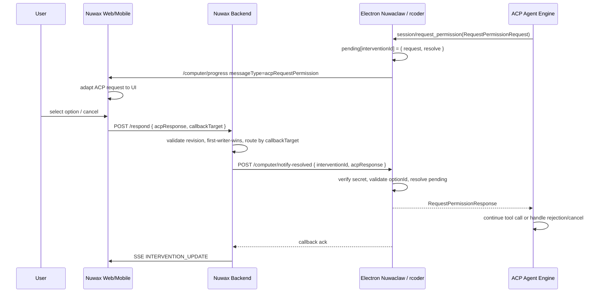

# ACP 模式切换 + 权限审批/Ask 表单 —— 多端落地实施方案 v3

| 项 | 内容 |
|---|---|
| 状态 | **v3 新权威草案**,基于 v2 grill 结论新建 |
| 版本 | v3(2026-05-13) |
| 覆盖仓库 | A: `crates/agent-electron-client/`(Electron 客户端,本仓库)<br>B: `/projects/nuwax/`(Web 前端)<br>C: `/projects/nuwax-mobile/`(UniApp X 移动端)<br>D: rcoder(端云电脑 ACP Client,设计对齐,不在本仓库实施) |
| 取代 | `acp-mode-and-intervention-cross-end-v2.md` |
| 关联文档 | [`interaction-ui-schema-v1.md`](./interaction-ui-schema-v1.md)<br>[`acp-permission-approval-cross-end-v1.md`](./acp-permission-approval-cross-end-v1.md)<br>[`mcp-ask-question-acp-toolcall-v1.md`](./mcp-ask-question-acp-toolcall-v1.md) |

---

## 0. v3 核心修订

v3 保留 v2 的三端目标,但修正以下设计边界:

1. ACP mode 接入以 `session/configuration` 的 `configOptions` 为首选,`modes` 仅作为 fallback。
2. 删除 Electron 当前创建 ACP session 后无条件 `full-access` 的行为。
3. mode 不在 Electron/rcoder 本地持久化,由后端 chat 请求中的 `agent_config.agent_server.agent_mode` 驱动。
4. engine ID 收敛为 `claude-code | nuwaxcode | codex`;历史 `codex-cli` 只做兼容映射。
5. Approval request/response 严格走 ACP 官方 `schema/schema.json` 中的 `RequestPermissionRequest` / `RequestPermissionResponse` 定义。
6. Electron Nuwaclaw 与 rcoder 只做 ACP Client Host 与 pending 路由,不把 ACP permission 转成 Nuwaclaw UI schema。
7. ACP permission -> 数据驱动 UI schema 的适配放在 Nuwax Web / Nuwax Mobile 渲染会话交互组件时统一实现。
8. Agent mode 本期只提供 `ask` 与 `yolo`,暂不实现 `auto`。
9. 默认 mode 改为 `yolo`;`yolo` 按 `allow_always > allow_once > options[0]` 选择,但选到非 allow 时必须记录 warning。
10. Approval UI 不在 Electron/rcoder Host 内实现;用户响应根据 callbackTarget 回到触发 permission 的 Host。
11. Ask/question 不走 ACP permission;由 MCP ask server 触发,并通过 ACP `session/update` 的 `tool_call` / `tool_call_update` 标准事件下发。
12. callbackTarget/device routing 不进入 ACP 官方 request;它作为 `/computer/progress/{session_id}` 专门 message type 的路由元数据随 interaction envelope 传递。
13. approval ask 模式依赖 Backend/Web 或 Mobile 渲染链路;后端未就绪时只能 yolo 自动处理或 fail-safe cancelled。
14. `/computer/notify-resolved` 是 Electron/rcoder 新实现并暴露给后端的 HTTP internal callback,不是 IPC handler。
15. `deviceId` 只作客户端实例标识,不能作鉴权 secret;internal callback 另用 `internalSecret`。
16. Ask/question 的 pending/response 由 MCP ask server 单独实现;Nuwaclaw/rcoder ACP Host 只透传 ACP tool call / tool call update 进度,不拥有 question resolver。
17. `InteractionUISchema.version` 本期只用于 Nuwax Web/Mobile 渲染层的内部数据驱动 UI;未知版本降级 fallback。
18. `InteractionUISchema` 的唯一权威定义在 [`interaction-ui-schema-v1.md`](./interaction-ui-schema-v1.md);Approval 与 Ask 文档只引用,不重复定义。

---

## 1. 角色与边界

### 1.1 ACP Engines

本期只考虑三个 engine:

| Engine ID | 说明 |
|---|---|
| `claude-code` | Anthropic Claude Code ACP engine |
| `nuwaxcode` | OpenCode 变体 ACP engine |
| `codex` | Codex ACP engine |

Electron 现有代码中的 `codex-cli` 是历史实现名,新对外契约统一使用 `codex`。读取旧配置时必须兼容:

```ts
codex-cli -> codex
codex-acp -> codex
```

其他 legacy engine(`pi-agent` / `hermes-agent` / `kilo-cli` / `openclaw`)已从当前客户端代码中移除,不进入本方案。

### 1.2 ACP Client Hosts

Approval 的源头是 ACP Client Host 收到 engine 的 `session/request_permission`:

| Host | 实现 | 本期实施 |
|---|---|---|
| Electron | TypeScript | 是 |
| rcoder | Rust | 设计对齐,不在本仓库实施 |

Approval 回流必须回到触发它的 Host,不能写死 Electron。

Ask/question 的 pending owner 是 MCP ask server,不属于 ACP permission pending 管理。ACP Host 仍会把 Agent 产生的 ACP `session/update` 中 `tool_call` / `tool_call_update` 进度透传给 Web/Mobile。

---

## 2. Mode 语义与请求来源

### 2.1 两档客户端硬约定

| modeId | 行为 |
|---|---|
| `ask` | 所有 ACP `session/request_permission` 都进入 approval UI |
| `yolo` | 自动选择 `allow_always > allow_once > options[0]` |

默认 mode = `yolo`。

未知 mode fail-safe 降级为 `ask`。

### 2.2 请求字段

Nuwax / Nuwax Mobile 会话框架提供 mode 选择。用户选择后,通过后端 chat 接口下发到 `POST /computer/chat`,字段放在现有配置结构:

```ts
interface ComputerChatRequest {
  user_id: string;
  project_id?: string;
  prompt: string;
  session_id?: string;
  agent_config?: {
    agent_server?: {
      agent_mode?: "ask" | "yolo";
    };
  };
  // ...existing fields
}
```

字段路径固定为 `agent_config.agent_server.agent_mode`。

缺省规则:

- `agent_config.agent_server.agent_mode` 缺省:按 `"yolo"` 处理。
- `agent_config.agent_server.agent_mode` 非法:fail-safe 按 `"ask"` 处理,并记录 warning。

后端必须把 `agent_config.agent_server.agent_mode` 原样转发给 Electron Nuwaclaw 或 rcoder 的 `/computer/chat`。Electron/rcoder 不从本地 SQLite 读取 mode。

### 2.3 ACP mode 接入优先级

Electron/rcoder 收到 `/computer/chat` 请求后,在 prompt 派发前按 `request.agent_config?.agent_server?.agent_mode` 应用 mode。

ACP 新实现优先使用 `configOptions`;`modes` 是兼容 fallback:

1. `newSessionResult.configOptions` 中 mode 类 option。
2. `newSessionResult.modes`。
3. Host 内存中的 effective mode,仅用于本次 permission 分流。

本期 UI 与本地策略只接受 `ask/yolo`。如果 Agent 暴露 `auto` 或其他 mode:

- 不在 Web mode 选择器中展示为可选项。
- 若 Agent 当前 mode 为不支持值,客户端 effective mode 按未知 mode 处理,fail-safe 为 `ask`。
- 若 Agent 同时支持 `yolo`,Host 可在收到缺省 mode 请求时尝试切换到 `yolo`。

切换 mode 时:

1. 如果 session 有 mode config option,调用 ACP `session/set_config_option`。
2. 否则如果 session 有 `availableModes` 且包含目标 mode,调用 ACP `session/set_mode`。
3. 否则只更新 Host 内存 effective mode,用于 `handlePermissionRequest` 分流。

`session/update` 处理:

- `config_option_update`:刷新 mode config option 的 current value。
- `current_mode_update`:兼容读取 `modeId ?? currentModeId`。

### 2.4 删除隐藏 full-access

Electron 不再在 `createSession()` 后无条件调用:

```ts
session/set_mode { modeId: "full-access" }
```

`yolo` 的自动化由客户端 permission response 策略实现,不是通过强行把 Agent 切到 full access 实现。

---

## 3. Mode 不做本地持久化

本期不为 mode 新增 Electron/rcoder 本地 SQLite 表,也不在 settings 中保存默认 mode。

约束:

- mode 的来源是 `/computer/chat` 请求字段 `agent_config.agent_server.agent_mode`。
- Electron/rcoder 只在内存中记录当前 session/prompt 的 effective mode。
- 同一会话的后续请求可以携带不同 `agent_config.agent_server.agent_mode`,Host 必须在每次 prompt 前重新应用。
- 如果没有 `agent_config.agent_server.agent_mode`,Host 使用默认 `yolo`。
- 不创建或迁移任何 mode 数据表;旧实验数据即使存在也不读取。

---

## 4. 数据契约与适配边界

核心边界:ACP permission 不定义 Nuwaclaw 自有中间 schema。Electron Nuwaclaw 与 rcoder 收到 ACP `session/request_permission` 后,只把 ACP 官方 request 包进 intervention envelope 并保持原样路由;不在 Host 侧转换成 `InteractionUISchema`。

Approval 详细契约、Web/Mobile 适配、`/computer/notify-resolved` 回流和 Host 状态机单独维护在 [`acp-permission-approval-cross-end-v1.md`](./acp-permission-approval-cross-end-v1.md)。本节仅保留跨端摘要和关键类型摘录。

官方 schema 来源:

- <https://github.com/agentclientprotocol/agent-client-protocol/blob/main/schema/schema.json>
- 以该 `schema.json` 为唯一准绳;SDK 生成类型只作为实现侧引用,不得在 nuwaclaw/rcoder 内维护分叉定义。
- approval 相关定义:`RequestPermissionRequest`、`RequestPermissionResponse`、`PermissionOption`、`ToolCallUpdate`
- MCP ask 下发相关定义:`SessionNotification`、`SessionUpdate`、`ToolCall`、`ToolCallUpdate`,其中 `SessionUpdate.sessionUpdate` 使用官方 `tool_call` / `tool_call_update` discriminator

适配职责:

| 层 | 职责 |
|---|---|
| Electron Nuwaclaw ACP Host | 接收 ACP permission、挂起 pending、派发官方 `RequestPermissionRequest`、接收官方 `RequestPermissionResponse` 并 resolve |
| rcoder ACP Host | 同 Electron,但实现语言是 Rust |
| Nuwax Web | 通过现有 `/computer/progress/{session_id}` 进度流接收专门 message type,把 ACP permission request 适配成数据驱动 UI,并在 `/respond` 中回传 callbackTarget |
| Nuwax Mobile | 复用同一 ACP permission payload,适配成移动端数据驱动 UI |
| Backend | 接收 `/respond`,校验 callbackTarget 是否匹配 session/project,再回调对应 Host |

### 4.1 ACP 官方 permission 输入

以下 TypeScript 只是从官方 `schema.json` 对应定义整理出的阅读摘录,用于说明字段语义;实现必须引用/生成官方 schema 类型或按官方 schema 校验:

```ts
type PermissionOptionKind =
  | "allow_once"
  | "allow_always"
  | "reject_once"
  | "reject_always";

type ToolKind =
  | "read"
  | "edit"
  | "delete"
  | "move"
  | "search"
  | "execute"
  | "think"
  | "fetch"
  | "switch_mode"
  | "other";

interface PermissionOption {
  optionId: string;
  kind: PermissionOptionKind;
  name: string; // human-readable label
  _meta?: Record<string, unknown> | null;
}

interface RequestPermissionRequest {
  sessionId: string;
  toolCall: ToolCallUpdate;
  options: PermissionOption[];
  _meta?: Record<string, unknown> | null;
}

interface ToolCallUpdate {
  toolCallId: string;
  title?: string | null;
  kind?: ToolKind | null;
  rawInput?: unknown;
  rawOutput?: unknown;
  locations?: Array<{ path: string; line?: number | null }> | null;
  content?: unknown[] | null;
  status?: "pending" | "in_progress" | "completed" | "failed" | null;
}

type RequestPermissionOutcome =
  | {
      outcome: "selected";
      optionId: string;
      _meta?: Record<string, unknown> | null;
    }
  | { outcome: "cancelled" };

interface RequestPermissionResponse {
  outcome: RequestPermissionOutcome;
  _meta?: Record<string, unknown> | null;
}
```

约束:

- ACP `PermissionOption.name` 是给用户看的 label。
- ACP `PermissionOption.optionId` 是唯一决策值。
- ACP `_meta` 是扩展保留字段,Nuwaclaw/rcoder 不依赖其语义。
- ACP `toolCall` 是 `ToolCallUpdate`,字段可能缺省;Web/Mobile 适配器负责渲染 fallback。

### 4.2 公开 InterventionRequest

公开 request 是进度流中的 interaction envelope,不是 UI schema。不要放 internal secret。Approval payload 必须保留 ACP 官方 request。

```ts
type InterventionKind = "approval" | "question";

type InterventionStatus =
  | "pending"
  | "approved"
  | "rejected"
  | "answered"
  | "cancelled"
  | "skipped"
  | "expired"
  | "superseded";

type AgentEngineId = "claude-code" | "nuwaxcode" | "codex";

interface BaseInterventionRequest {
  id: string;
  revision: number;
  kind: InterventionKind;
  status: InterventionStatus;
  sessionId: string; // Nuwaclaw app session id;若与 ACP sessionId 不同,由 Host 内部映射
  source: "acp_permission" | "mcp_ask";
  timeoutMs?: number;
  createdAt: number;
}

interface AcpPermissionInterventionRequest extends BaseInterventionRequest {
  kind: "approval";
  source: "acp_permission";
  engine: AgentEngineId;
  protocol: "acp";
  callbackTarget: {
    kind: "electron" | "rcoder";
    targetId: string;
  };
  schemaRef: "https://github.com/agentclientprotocol/agent-client-protocol/blob/main/schema/schema.json";
  acp: {
    method: "session/request_permission";
    request: RequestPermissionRequest;
  };
}

type InterventionRequest = AcpPermissionInterventionRequest;
```

说明:

- `InterventionRequest` 这里仅指 Host 通过 `/computer/progress/{session_id}` 主动投递的 approval intervention。
- Question 不定义新的 Host progress request envelope;它使用 ACP 官方 `SessionUpdate` 中的 `ToolCall` / `ToolCallUpdate`。
- Web/Mobile 可以在渲染层把 ask tool call 派生成内部 question view model,但该 view model 不进入 nuwaclaw/rcoder Host 协议。

构造规则:

```ts
function buildAcpPermissionInterventionRequest(args: {
  engine: AgentEngineId;
  appSessionId: string;
  acpRequest: RequestPermissionRequest;
  now?: number;
  timeoutMs?: number;
}): AcpPermissionInterventionRequest {
  return {
    id: createOpaqueInterventionId("acp"),
    revision: 1,
    kind: "approval",
    status: "pending",
    sessionId: args.appSessionId,
    source: "acp_permission",
    engine: args.engine,
    protocol: "acp",
    callbackTarget: buildCurrentHostCallbackTarget(),
    schemaRef: "https://github.com/agentclientprotocol/agent-client-protocol/blob/main/schema/schema.json",
    acp: {
      method: "session/request_permission",
      request: args.acpRequest,
    },
    timeoutMs: args.timeoutMs,
    createdAt: args.now ?? Date.now(),
  };
}
```

Host 侧禁止事项:

- 不生成 `InteractionUISchema`。
- 不把 `PermissionOption.name` 改名为 `label`。
- 不把 `ToolCallUpdate` 改成自定义 `toolCallView`。
- 不把 `optionId` 改成 `kind`。
- 不依赖 ACP `_meta` 的业务语义。

### 4.3 Nuwax Web/Mobile 渲染层适配

ACP permission -> 数据驱动 UI 的转换只在 Nuwax Web / Nuwax Mobile 渲染会话交互组件时做。

渲染层内部数据驱动 UI schema 的唯一权威定义见 [`interaction-ui-schema-v1.md`](./interaction-ui-schema-v1.md)。

```ts
function adaptAcpPermissionToInteractionUi(
  request: RequestPermissionRequest,
): InteractionUISchema {
  return {
    version: "nuwaclaw.interaction.v1",
    presentation: "inline",
    title: request.toolCall.title?.trim() || fallbackToolTitle(request.toolCall.kind),
    description: buildToolCallDescription(request.toolCall),
    schema: {
      type: "object",
      required: ["decision"],
      properties: {
        decision: {
          type: "string",
          oneOf: request.options.map((option) => ({
            const: option.optionId,
            title: option.name,
          })),
        },
        reason: { type: "string", maxLength: 500 },
      },
    },
    uiSchema: {
      decision: {
        "ui:widget": "approvalOptions",
        "ui:optionKinds": Object.fromEntries(
          request.options.map((option) => [option.optionId, option.kind]),
        ),
      },
      reason: {
        "ui:widget": "textarea",
        "ui:visibleWhen": {
          decisionKind: ["reject_once", "reject_always"],
        },
      },
    },
  };
}
```

适配规则:

- `decision.oneOf[].const` 必须是 ACP `PermissionOption.optionId`。
- 按钮文案来自 ACP `PermissionOption.name`。
- 按钮样式可由 ACP `PermissionOption.kind` 派生。
- reject reason 只用于 Nuwax UI/审计,不得写入 ACP `_meta.reason`。
- `request.toolCall.rawInput/content/locations` 的展示、折叠、脱敏和 fallback 是 Web/Mobile UI 责任。
- `InteractionUISchema` 是 Nuwax Web/Mobile 渲染层 schema,可用于表单、分步流程和交互式表格;ACP permission 适配器可只生成基础 approval form,MCP ask 工具可在 `ToolCall.rawInput.ui` 中携带更丰富的 schema。

### 4.4 InterventionResponse

Approval 响应也走 ACP 官方 response,外层只保留 intervention 路由字段。

```ts
type InterventionAction = "submit" | "cancel" | "skip" | "timeout";

type InterventionResponse =
  | {
      interventionId: string;
      revision: number;
      source: "acp_permission";
      protocol: "acp";
      action: InterventionAction;
      acpResponse: RequestPermissionResponse;
      uiAudit?: { reason?: string };
      receivedAt: number;
    }
  | {
      interventionId: string;
      revision: number;
      source: "mcp_ask";
      protocol: "mcp";
      action: InterventionAction;
      formData?: Record<string, unknown>;
      receivedAt: number;
    };
```

Approval response 构造规则:

```ts
function buildAcpPermissionResponseFromUi(args: {
  request: RequestPermissionRequest;
  action: InterventionAction;
  decision?: string;
}): RequestPermissionResponse {
  if (args.action !== "submit") {
    return { outcome: { outcome: "cancelled" } };
  }

  const option = args.request.options.find((item) => item.optionId === args.decision);
  if (!option) {
    return { outcome: { outcome: "cancelled" } };
  }

  return { outcome: { outcome: "selected", optionId: option.optionId } };
}
```

注意:

- 选 `reject_once/reject_always` 也返回 ACP `selected optionId`,不是 `cancelled`。
- `cancel/skip/timeout/session cancel` 才返回 ACP `cancelled`。
- `action=submit` 不等于 approved;最终 UI status 由选中 option 的 `kind` 决定。
- Host 收到 `acpResponse` 后只校验 `optionId` 是否属于 pending request options,然后 resolve ACP pending。
- revision mismatch 时不调用 ACP pending resolve,返回 `superseded` 给响应方。

### 4.5 Ask/question 数据契约

Ask/question 是 MCP 独立能力,不经过 ACP `session/request_permission`,也不回 `/computer/notify-resolved`。

详细契约见 [`mcp-ask-question-acp-toolcall-v1.md`](./mcp-ask-question-acp-toolcall-v1.md)。

- MCP ask server 负责 pending、timeout、tool result。
- Agent 调用 MCP ask 工具时,ACP 侧按官方 `session/update` 发送 `tool_call`;后续状态按 `tool_call_update` 更新。
- `/computer/progress/{session_id}` 只透传现有 `agentSessionUpdate`,其中 `data` 是 ACP 官方 `ToolCall` / `ToolCallUpdate` 加 `sessionUpdate` discriminator。
- Backend/Web/Mobile 从 ask tool call 的 `rawInput.ui` 读取 `InteractionUISchema`,处理 form response。
- Electron Nuwaclaw / rcoder 不创建、不转换、不 resolve ask/question。

---

## 5. Progress Message 投递

ACP permission 不新增 `POST /dispatch`。它复用现有客户端进度流:

Approval progress 的完整 envelope 见 [`acp-permission-approval-cross-end-v1.md`](./acp-permission-approval-cross-end-v1.md)。

```http
GET /computer/progress/{session_id}
```

Host 在收到 ACP `session/request_permission` 后,向该 session 的 progress stream 推一个专门 message type。消息仍沿用现有 `UnifiedSessionMessage` 外壳,`data` 内承载 `AcpPermissionInterventionRequest`。

```ts
interface UnifiedSessionMessage {
  sessionId: string;
  acpSessionId?: string;
  messageType:
    | "sessionPromptStart"
    | "sessionPromptEnd"
    | "agentSessionUpdate"
    | "heartbeat"
    | "acpRequestPermission";
  subType: string;
  data: unknown;
  timestamp: string;
}

interface AcpRequestPermissionProgressMessage extends UnifiedSessionMessage {
  messageType: "acpRequestPermission";
  subType: "session/request_permission";
  data: AcpPermissionInterventionRequest;
}
```

ACP 标准 `session/update` 继续使用现有 `agentSessionUpdate`:

```ts
interface AgentSessionUpdateProgressMessage extends UnifiedSessionMessage {
  messageType: "agentSessionUpdate";
  subType: SessionUpdate["sessionUpdate"];
  data: SessionUpdate;
}
```

Ask/question 复用该 `agentSessionUpdate` 外壳,并只识别 `subType="tool_call"` / `subType="tool_call_update"`。不得再新增 `mcpAskQuestion` 或 `mcpAskQuestionUpdate` message type。

投递规则:

1. Electron Nuwaclaw/rcoder Host 生成 `AcpPermissionInterventionRequest`。
2. Host 本地保存 `pendingPermissions[interventionId] = { acpRequest, resolve, timer }`。
3. Host 通过 `/computer/progress/{session_id}` 推送 `messageType="acpRequestPermission"`。
4. Nuwax Web / Nuwax Mobile 收到后读取 `data.acp.request`,按 ACP 官方 schema 渲染 approval。
5. `callbackTarget` 保留在 `data.callbackTarget` 中,只用于响应回流路由;不属于 ACP 官方 request,也不是鉴权 secret。

Host 本地必须保留 `interventionId -> ACP pending permission` 映射。Web/Mobile/Backend 不需要理解 ACP connection 内部 resolver。

---

## 6. Approval 映射

Approval 渲染与数据驱动 UI 适配只属于 Nuwax Web / Nuwax Mobile:

完整适配规则见 [`acp-permission-approval-cross-end-v1.md`](./acp-permission-approval-cross-end-v1.md)。

- 输入是 `AcpPermissionInterventionRequest.acp.request`。
- `ApprovalDecisionForm` 可以作为 Web/Mobile 内部组件,但不要求 Electron/rcoder 生成其 props。
- 按 `request.options[].kind` 控制按钮样式。
- 按 `request.options[].name` 显示按钮文案。
- 提交时生成 ACP `RequestPermissionResponse`,其中 selected 值必须是 `optionId`。

`SchemaForm` 可作为 Web/Mobile 内部 fallback,但 ACP Host 不感知。

---

## 7. Permission 自动策略

### 7.1 strict guard

本期 Electron proactive strict guard 只承诺 `nuwaxcode` strict sandbox 路径。它独立于 mode:

- blocked:直接 ACP `cancelled`。
- strict write request:即使 `yolo` 也进入 approval UI。

Claude Code / Codex 的 sandbox enforcement 由各自 engine/sandbox 机制保证,不把 nuwaxcode proactive guard 承诺泛化到所有 engine。

### 7.2 yolo

```ts
const selected =
  options.find(o => o.kind === "allow_always") ||
  options.find(o => o.kind === "allow_once") ||
  options[0];
```

如果 fallback 选到非 allow option,必须记录 warning/telemetry。

---

## 8. Intervention Service 架构

抽象基类只管 pending 生命周期,不理解 ACP/MCP 协议:

```ts
abstract class BaseInterventionService<
  TRequest extends { id: string; revision: number; sessionId: string; timeoutMs?: number },
  TResponse extends { interventionId: string; revision: number; action: string; receivedAt: number }
> extends EventEmitter {
  protected pending: Map<string, PendingEntry<TRequest, TResponse>>;
  registerDelivery(delivery: InterventionDelivery<TRequest, TResponse>): void;
  create(req: TRequest): Promise<TResponse>;
  respond(payload: TResponse, channel: string): RespondResult;
  cancelBySession(sessionId: string): void;

  protected abstract buildTimeoutResponse(req: TRequest): TResponse;
  protected abstract buildCancelResponse(req: TRequest): TResponse;
  protected abstract isTerminalAction(action: string): boolean;
}
```

本期:

```ts
type AcpPermissionInterventionResponse = Extract<
  InterventionResponse,
  { source: "acp_permission" }
>;

class ApprovalInterventionService
  extends BaseInterventionService<
    AcpPermissionInterventionRequest,
    AcpPermissionInterventionResponse
  > {
  resolveAcpResponse(resp: AcpPermissionInterventionResponse): RequestPermissionResponse;
}
```

`ApprovalInterventionService` 只校验并转交 Web/Mobile 回传的 ACP `RequestPermissionResponse`,不生成 UI schema。

Delivery 用 interface,不做复杂继承:

```ts
interface InterventionDelivery<TRequest, TResponse> {
  name: string;
  deliver(req: TRequest): Promise<void>;
  notifyResolved(payload: TResponse, resolvedBy: string): Promise<void>;
}
```

旧 `pendingPermissions/respondPermission` 只保留 legacy 兼容,新 UI 不使用它。

---

## 9. Electron 实施要点

### 9.1 关键文件

| 操作 | 路径 |
|---|---|
| 新增 | `src/shared/types/acpMode.ts` |
| 新增 | `src/shared/types/intervention.ts` |
| 修改 | `src/shared/types/computerTypes.ts` |
| 新增 | `src/main/services/intervention/baseInterventionService.ts` |
| 新增 | `src/main/services/intervention/approvalInterventionService.ts` |
| 新增 | `src/main/services/intervention/interventionDelivery.ts` |
| 新增 | `src/main/services/intervention/buildAcpPermissionInterventionRequest.ts` |
| 修改 | `src/main/services/computerServer.ts` |
| 新增/修改 | `src/main/services/interventionHttpHandlers.ts` |
| 修改 | `src/main/services/engines/acp/acpEngine.ts` |
| 修改 | `src/main/services/engines/acp/acpClient.ts` |
| 修改 | `src/main/services/engines/unifiedAgent.ts` |
| 修改 | `src/main/ipc/agentHandlers.ts` |
| 修改 | `src/main/preload.ts` |
| 处置 | `src/renderer/components/modals/PermissionModal.tsx` 标 `@deprecated`,不删除 |

### 9.2 Chat request mode 字段

`ComputerChatRequest` 使用现有 `agent_config` 配置结构传 mode:

```ts
agent_config?: {
  agent_server?: {
    agent_mode?: "ask" | "yolo";
  };
};
```

`computerServer` 收到 `/computer/chat` 后:

1. 解析 `agent_config?.agent_server?.agent_mode`,缺省为 `yolo`。
2. 非法值按 `ask` 处理并记录 warning。
3. 将解析后的 effective mode 传给 `unifiedAgent` / `acpEngine`。
4. ACP session 创建或复用完成后,在发送 prompt 前调用 `applyModeForPrompt(sessionId, effectiveMode)`。
5. 将本次 request effective mode 记录在 Host 内存 session state,供后续 `session/request_permission` 分流。

不新增任何 mode 表,不读取 settings 默认 mode,也不从 renderer 查询 mode。

### 9.3 IPC/preload

本期 Electron renderer 不承担 approval 渲染职责。下面 API 仅作为 Host 本地调试/legacy 兼容入口,跨端主路径走 Backend/Web/Mobile:

```ts
intervention: {
  respond(payload: InterventionResponse): Promise<RespondResult>;
  cancel(interventionId: string): Promise<RespondResult>;
  onRequest(callback: (req: InterventionRequest) => void): () => void;
  onUpdated(callback: (event: InterventionUpdatedEvent) => void): () => void;
}
```

内部 channel:

- `intervention:request`
- `intervention:updated`

### 9.4 本地 UI 与 settings 边界

Electron renderer 不新增本地 mode 切换组件,Settings 不新增 mode 默认值入口。

mode 的交互入口在 Nuwax / Nuwax Mobile 会话框架。Electron 仅作为 ACP Client Host 执行后端转发来的 `agent_config.agent_server.agent_mode`:

- Electron renderer 不把 ACP permission 转成 `InteractionUISchema`。
- approval UI 由 Nuwax Web / Nuwax Mobile 渲染。
- Settings 可继续保存 internal callback 所需的 `intervention.internalSecret`,但不保存 mode。

### 9.5 `/computer/notify-resolved` 落地实现

Nuwaclaw 客户端实现该 callback 的最小改造点:

完整 callback 契约、状态码、Host pending 状态机见 [`acp-permission-approval-cross-end-v1.md`](./acp-permission-approval-cross-end-v1.md)。

| 文件 | 改造 |
|---|---|
| `src/shared/types/intervention.ts` | 定义 `AcpPermissionInterventionRequest`、`NotifyResolvedRequest`、`NotifyResolvedResponse` |
| `src/shared/types/computerTypes.ts` | `UnifiedSessionMessage.messageType` 增加 `"acpRequestPermission"` |
| `src/main/services/engines/acp/acpEngine.ts` | `handlePermissionRequest()` 在 ask 模式创建 pending 并等待 `/computer/notify-resolved` resolve |
| `src/main/services/computerServer.ts` | 新增 `POST /computer/notify-resolved` 路由 |
| `src/main/services/intervention/approvalInterventionService.ts` | 可选:封装 pending 状态机;也可第一期直接落在 `AcpEngine` |

`pendingPermissions` 需要从当前 legacy 形态扩展为 intervention 维度:

```ts
interface PendingAcpPermission {
  interventionId: string;
  revision: number;
  acpSessionId: string;
  appSessionId: string;
  request: RequestPermissionRequest;
  options: PermissionOption[];
  status: "pending" | "resolved" | "cancelled" | "expired";
  resolvedResponse?: RequestPermissionResponse;
  resolve: (response: RequestPermissionResponse) => void;
  timer?: NodeJS.Timeout;
  createdAt: number;
}

private pendingPermissions = new Map<string, PendingAcpPermission>();
```

`handlePermissionRequest()` ask 模式主流程:

```ts
private async handlePermissionRequest(
  acpRequest: RequestPermissionRequest,
): Promise<RequestPermissionResponse> {
  const effectiveMode = this.getEffectiveMode(acpRequest.sessionId);

  if (effectiveMode === "yolo") {
    return this.buildYoloPermissionResponse(acpRequest);
  }

  const intervention = buildAcpPermissionInterventionRequest({
    engine: this.engineName,
    appSessionId: this.toAppSessionId(acpRequest.sessionId),
    acpRequest,
    timeoutMs: DEFAULT_PERMISSION_TIMEOUT_MS,
  });

  return await new Promise<RequestPermissionResponse>((resolve) => {
    const timer = setTimeout(() => {
      this.resolvePendingPermission(intervention.id, {
        outcome: { outcome: "cancelled" },
      }, "timeout");
    }, intervention.timeoutMs);

    this.pendingPermissions.set(intervention.id, {
      interventionId: intervention.id,
      revision: intervention.revision,
      acpSessionId: acpRequest.sessionId,
      appSessionId: intervention.sessionId,
      request: acpRequest,
      options: acpRequest.options,
      status: "pending",
      resolve,
      timer,
      createdAt: Date.now(),
    });

    this.emit("computer:progress", {
      sessionId: intervention.sessionId,
      acpSessionId: acpRequest.sessionId,
      messageType: "acpRequestPermission",
      subType: "session/request_permission",
      data: intervention,
      timestamp: new Date().toISOString(),
    } satisfies AcpRequestPermissionProgressMessage);
  });
}
```

`AcpEngine` 暴露给 `computerServer` 的 resolver:

```ts
resolvePermissionIntervention(
  payload: NotifyResolvedRequest,
): NotifyResolvedResponse {
  const pending = this.pendingPermissions.get(payload.interventionId);
  if (!pending) {
    return { ok: false, hostStatus: "gone", error: { code: "not_found", message: "pending permission not found" } };
  }

  if (pending.revision !== payload.revision) {
    return { ok: false, hostStatus: "superseded", error: { code: "revision_mismatch", message: "revision mismatch" } };
  }

  if (pending.status !== "pending") {
    if (sameAcpResponse(pending.resolvedResponse, payload.acpResponse)) {
      return { ok: true, hostStatus: "already_resolved" };
    }
    return {
      ok: false,
      error: { code: "already_resolved_conflict", message: "permission already resolved with different response" },
    };
  }

  if (!isValidAcpPermissionResponse(payload.acpResponse, pending.options)) {
    return { ok: false, error: { code: "invalid_acp_response", message: "invalid ACP permission response" } };
  }

  pending.status = "resolved";
  pending.resolvedResponse = payload.acpResponse;
  if (pending.timer) clearTimeout(pending.timer);
  this.pendingPermissions.delete(payload.interventionId);
  pending.resolve(payload.acpResponse);

  return { ok: true, hostStatus: "resolved" };
}
```

`isValidAcpPermissionResponse()` 只做 ACP 官方 response 校验:

```ts
function isValidAcpPermissionResponse(
  response: RequestPermissionResponse,
  options: PermissionOption[],
): boolean {
  if (response.outcome.outcome === "cancelled") return true;
  if (response.outcome.outcome !== "selected") return false;
  return options.some((option) => option.optionId === response.outcome.optionId);
}
```

`computerServer.ts` 新增 route:

```ts
if (pathname === "/computer/notify-resolved" && method === "POST") {
  const auth = verifyInternalCallback(req);
  if (!auth.ok) {
    sendJson(res, 401, { ok: false, error: { code: "unauthorized", message: "invalid internal secret" } });
    return;
  }

  const body = await parseJsonBody<NotifyResolvedRequest>(req);
  const validation = validateNotifyResolvedRequest(body);
  if (!validation.ok) {
    sendJson(res, 400, { ok: false, error: { code: "invalid_acp_response", message: validation.message } });
    return;
  }

  const acpEngine = agentService.getAcpEngine();
  if (!acpEngine) {
    sendJson(res, 404, { ok: false, hostStatus: "gone", error: { code: "not_found", message: "ACP engine not running" } });
    return;
  }

  const result = acpEngine.resolvePermissionIntervention(body);
  sendJson(res, statusFromNotifyResolvedResult(result), result);
  return;
}
```

实现注意:

- `interventionId` 必须使用 opaque id,不要让外部可从中推断 ACP session/tool call。
- `callbackTarget.targetId` 与 `X-Nuwax-Device-Id` 的关系由 Backend 路由层校验;Host 仍必须校验 internal secret。
- `resolvePermissionIntervention()` 必须同步地只 resolve 一次 Promise。
- timeout/session cancel 发生时,Host 应先 resolve ACP `cancelled`,再把 pending 标记为 terminal。
- 日志中不要打印完整 `internalSecret`、完整 `rawInput` 或敏感 env。
- rcoder 可按同一状态机实现:Rust 侧用 `HashMap<InterventionId, PendingPermission>` 保存 oneshot sender,HTTP `/computer/notify-resolved` 收到后校验并向 sender 发送 `RequestPermissionResponse`。

---

## 10. Remote Delivery 与后端

Approval remote delivery 的端到端细节见 [`acp-permission-approval-cross-end-v1.md`](./acp-permission-approval-cross-end-v1.md)。本节保留主链路和跨端 endpoint 摘要。

### 10.1 分阶段发布

阶段 1:Host 与后端闭环

- Electron/rcoder Host 通过现有 `/computer/progress/{session_id}` 推送 `messageType="acpRequestPermission"`。
- 进度消息 `data` 携带 `AcpPermissionInterventionRequest`,其中 approval payload 是 ACP 官方 `RequestPermissionRequest`。
- Nuwax Web 完成 approval 渲染适配并回传 ACP `RequestPermissionResponse`。
- `yolo` 可继续在 Host 内自动选择,不依赖 UI。

阶段 2:Mobile 与多端竞态

- Nuwax Mobile 复用同一 ACP permission payload 适配规则。
- 后端实现多端 response 去重、revision 检查和 `INTERVENTION_UPDATE`。

progress 投递失败时:

- `yolo`:Host 可继续按自动策略选择。
- `ask`:Host 必须 fail-safe 返回 ACP `cancelled`,并记录错误;不在 Electron/rcoder 内临时生成 UI schema。

### 10.2 通道与 endpoint

| 通道 / Endpoint | 方向 | 说明 |
|---|---|---|
| `GET /computer/progress/{session_id}` | Host -> Nuwax Web/Mobile | 现有进度流;approval 新增 `acpRequestPermission`;question 复用现有 `agentSessionUpdate` 中的 ACP `tool_call` / `tool_call_update` |
| `POST /api/agent-interventions/:interventionId/respond` | Web/Mobile -> Backend | 用户响应 |
| `POST /computer/notify-resolved` | Backend -> ACP Host | approval 响应回流,`interventionId` 在 body 中 |
| `POST /api/internal/agent-interventions/:interventionId/notify-update` | ACP Host -> Backend | Host timeout/cancel 后通知其他端卡片失效 |

不新增 `POST /api/internal/agent-interventions/dispatch`。Electron/rcoder 的 `/computer/notify-resolved` 挂在各自 HTTP 服务,不是 IPC handler。

### 10.3 deviceId 与 internalSecret

`deviceId` 只用于标识客户端实例,不能作为 secret。

Electron 首次启动生成 `intervention.internalSecret`,存 SQLite settings:

- 32 字节随机值。
- base64url 编码。
- 不打印完整值。

注册/心跳上报:

```json
{
  "deviceId": "...",
  "interventionInternalSecret": "..."
}
```

后端回调 header:

- `X-Nuwax-Device-Id: <deviceId>`
- `X-Nuwax-Internal-Secret: <secret>`

Electron 校验 secret。deviceId 只用于路由和日志。

### 10.4 用户授权后的响应回流

用户在 Nuwax Web 或 Nuwax Mobile 完成 approval 操作后,响应必须回到最初触发 `session/request_permission` 的 ACP Client Host。这个 Host 可能是 Electron Nuwaclaw,也可能是 rcoder。

端到端流程:



Web/Mobile 提交:

```ts
interface AgentInterventionRespondRequest {
  interventionId: string;
  revision: number;
  source: "acp_permission";
  protocol: "acp";
  callbackTarget: {
    kind: "electron" | "rcoder";
    targetId: string;
  };
  action: InterventionAction;
  acpResponse: RequestPermissionResponse;
  uiAudit?: {
    reason?: string;
  };
}
```

Web/Mobile 规则:

1. 用户选择任意 ACP option 时,`acpResponse = { outcome: { outcome: "selected", optionId } }`。
2. `optionId` 必须来自当前 `RequestPermissionRequest.options`。
3. 用户取消、跳过、超时,统一构造 `acpResponse = { outcome: { outcome: "cancelled" } }`。
4. `uiAudit.reason` 只用于产品审计,不写入 ACP `_meta`。
5. Web/Mobile 可以携带 progress message 中的 `callbackTarget` 回传给 Backend,但不得直接调用 Host callback。
6. Web/Mobile 不知道 `internalSecret`、Host 地址。

Backend `/respond` 处理:

1. 校验用户有权限操作该 intervention 所属 session/project。
2. 校验 `interventionId` 存在、`revision` 匹配、状态仍为 `pending`。
3. 对 selected response 的 `acpResponse.outcome.optionId` 做白名单校验:必须存在于保存的 `request.acp.request.options`。
4. 校验 `callbackTarget` 是该 session/project 当前允许的 Host target;`callbackTarget` 只是路由 hint,不是用户可随意指定的信任凭据。
5. 在事务内写入 terminal 状态、`resolvedBy`、`resolvedAt`、`acpResponse`。
6. first-writer-wins:并发响应只有第一个生效,后续响应返回 `superseded` 或当前 terminal 状态。
7. 使用校验后的 `callbackTarget` 调用对应 Host 的 `/computer/notify-resolved`。
8. 向所有在线 Web/Mobile 发送 `INTERVENTION_UPDATE`,禁用卡片并显示处理人。

Backend -> Host callback:

```http
POST /computer/notify-resolved
Content-Type: application/json
X-Nuwax-Device-Id: <deviceId>
X-Nuwax-Internal-Secret: <secret>
```

该 endpoint 是 nuwaclaw/rcoder 新增的 Host internal callback。`interventionId` 放 body,不放 path。

```ts
interface NotifyResolvedRequest {
  interventionId: string;
  revision: number;
  source: "acp_permission";
  protocol: "acp";
  action: InterventionAction;
  acpResponse: RequestPermissionResponse;
  resolvedBy: {
    kind: "web" | "mobile";
    userId?: string;
    clientId?: string;
  };
  resolvedAt: number;
}

type NotifyResolvedHostStatus =
  | "resolved"
  | "already_resolved"
  | "superseded"
  | "gone";

type NotifyResolvedErrorCode =
  | "unauthorized"
  | "forbidden_target"
  | "not_found"
  | "revision_mismatch"
  | "invalid_acp_response"
  | "already_resolved_conflict"
  | "internal_error";

interface NotifyResolvedResponse {
  ok: boolean;
  hostStatus?: NotifyResolvedHostStatus;
  error?: {
    code: NotifyResolvedErrorCode;
    message: string;
  };
}
```

body 示例:

```json
{
  "interventionId": "itv_01H...",
  "revision": 1,
  "source": "acp_permission",
  "protocol": "acp",
  "action": "submit",
  "acpResponse": {
    "outcome": {
      "outcome": "selected",
      "optionId": "allow_once"
    }
  },
  "resolvedBy": {
    "kind": "web",
    "userId": "u_123",
    "clientId": "web_abc"
  },
  "resolvedAt": 1760000000000
}
```

HTTP status:

| 状态码 | 场景 |
|---|---|
| `200` | resolved 或 already_resolved |
| `202` | Host 已接受但异步 resolve,通常不需要;能同步 resolve 时优先 `200` |
| `400` | body 非法、source/protocol 非 approval、ACP response 非法 |
| `401` | internal secret 校验失败 |
| `403` | deviceId/target 与当前 Host 不匹配 |
| `404` | 找不到 pending 且无法确认已处理 |
| `409` | revision mismatch 或同 intervention 已被不同 response resolve |
| `410` | pending 已超时/取消/gone |
| `500` | Host 内部错误 |

路由规则:

| callbackTarget.kind | 处理方 | 回调落点 |
|---|---|---|
| `electron` | Electron Nuwaclaw | 当前在线 device/computer 的 `computerServer` internal HTTP endpoint |
| `rcoder` | rcoder | rcoder 暴露的 internal HTTP endpoint |

Host `/computer/notify-resolved` 处理:

1. 校验 `X-Nuwax-Device-Id` 与 `X-Nuwax-Internal-Secret`;若 Host 是 rcoder,校验等价的 rcoder target identity 与 secret。
2. 查找本地 `pendingPermissions.get(interventionId)`。
3. 校验 `revision` 与 pending request 一致。
4. 如果 `acpResponse.outcome.outcome === "selected"`,校验 `optionId` 属于原始 ACP `RequestPermissionRequest.options`。
5. 调用 pending resolver,把 `RequestPermissionResponse` 返回给 ACP connection。
6. 删除 pending entry,停止 timeout timer,标记 terminal。
7. 返回 callback ack。

Host 运行语义:

- `allow_once/allow_always` 对应的 `selected optionId`:Agent engine 收到 ACP selected response 后继续执行对应工具调用。
- `reject_once/reject_always` 对应的 `selected optionId`:Agent engine 收到 ACP selected response,由 engine 按该 reject option 阻断或调整工具调用。
- `cancelled`:Agent engine 收到 ACP cancelled response,按 ACP cancellation/permission denied 语义处理当前 permission request。

幂等与失败处理:

- Host 收到同一个 `interventionId + revision` 的相同 callback,返回 `already_resolved`。
- Host 已 resolved 但收到不同 `acpResponse`,返回 conflict,不得二次 resolve ACP pending。
- Backend 调 Host 超时或网络失败时,保留 callback pending 标记并按退避策略重试。
- Host pending 已不存在时,返回 `already_resolved` 或 `gone`;Backend 不得重新打开用户卡片,只记录审计。
- Host 侧 permission timeout 先发生时,Host 自行 resolve ACP `cancelled`,并通过 `notify-update` 告知 Backend/Web/Mobile 卡片失效。

---

## 11. Ask / Question

Ask/question 相对独立,详细实施方案单独维护在:

- [`mcp-ask-question-acp-toolcall-v1.md`](./mcp-ask-question-acp-toolcall-v1.md)

主文档只保留跨端集成约束:

- Ask/question 不走 ACP `session/request_permission`,也不回 `/computer/notify-resolved`。
- Ask/question 由 MCP ask server 负责 pending、timeout、tool result。
- 下发复用 ACP 官方 `session/update` 中的 `tool_call` / `tool_call_update`,经现有 `/computer/progress/{session_id}` 包成 `messageType="agentSessionUpdate"`。
- MCP ask 工具可在 `ToolCall.rawInput` 中放自定义业务字段,包括 `rawInput.ui` 交互式 UI/表格 schema。
- Nuwaclaw/rcoder Host 只透传 ACP tool call progress,不创建 question pending,不转换 question UI schema,不 resolve question response。
- 禁止新增 `mcpAskQuestion` / `mcpAskQuestionUpdate` 自定义 progress message。

---

## 12. Web 实施要点

Nuwax / Nuwax Mobile 会话框架提供 `ask/yolo` mode 选择,默认 `yolo`。每次发送消息时,后端 chat 请求下发到 `/computer/chat` 时必须携带当前选择:

```json
{
  "prompt": "...",
  "session_id": "...",
  "agent_config": {
    "agent_server": {
      "agent_mode": "yolo"
    }
  }
}
```

Web 可以在自身产品层面记住用户上次选择,但 Electron/rcoder 不依赖本地数据库持久化 mode。

Web Chat 负责渲染会话交互消息:

- approval:处理 `/computer/progress/{session_id}` 中 `messageType="acpRequestPermission"` 的进度消息,读取 `data.acp.request`,按 ACP 官方 `RequestPermissionRequest` 适配成内部数据驱动 UI。
- approval response:按 [`acp-permission-approval-cross-end-v1.md`](./acp-permission-approval-cross-end-v1.md) 直接构造 ACP 官方 `RequestPermissionResponse` 并放入 `InterventionResponse.acpResponse`。
- question:按 [`mcp-ask-question-acp-toolcall-v1.md`](./mcp-ask-question-acp-toolcall-v1.md) 处理 `/computer/progress/{session_id}` 中的 `agentSessionUpdate/tool_call`,从 `data.rawInput.ui` 渲染表单、分步或交互式表格。
- question update:按 [`mcp-ask-question-acp-toolcall-v1.md`](./mcp-ask-question-acp-toolcall-v1.md) 处理 `agentSessionUpdate/tool_call_update`,用 `data.toolCallId` 更新或禁用卡片。
- status update 后禁用卡片并显示 resolvedBy。
- mode selector 只影响后续 chat 请求的 `agent_config.agent_server.agent_mode`,不直接调用 ACP。

progress message 的 `callbackTarget` 只作为回传 Backend 的路由 hint,Web/Mobile 不得直接调用 Host callback。

---

## 13. Mobile 实施要点

### 13.1 capability

新版移动端 SSE 连接上报 capability:

```json
{
  "supportsIntervention": true,
  "interventionSchemaVersion": "nuwaclaw.interaction.v1",
  "mobileInterventionLevel": "M2"
}
```

后端策略:

- 支持 intervention:approval 推 `acpRequestPermission`;question 复用 ACP `agentSessionUpdate/tool_call` 与 `agentSessionUpdate/tool_call_update`。
- 不支持/未知:推普通 `MESSAGE fallback + webUrl`。
- 过渡期双推时,移动端必须按 `intervention.id` 去重。

### 13.2 M0/M1/M2

| 阶段 | 能力 |
|---|---|
| M0 | fallback MESSAGE + webUrl,未知 SSE event 安全忽略 |
| M1 | 按 ACP `RequestPermissionRequest.options` 渲染四种 option kind 按钮,回 ACP `RequestPermissionResponse` |
| M2 | question drawer:单选/多选/短文本 |

复杂 schema 或未知 version:显示 fallback + webUrl。

---

## 14. rcoder 对齐

rcoder 是独立 ACP Client Host,不实施在本仓库,但必须遵守:

| 维度 | 共识 |
|---|---|
| Mode | 每次请求读取 `agent_config.agent_server.agent_mode`,缺省 `yolo`,不本地持久化,configOptions 优先,modes fallback |
| Approval | 透传 ACP 官方 `RequestPermissionRequest` / `RequestPermissionResponse`,不做 UI schema 适配;细节见 [`acp-permission-approval-cross-end-v1.md`](./acp-permission-approval-cross-end-v1.md) |
| callbackTarget | progress message 中标识 `kind="rcoder"` 与 rcoder target id |
| Ask | 走 MCP ask server,pending/response 与 rcoder ACP Host 无关;下发复用 `/computer/progress/{session_id}` 中现有 `agentSessionUpdate` 的 ACP `tool_call` / `tool_call_update`;细节见 [`mcp-ask-question-acp-toolcall-v1.md`](./mcp-ask-question-acp-toolcall-v1.md) |
| 数据契约 | 公开 `InterventionRequest` envelope 对齐,approval payload 是 ACP 官方 schema |
| 自动策略 | yolo 与本方案一致 |

---

## 15. 验收重点

### Electron

- 默认 mode 为 `yolo`。
- `/computer/chat` 接收 `agent_config.agent_server.agent_mode?: "ask" | "yolo"`。
- 缺省 `agent_config.agent_server.agent_mode` 按 `yolo` 处理,非法显式值 fail-safe 为 `ask`。
- 同一 session 不同请求可携带不同 mode,每次 prompt 前重新应用。
- mode 不写入 Electron SQLite/settings,也不需要 mode 迁移。
- 不再无条件 set `full-access`。
- `configOptions` mode 优先于 `modes`。
- yolo 非 allow fallback 记录 warning。
- approval progress message 携带 ACP 官方 `RequestPermissionRequest`,不生成 `InteractionUISchema`。
- approval response 接收 ACP 官方 `RequestPermissionResponse`。
- `/computer/notify-resolved` 根据 body 中的 `interventionId + revision` 找到 pending ACP permission 并 resolve。
- selected `optionId` 不属于原始 request options 时拒绝 callback,不 resolve pending。
- reject option 以 ACP `selected optionId` 返回。
- cancel/skip/timeout/session cancel 以 ACP `cancelled` 返回。
- ask/question 不进入 Electron ACP Host。
- `/computer/notify-resolved` HTTP callback 校验 internalSecret。

### Web

- 收 `/computer/progress/{session_id}` 的 `messageType="acpRequestPermission"` 后插入 approval 卡片。
- Approval 渲染层按 [`acp-permission-approval-cross-end-v1.md`](./acp-permission-approval-cross-end-v1.md) 把 ACP `RequestPermissionRequest` 适配成数据驱动 UI。
- Approval 响应层负责生成 ACP `RequestPermissionResponse`。
- Web/Mobile 只 POST Backend `/respond`,不直接调用 Electron/rcoder callback。
- Question 按 [`mcp-ask-question-acp-toolcall-v1.md`](./mcp-ask-question-acp-toolcall-v1.md) 从 `agentSessionUpdate/tool_call` 读取 `data.rawInput.ui`。
- Question 状态从 `agentSessionUpdate/tool_call_update` 按 `toolCallId` 更新,terminal 后卡片禁用并显示处理人。
- 不展示 internal callback target。
- 会话输入框提供 `ask/yolo` selector,默认 `yolo`。
- 每次发送 chat 请求经后端下发 `agent_config.agent_server.agent_mode`。

### Mobile

- unknown SSE event 不崩溃。
- capability 上报。
- M1 approval 从 ACP `RequestPermissionRequest.options` 渲染并回 ACP `RequestPermissionResponse`。
- M2 question 按 [`mcp-ask-question-acp-toolcall-v1.md`](./mcp-ask-question-acp-toolcall-v1.md) 渲染 `agentSessionUpdate/tool_call`,并通过 `tool_call_update` 更新状态,子集可操作。
- 复杂/未知 schema fallback webUrl。
- 不提供 mode 切换。

### 跨端

- 同一 intervention 只接受一次有效响应。
- revision mismatch 返回 superseded。
- approval 根据 callbackTarget 回到 Electron 或 rcoder,Host resolve ACP pending 后 Agent 才继续。
- callback 重试必须幂等,不得二次 resolve 同一 ACP pending。
- ask/question 根据 source 回 MCP ask server,不回 Electron/rcoder ACP Host。

---

## 16. 推荐交付顺序

1. A1:类型、engine ID 收敛、`ComputerChatRequest.agent_config.agent_server.agent_mode` 字段。
2. A2:`/computer/chat` mode 解析与转发,ACP configOptions/modes mode 接入,删除 full-access。
3. A3:按 [`acp-permission-approval-cross-end-v1.md`](./acp-permission-approval-cross-end-v1.md) 实现 BaseInterventionService + ApprovalInterventionService + ACP 官方 request/response passthrough。
4. A4:按 [`acp-permission-approval-cross-end-v1.md`](./acp-permission-approval-cross-end-v1.md) 实现 computerServer internal callback + internalSecret。
5. 后端:按 [`acp-permission-approval-cross-end-v1.md`](./acp-permission-approval-cross-end-v1.md) 实现 respond/notify/update + callbackTarget 路由校验。
6. MCP ask server + Backend:按 [`mcp-ask-question-acp-toolcall-v1.md`](./mcp-ask-question-acp-toolcall-v1.md) 实现 ask pending、rawInput UI schema、tool result。
7. Web/Mobile:Chat mode selector + `agent_config.agent_server.agent_mode` 请求字段 + ACP approval adapter + InterventionCard + response API。
8. Mobile:M0/M1/M2 + ACP approval adapter + capability。
9. rcoder:按本方案对齐 callbackTarget 与 mode/ACP permission passthrough 行为。
