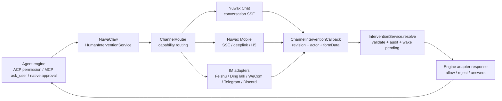
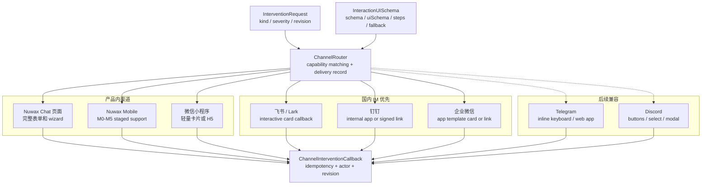
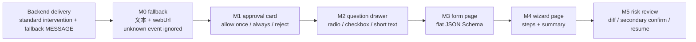
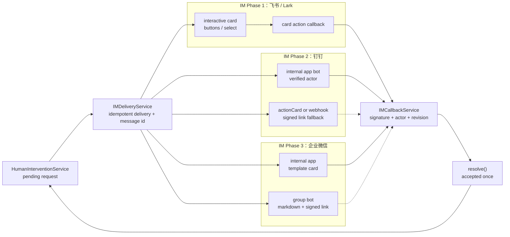
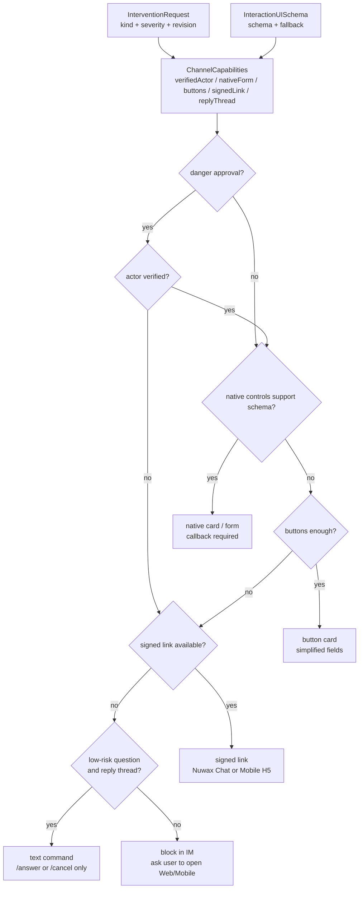

# 人类介入多端调用与降级方案

本文是《通用智能体 ACP 架构：Hooks 与人类介入支持方案》的配套调用文档，聚焦三类入口：

1. Web Chat 页面：`/Users/apple/workspace/nuwax` 的 Chat 页面（`src/pages/Chat/`）
2. 移动端会话：`/Users/apple/workspace/nuwax-mobile`
3. IM 远程调用：国内 IM 优先，先飞书、钉钉、企业微信，再兼容 Telegram、Discord

核心原则：NuwaClaw 后端只产出标准化 `InterventionRequest + InteractionUISchema`，各端按能力渲染。平台能力不足时必须可降级，不能因为某个 IM 或移动端不支持复杂表单而阻塞 agent。

## 1. 统一调用链路



所有渠道回调都归一成一个响应：

```ts
interface ChannelInterventionCallback {
  interventionId: string;
  revision: number;
  channel: "nuwax-web" | "nuwax-mobile" | "feishu" | "dingtalk" | "wecom" | "telegram" | "discord";
  actor: {
    platformUserId: string;
    displayName?: string;
    tenantId?: string;
  };
  action: "submit" | "cancel" | "timeout";
  formData?: Record<string, unknown>;
  rawEvent?: unknown;
  receivedAt: number;
}
```

### 1.1 渠道路由总览



## 2. Nuwax Chat 页面

Chat 页面（`src/pages/Chat/`）是本方案中 Web 端完整交互能力的基准。当前项目结构：

- `/Users/apple/workspace/nuwax/src/pages/Chat/index.tsx`：Chat 页面主入口。
- `/Users/apple/workspace/nuwax/src/components/ChatView/index.tsx`：单条消息渲染组件。
- `/Users/apple/workspace/nuwax/src/types/interfaces/conversationInfo.ts`：定义 `MessageInfo`、`ConversationInfo` 等核心类型。
- `/Users/apple/workspace/nuwax/src/types/enums/agent.ts`：定义 `ConversationEventTypeEnum`。
- `/Users/apple/workspace/nuwax/src/models/conversationInfo.ts`：管理会话状态与消息流。
- `/Users/apple/workspace/nuwax/src/pages/Chat/components/ConversationStatus/`：会话状态展示。

Chat 页面第一阶段应实现完整的 intervention 交互：

- approval：允许一次、始终允许、拒绝、拒绝并记住。
- question：单选、多选、自定义输入。
- form：JSON Schema flat object。
- wizard：多步骤表单。
- diff/path preview：高风险工具调用前展示文件、命令、diff。

Chat 页面不需要降级，但需要负责给移动端/IM 提供同一 schema 的参考渲染。

## 3. Nuwax Mobile 分阶段方案

### 3.1 当前移动端现状

`/Users/apple/workspace/nuwax-mobile` 是 UniApp X 项目，支持 H5 和微信小程序。关键路径：

- `subpackages/pages/chat-conversation-component/chat-conversation-component.uvue`：移动端会话页。
- `subpackages/pages/chat-conversation-component/layers/AgentDetailService.uts`：会话业务、SSE chunk 解析、消息列表更新。
- `utils/chatService.uts`：流式请求封装。
- `types/interfaces/conversationInfo.uts`、`types/interfaces/chat.uts`：消息类型。
- `subpackages/components/markdown-msg/markdown-msg.uvue`：基于 `mp-html` 的 markdown 渲染。
- `components/radio-list-drawer/radio-list-drawer.uvue`：已有单选底部抽屉，可复用为 question 选择器基础。

移动端不应第一阶段追求 Web 全量一致。原因：

- UniApp X / UTS 对复杂动态组件、CSS 选择器、复杂表单渲染有约束。
- 微信小程序和 H5 的流式连接、后台保活、页面恢复行为不同。
- 移动屏幕不适合在消息气泡内塞复杂多步骤表单。
- IM 和移动端经常共享“轻量审批”场景，适合先做最小闭环。

### 3.2 Phase M0：只读降级

目标：不破坏现有移动端会话。

当前移动端 `AgentDetailService.uts` 只稳定处理 `MESSAGE / PROCESSING / FINAL_RESULT / ERROR` 一类会话事件，未知事件不会自动进入消息列表。因此 M0 不能假设移动端“未识别 `intervention_request` 也会显示 fallback”。M0 的可行契约是：

1. 后端对 Nuwax Chat 页面发送标准 `intervention_request`。
2. 同时对移动端会话流发送一条普通 `MESSAGE`，内容为 `fallbackText + webUrl`。
3. 如果移动端未来收到了未知 `intervention_request`，也必须安全忽略，不报错、不中断会话。

普通 `MESSAGE` 中携带的 fallback 文案建议包含：

```json
{
  "fallbackText": "需要你确认：允许执行 npm install 吗？请打开 Nuwax Chat 或移动端 H5 处理。",
  "webUrl": "https://.../interventions/int_xxx"
}
```

高风险 approval 在超时前保持 pending；超时按 fail closed。

验收：

- 移动端不会因为未知事件报错。
- 不改移动端代码时，用户也能在普通消息里看到 fallback 文本和链接。
- 用户能通过链接跳到 Chat 页面/H5 处理。

### 3.2.1 移动端分阶段路线图



### 3.3 Phase M1：会话内 approval 卡片

目标：先支持最常见的 approve/reject。

改造点：

1. 在 `AgentDetailService.uts` 的 `handleChangeMessageList()` 识别 `ConversationEventTypeEnum.INTERVENTION` 或字符串 `"INTERVENTION_REQUEST"`。
2. 给 `MessageInfo` 增加轻量字段，例如 `intervention?: MobileInterventionInfo`，或把卡片数据放入 `metadata`。
3. 在 `chat-conversation-component.uvue` 的 assistant message 分支里，优先渲染 `mobile-intervention-card`，否则走 `uni-ai-x-msg`。
4. 新增 `subpackages/components/mobile-intervention-card/mobile-intervention-card.uvue`。
5. 新增响应 API：`respondAgentIntervention(interventionId, revision, formData)`。

M1 控件只做：

- `allow_once`
- `allow_always`
- `reject`
- 可选 `reason` 短文本

UI 建议：消息内卡片展示工具名、命令/路径摘要、风险等级；按钮固定在卡片底部。危险操作的拒绝按钮必须可见，不放进二级菜单。

### 3.4 Phase M2：单选、多选、短文本

目标：覆盖常见 ask/question。

复用和新增组件：

- 单选：复用 `components/radio-list-drawer/radio-list-drawer.uvue`。
- 多选：新增 `checkbox-list-drawer.uvue`。
- 短文本：新增 `text-input-drawer.uvue`。

支持 schema 子集：

```json
{
  "type": "object",
  "properties": {
    "choice": { "type": "string", "oneOf": [{ "const": "a", "title": "A" }] },
    "items": { "type": "array", "uniqueItems": true, "items": { "type": "string", "enum": ["x", "y"] } },
    "note": { "type": "string", "maxLength": 500 }
  }
}
```

M2 不支持复杂嵌套对象、数组对象、动态条件分支。复杂 schema 继续走 `webUrl`。

### 3.5 Phase M3：移动端轻量表单

目标：支持 flat object 表单。

实现方式：

- 使用 full-screen page 或 bottom drawer，而不是消息气泡内直接展开。
- 每个字段一行，提交前做本地校验。
- 支持 `required`、`minLength/maxLength`、`minimum/maximum`、`enum/oneOf`。
- 不支持自定义 React/iframe UI，不支持 diff 大文本内嵌展示。

建议新增页面：

```text
subpackages/pages/intervention-form/intervention-form.uvue
```

会话卡片点击“填写”后跳转：

```text
/subpackages/pages/intervention-form/intervention-form?interventionId=int_xxx&revision=1
```

提交后返回会话页，并通过接口结果更新卡片状态。

### 3.6 Phase M4：多步骤 Wizard

目标：支持 step 多级表单。

移动端 wizard 必须独立页面实现，不放在聊天消息内部：

- 顶部显示步骤条：`1/3 目标`。
- 每步只展示当前 step fields。
- 下一步前只校验当前 step。
- 支持上一步，但每次提交带 `revision`，防止旧卡片提交。
- 最后一页展示摘要和确认按钮。

不支持跨步骤复杂动态联动时，后端应拆成多次 `nuwaclaw_ask_user`，避免移动端实现过重。

### 3.7 Phase M5：高风险增强

目标：移动端接近 Web 安全体验。

增强项：

- 命令审批显示命令、cwd、环境、风险提示。
- 文件写入审批显示路径、大小、diff 摘要。
- 外部目录、网络发布、删除操作使用二次确认。
- App/H5/小程序恢复时重新拉取 pending interventions。
- 可选接入系统推送或服务号通知，提醒长时间 pending。

## 4. IM 国内优先策略

### 4.1 优先级

第一优先级：

1. 飞书 / Lark 国内租户
2. 钉钉
3. 企业微信 / WeCom

第二优先级：

4. Telegram
5. Discord

当前 NuwaClaw 代码里的 `IMPlatform` 只有 `discord | telegram | dingtalk | feishu`，企业微信可作为下一阶段新增平台。国内优先不代表完全放弃 Telegram/Discord，而是国内 IM 的产品形态、鉴权、卡片回调、企业用户身份绑定先做完整。

### 4.2 能力分级

```ts
type ChannelCapabilityLevel =
  | "text_only"
  | "signed_link"
  | "buttons"
  | "select"
  | "free_text"
  | "native_form"
  | "native_wizard";
```

降级顺序：

1. 能原生渲染就原生渲染。
2. 不能原生渲染，但能放按钮，则放“打开处理页”签名链接。
3. 不能按钮，则发带 token 的文本命令说明。
4. 高风险操作没有可靠身份校验时不允许在 IM 完成，只能回到 Nuwax Chat / Nuwax Mobile。

### 4.3 国内 IM 能力矩阵

| 平台 | approval | 单选 | 多选 | 自由输入 | 多字段表单 | 卡片更新 | 推荐阶段 |
| --- | --- | --- | --- | --- | --- | --- | --- |
| 飞书/Lark | 交互卡片按钮 | select/static 或按钮 | 多按钮/选择器，复杂场景用表单页 | 文本回复或卡片输入能力按租户能力验证 | 可用交互卡片或跳转表单页 | 支持卡片回调后更新 | IM Phase 1 |
| 钉钉 | actionCard/交互卡片/链接审批，按机器人类型决定 | 多按钮或链接页 | 建议链接页 | 文本回复或链接页 | 建议链接页 | 取决于企业内部机器人/交互卡片能力 | IM Phase 2 |
| 企业微信 | 应用消息模板卡片较适合 | 投票/选择类模板卡片或链接页 | 多项选择模板卡片或链接页 | 文本回复或链接页 | 建议链接页 | 应用消息卡片可更新状态 | IM Phase 3 |
| Telegram | InlineKeyboardMarkup | InlineKeyboard 或 Poll | Poll 支持多选 | ForceReply/普通文本 | Web App/链接页 | 可编辑消息 | Later |
| Discord | Buttons | Select menu | Select menu | Modal text input | Modal 支持文本字段 | 可编辑消息 | Later |

注意：

- 飞书交互卡片必须配置 card action callback，否则卡片能发但点击无效。
- 钉钉自定义机器人 actionCard 常见能力是“按钮跳转 URL”，不一定有原生回调；需要企业内部应用或交互卡片能力才能做可靠 callback。
- 企业微信群机器人偏通知；要做可靠按钮回调，应优先使用企业内部应用消息/模板卡片。

### 4.3.1 国内 IM 渐进架构



### 4.4 IM Phase 1：飞书

目标：国内 IM 首个完整闭环。

支持：

- approval：交互卡片按钮 `allow_once / allow_always / reject`。
- question 单选：按钮或 select。
- 多选/表单：优先跳转 Nuwax Mobile H5 表单页。
- 回调：订阅 `card.action.trigger`，回调归一到 `ChannelInterventionCallback`。
- 卡片更新：提交后把卡片更新为“已处理/已拒绝/已过期”。

飞书实现要点：

- 按 `tenantId + openId` 绑定 NuwaClaw 用户。
- callback 必须校验 `interventionId + revision + signed nonce`。
- 对同一卡片回调做幂等，重复点击只返回 toast。
- WebSocket 长连接和 Webhook 两种方式都应支持，但生产建议只启用一种，避免重复回调。

### 4.5 IM Phase 2：钉钉

目标：先做可靠审批，再做复杂表单降级。

支持路径：

1. 企业内部应用机器人：优先，能拿到用户身份，适合审批。
2. 自定义群机器人：适合通知和跳转链接，不适合作为高风险审批的唯一闭环。

降级策略：

- approval：如果支持回调卡片，使用按钮；否则发 actionCard，按钮跳到 Nuwax H5 审批页。
- question：单选可用多个按钮链接；多选/自由输入走 H5 表单页。
- 高风险：没有用户身份绑定时只允许“打开审批页”，不接受群内普通文本 `同意`。

### 4.6 IM Phase 3：企业微信

目标：补齐国内企业场景。

建议新增 `IMPlatform = "wecom"`，区分两种模式：

1. 群机器人 webhook：通知、markdown、跳转链接。
2. 企业内部应用：模板卡片、按钮交互、回调、身份绑定。

降级策略：

- approval：优先应用模板卡片按钮；群机器人只发签名链接。
- 单选/多选：能用投票/选择卡片就用卡片，否则 H5 表单页。
- 自由输入/多步骤：统一跳 Nuwax Mobile H5。

### 4.7 Later：Telegram / Discord

Telegram 和 Discord 能力较强，但按“国内优先”放到后续：

- Telegram：按钮和 poll 适合 approval/选择题；复杂表单用 Web App 或签名链接。
- Discord：按钮、select、modal 能覆盖很多表单，但需要 interaction 体系和权限配置。

## 5. IM 降级算法

```ts
function chooseChannelRendering(
  request: InterventionRequest,
  ui: InteractionUISchema,
  caps: ChannelCapabilities
): ChannelRendering {
  if (request.kind === "approval" && caps.buttons && caps.verifiedActor) {
    return { mode: "native_buttons" };
  }

  if (isSingleSelect(ui) && caps.select && caps.verifiedActor) {
    return { mode: "native_select" };
  }

  if (isMultiSelect(ui) && caps.multiSelect && caps.verifiedActor) {
    return { mode: "native_multi_select" };
  }

  if (isFlatShortTextForm(ui) && caps.nativeForm && caps.verifiedActor) {
    return { mode: "native_form" };
  }

  if (caps.signedLink) {
    return { mode: "signed_link", target: "nuwax-mobile-h5" };
  }

  return {
    mode: "text_command",
    allowed:
      request.kind === "question" &&
      ui.severity !== "danger" &&
      caps.verifiedActor &&
      caps.replyThread
  };
}
```

### 5.1 降级决策图



文字命令格式必须严格，避免自然语言误触：

```text
/answer int_xxx rev_1 code_492813 {"choice":"a"}
/cancel int_xxx rev_1 code_492813 原因
```

文字命令只作为最后兜底，默认仅允许低风险 `question`，不允许直接批准 approval。即使平台能可靠证明发送者身份，也必须满足：回复在原消息 thread 内、命令带一次性 code、服务端校验 delivery/revision/actor。approval 应优先走原生按钮或签名链接。

## 6. Deep Link 与签名链接

所有不支持原生复杂交互的平台都跳转到统一处理页：

```text
https://<host>/m/#/subpackages/pages/intervention-form/intervention-form
  ?interventionId=int_xxx
  &revision=1
  &token=<signed-token>
```

token 要求：

- 绑定 `interventionId/revision/sessionId/channel/platformUserId`。
- 短有效期，approval 建议 5 到 30 分钟。
- 单次使用。
- 服务端校验，不信任前端传入的 decision。

## 7. 数据库补充

除主文档的 `agent_intervention_requests` 外，建议增加渠道投递记录：

```sql
CREATE TABLE agent_intervention_deliveries (
  id TEXT PRIMARY KEY,
  intervention_id TEXT NOT NULL,
  revision INTEGER NOT NULL,
  channel TEXT NOT NULL,
  platform_message_id TEXT,
  platform_thread_id TEXT,
  target_id TEXT,
  target_actor_json TEXT,
  capability_level TEXT NOT NULL,
  render_mode TEXT NOT NULL,
  status TEXT NOT NULL,
  signed_token_hash TEXT,
  expires_at INTEGER,
  error TEXT,
  created_at INTEGER NOT NULL,
  updated_at INTEGER NOT NULL
);

CREATE TABLE agent_intervention_callbacks (
  id TEXT PRIMARY KEY,
  intervention_id TEXT NOT NULL,
  revision INTEGER NOT NULL,
  delivery_id TEXT,
  channel TEXT NOT NULL,
  platform_callback_id TEXT,
  idempotency_key TEXT NOT NULL,
  actor_json TEXT NOT NULL,
  payload_json TEXT NOT NULL,
  raw_event_json TEXT,
  accepted INTEGER NOT NULL,
  reason TEXT,
  created_at INTEGER NOT NULL
);

CREATE UNIQUE INDEX idx_intervention_delivery_unique
ON agent_intervention_deliveries(intervention_id, revision, channel, target_id);

CREATE UNIQUE INDEX idx_intervention_callback_idempotency
ON agent_intervention_callbacks(idempotency_key);
```

约束：

- `revision` 必须和当前 intervention revision 一致，否则 callback 拒绝为 `superseded`。
- `signed_token_hash` 只存 hash，不存明文 token。
- `platform_callback_id` 有值时参与幂等；没有时用 `channel + interventionId + revision + actor + nonce` 生成 `idempotency_key`。
- 同一个 intervention 只能有一个最终 accepted callback；重复 callback 只能返回“已处理”提示。

## 8. 验收清单

Web：

1. Chat 页面能渲染 approval、单选、多选、文本、wizard。
2. 历史回放时 resolved/expired 卡片不可提交。

Mobile：

1. M0 后端以普通 `MESSAGE` 下发 fallback 文本和链接，移动端未知 `intervention_request` 不报错。
2. M1 approval 卡片可完成 approve/reject。
3. M2 单选、多选、短文本可提交。
4. M3/M4 表单页支持返回会话并刷新卡片状态。
5. H5、微信小程序都能处理页面恢复后的 pending intervention。

IM：

1. 飞书 approval 卡片按钮回调能 resolve intervention。
2. 飞书重复点击不重复执行。
3. 钉钉不支持 callback 时能降级到签名链接。
4. 企业微信群机器人模式只发通知/链接，不做高风险直接审批。
5. 所有 IM 回调都校验用户身份、revision、过期时间和一次性 token。

## 9. 资料来源

- 飞书开放平台卡片回调 SDK 文档：<https://open.feishu.cn/document/uAjLw4CM/ukTMukTMukTM/server-side-sdk/java-sdk-guide/handle-callback>
- 飞书/Lark SDK 仓库：<https://github.com/larksuite/oapi-sdk-java>
- 钉钉机器人接收消息类型：<https://opensource.dingtalk.com/developerpedia/docs/learn/bot/message>
- 钉钉自定义机器人消息类型参考：<https://open.dingtalk.com/document/orgapp/custom-robot-send-group-message>
- 企业微信群机器人文档：<https://developer.work.weixin.qq.com/document/path/91770>
- 企业微信应用模板卡片消息文档：<https://developer.work.weixin.qq.com/document/path/90372>
- Telegram Bot API：<https://core.telegram.org/bots/api>
- Discord Components & Modals：<https://docs.discord.com/developers/platform/components>
- Discord Component Reference：<https://docs.discord.com/developers/docs/interactions/message-components>
