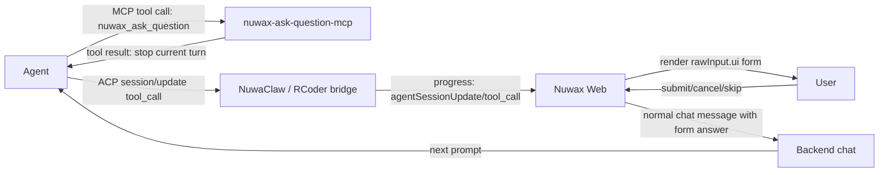

# MCP Ask / Question over ACP ToolCall

| 项       | 内容                                                 |
| -------- | ---------------------------------------------------- |
| 状态     | v1 可提测                                            |
| 版本     | v1.1 (2026-05-26)                                    |
| 覆盖范围 | Nuwax Web、Backend、NuwaClaw、nuwax-ask-question-mcp |

## 1. 结论

Ask/question 与 ACP 权限审批是两条独立链路：

- MCP Ask 不走 ACP `session/request_permission`。
- MCP Ask 不调用 NuwaClaw `/computer/notify-resolved`。
- MCP Ask 通过普通 ACP `session/update` 工具事件下发给前端。
- MCP 工具当前采用 stdio 模式，调用后立即返回，并提示 Agent 停止当前轮。
- 用户填写表单后，Nuwax Web 将答案格式化为下一条普通用户消息，下一轮 Agent 从消息中读取答案继续执行。

禁止新增 `mcpAskQuestion` / `mcpAskQuestionUpdate` 自定义 progress message。

## 2. 与权限审批的边界

| 场景         | 下发事件                                                                        | 用户响应路径                                                             |
| ------------ | ------------------------------------------------------------------------------- | ------------------------------------------------------------------------ |
| ACP 权限审批 | `message_type="acpRequestPermission"` + `sub_type="request_permission"`         | Backend 转发 `permission_resolve_request` 到 `/computer/notify-resolved` |
| MCP Ask      | `messageType="agentSessionUpdate"` + `subType="tool_call"` / `tool_call_update` | 前端发送普通聊天消息                                                     |

权限审批字段格式以 `docs/permission-request-handler-design.md` 为唯一来源。MCP Ask 不复用 `permission_resolve_request`、`Selected`、`Cancelled` 等权限审批回执字段。

## 3. 端到端流程



## 4. MCP 工具

主工具名：

- `nuwax_ask_question`

兼容工具名：

- `nuwax_ask_user`
- `nuwaclaw_ask_user`

Codex 中 MCP server key 为 `ask-question` 时，工具名通常暴露为：

```text
mcp__ask_question__nuwax_ask_question
```

## 5. 工具输入

ACP `ToolCall.rawInput` 必须包含识别字段和 UI schema。不要依赖 `_meta` 识别。

```ts
type McpAskToolName =
  | "nuwax_ask_question"
  | "nuwax_ask_user"
  | "nuwaclaw_ask_user";

interface McpAskUserToolInput {
  toolName: McpAskToolName;
  schemaVersion: "nuwaclaw.mcp_ask.v1";
  requestId: string;
  revision: number;
  sessionId: string;
  title: string;
  description?: string;
  ui: InteractionUISchema;
  business?: Record<string, unknown>;
  timeoutMs?: number;
  priority?: "normal" | "high";
}
```

约束：

- `schemaVersion` 固定为 `"nuwaclaw.mcp_ask.v1"`。
- `ui.version` 固定为 `"nuwaclaw.interaction.v1"`。
- `requestId + revision` 标识一次可交互问题。
- `business` 只放业务上下文，不得放 token、secret、完整 env 或未脱敏敏感内容。

## 6. UI Schema 示例

```json
{
  "toolName": "nuwax_ask_question",
  "schemaVersion": "nuwaclaw.mcp_ask.v1",
  "requestId": "ask_123",
  "revision": 1,
  "sessionId": "session_123",
  "title": "请选择继续方式",
  "description": "Agent 需要你的决定后继续。",
  "ui": {
    "version": "nuwaclaw.interaction.v1",
    "presentation": "inline",
    "title": "请选择继续方式",
    "schema": {
      "type": "object",
      "properties": {
        "choice": {
          "type": "string",
          "title": "选项",
          "enum": ["deploy", "test", "cancel"]
        }
      },
      "required": ["choice"]
    },
    "uiSchema": {
      "choice": {
        "ui:widget": "radio",
        "ui:options": {
          "enumNames": ["直接部署", "先跑测试", "取消任务"]
        }
      },
      "ui:options": {
        "allowSkip": true,
        "skipLabel": "跳过"
      }
    },
    "submitLabel": "提交",
    "cancelLabel": "取消"
  },
  "timeoutMs": 1800000
}
```

## 7. 工具返回

`nuwax-ask-question-mcp` 当前不启动 HTTP 服务、不持有 pending、不提供 `/respond` sidecar。工具只返回一个让 Agent 停止当前轮的结果：

```json
{
  "status": "pending",
  "requestId": "ask_123",
  "revision": 1,
  "message": "The question has been presented to the user. Stop this turn now. When the user submits the form, their answer will arrive as a new user message."
}
```

这里的 `status: "pending"` 只是给 Agent 的工具结果信号，表示问题已经交给前端展示；MCP server 不保存 pending，也不会等待用户回调。

## 8. Progress 识别

前端只从标准工具事件识别 ask：

```ts
type McpAskProgress =
  | {
      messageType: "agentSessionUpdate";
      subType: "tool_call";
      data: {
        sessionUpdate: "tool_call";
        toolCallId: string;
        rawInput: McpAskUserToolInput;
      };
    }
  | {
      messageType: "agentSessionUpdate";
      subType: "tool_call_update";
      data: {
        sessionUpdate: "tool_call_update";
        toolCallId: string;
        rawInput?: McpAskUserToolInput;
        status?: string;
        rawOutput?: unknown;
      };
    };
```

识别条件：

1. `messageType === "agentSessionUpdate"`。
2. `subType === "tool_call"` 或 `"tool_call_update"`。
3. `data.toolCallId` 非空。
4. `data.rawInput.schemaVersion === "nuwaclaw.mcp_ask.v1"`。
5. `data.rawInput.toolName` 是主工具名或兼容工具名。
6. `data.rawInput.ui.version === "nuwaclaw.interaction.v1"`。

缺少 `rawInput.ui` 时按普通工具调用展示，不猜测为 question。

## 9. 用户响应消息

Web 端响应不直接调用 MCP server，也不调用 `/computer/notify-resolved`。响应会被构造成普通用户消息。

消息内容应使用表单字段 label 与用户可读选项文案，避免直接发送 JSON：

```text
我已填写「请选择继续方式」，表单内容如下：

选项：先跑测试
补充说明：先跑关键链路
```

`cancel` / `skip` / `timeout` 同样作为普通消息传给下一轮 Agent，由 Agent 根据 `action` 决定后续行为。

## 10. 验收标准

- MCP Ask 不出现 `acpRequestPermission`。
- MCP Ask 不调用 `/computer/notify-resolved`。
- 下发事件只使用 `agentSessionUpdate/tool_call` 与 `agentSessionUpdate/tool_call_update`。
- `rawInput.schemaVersion`、`rawInput.toolName`、`rawInput.requestId`、`rawInput.revision`、`rawInput.ui.version` 必须存在。
- Web 能从 `rawInput.ui` 渲染 inline / wizard 表单；不支持的复杂 schema 显示 fallback。
- 用户响应作为下一条普通聊天消息发送，Agent 下一轮读取答案继续。
