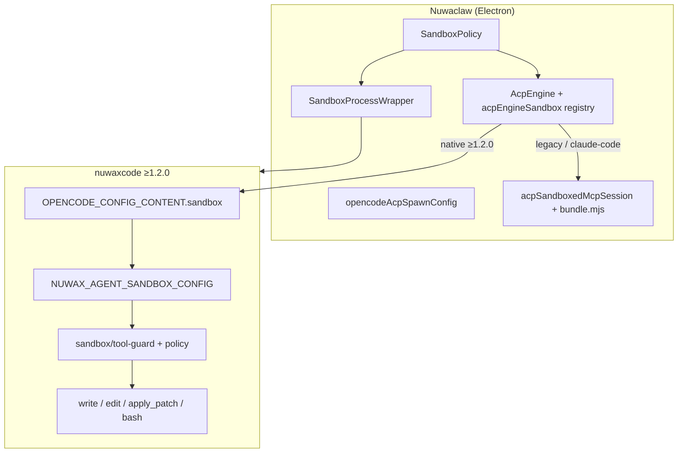

# Windows 沙箱修复与 nuwaxcode 1.2.0 集成报告

**日期**：2026-05-17  
**范围**：Nuwaclaw（agent-electron-client）+ nuwaxcode（OpenCode 引擎 fork，独立仓库）  
**状态**：开发环境 strict / compat / permissive 实测通过；沙箱相关 TypeScript 报错已清零

---

## 1. 背景与问题

### 1.1 现象（用户现场）

| 现象 | 典型日志 |
|------|----------|
| 开启沙箱后 nuwaxcode 1.1.99 崩溃 | `Unrecognized key: sandbox` |
| claude-code `session/new` 失败 | `Query closed` |
| sandboxed MCP 启动失败 | `ERR_MODULE_NOT_FOUND: @modelcontextprotocol/sdk` |
| Strict 模式下仍可写项目外路径 | `permission: allow` + 过宽 `writable_roots`（1.1.72 路径） |

### 1.2 根因归纳

| 层级 | 根因 |
|------|------|
| **版本契约** | `<1.2.0` 的 OpenCode 配置 schema **不接受** 顶层 `sandbox` 键；客户端若无条件注入会导致引擎解析失败 |
| **MCP 打包** | `sandboxed-bash/fs` 仅发布裸 `.mjs`，未 bundle `@modelcontextprotocol/sdk`，Windows 下 session 级 MCP 无法启动 |
| **引擎能力** | nuwaxcode **≥1.2.0** 才支持原生 `OPENCODE_CONFIG_CONTENT.sandbox`；此前只能依赖 MCP + `permission` deny 的兼容路径 |
| **进程沙箱** | serve 进程 wrap 的 `writablePaths` 若包含整个项目根，会与「Strict = 仅会话目录」语义冲突 |
| **引擎侧（1.2.0）** | 内置 write/edit/bash 需引擎内 `sandbox` 策略与路径守卫；此前缺失或工具层 Effect 类型不匹配 |

---

## 2. 目标架构



### 策略矩阵（实测对齐）

| 模式 | nuwaxcode 1.2.0 | claude-code |
|------|-----------------|-------------|
| **strict** | 原生 `sandbox` + 客户端 strict write guard；**不**注入 sandboxed MCP | sandboxed-bash/fs **bundle.mjs**，`writableRoots=1` |
| **compat** | 原生 `sandbox` + `writable_roots`（会话 + 项目根） | 同上，`writableRoots=2` |
| **permissive** | 原生 `sandbox`（宽松） | 主要 bash MCP；FS MCP 按策略跳过 |

---

## 3. Nuwaclaw（本仓库）变更摘要

### 3.1 新增模块（降侵入、可扩展 codex-cli）

| 文件 | 职责 |
|------|------|
| `opencodeAcpSandbox.ts` | 版本门控、`config.sandbox` 注入、MCP 路径、writable roots |
| `acpEngineSandbox.ts` | 引擎 registry（`nuwaxcode` / `codex-cli` / `claude-code`） |
| `opencodeAcpSpawnConfig.ts` | 组装 `OPENCODE_CONFIG_CONTENT` |
| `acpSandboxPolicy.ts` | 全局 policy → `SandboxProcessConfig` |
| `acpSandboxedMcpSession.ts` | session 级 sandboxed MCP 注入 |
| `nuwaxcodeSandboxCompat.ts` | 薄兼容层（`@deprecated`，重导出） |

### 3.2 构建链

- `scripts/prepare/prepare-sandboxed-mcp.js`：esbuild 产出 `dist/*.bundle.mjs`（含 MCP SDK）
- `scripts/verify-sandboxed-mcp-bundle.mjs`：`npm run verify:sandboxed-mcp`
- `prepare:all` 串联；`extraResources` 包含 `dist/**`
- `prepare-nuwaxcode.js`：默认 **nuwaxcode 1.2.1**（从 GitHub Release `v1.2.1` 下载）
- `.gitignore`：忽略 `dist/`、`.bundle-version`

### 3.3 行为要点

- **`supportsOpencodeConfigSandbox`**：仅 `compareSemver(version, "1.2.0") >= 0` 时写入 `sandbox` 键
- **Strict serve**：`sandboxProcessWrapper` 不再把整块 `projectWorkspaceDir` 放入 helper `writablePaths`
- **claude-code**：MCP 脚本缺失时 **warn + 跳过**，避免 `Query closed`
- **acpEngine.ts**：沙箱逻辑下沉至上述模块，减少 `engineName === "nuwaxcode"` 硬编码

### 3.4 关键日志（验收）

修复后 dev 日志应出现：

```
[AcpEngine:nuwaxcode] Using native OpenCode sandbox; sandboxed-bash/fs MCP skipped
sandbox_active.path: opencode-config-sandbox, nuwaxcodeVersion: 1.2.0
[AcpEngine:claude-code] script=sandboxed-*-mcp.bundle.mjs
✅ ACP newSession completed
```

不应再出现（22:09 之后会话）：

- `Unrecognized key: sandbox`
- `ERR_MODULE_NOT_FOUND: @modelcontextprotocol/sdk`
- `Query closed` / `newSession failed`

---

## 4. nuwaxcode（独立仓库）变更摘要

> 路径：`nuwaxcode`（分支 `feat/nuwaxcode`，版本 **1.2.0**）  
> 需在 **nuwaxcode 仓库** 单独提交/发版。

| 模块 | 说明 |
|------|------|
| `src/config/sandbox.ts` | Effect schema + `zod`（`withStatics`） |
| `src/sandbox/env.ts` | 统一解析 `NUWAX_AGENT_SANDBOX_CONFIG` |
| `src/sandbox/policy.ts` | Effect 策略（会话目录、writable roots） |
| `src/sandbox/policy-sync.ts` | bash helper 同步策略 |
| `src/sandbox/tool-guard.ts` | 内置工具同步写路径守卫 |
| `src/sandbox/path.ts` | strict/compat 根路径计算 |
| `src/sandbox/bash-helper.ts` | Windows helper 调用 |
| `src/tool/{edit,write,apply_patch,bash}.ts` | 接入 guard / sync policy |

TypeScript：`sandbox` / `edit` / `write` / `apply_patch` / `bash` 相关 **error 数量 = 0**（2026-05-17 复查）。

---

## 5. 客户端 ↔ 引擎配置契约

`OPENCODE_CONFIG_CONTENT` / `NUWAX_AGENT_SANDBOX_CONFIG` 中的 `sandbox` 对象（snake_case）：

```json
{
  "sandbox_mode": "strict | compat | permissive",
  "helper_path": "C:\\...\\nuwax-sandbox-helper.exe",
  "network_enabled": true,
  "mode": "workspace-write",
  "writable_roots": ["..."]
}
```

- **strict**：通常不写 `writable_roots`，引擎以 `Instance.directory`（会话 cwd）为准  
- **compat**：客户端注入 `writable_roots`（会话目录 + 项目根）  
- **permissive**：`sandbox_mode: permissive`，路径门控放宽  

---

## 6. 测试与发版清单

### 6.1 本地开发（Nuwaclaw）

```bash
cd crates/agent-electron-client
npm run prepare:sandboxed-mcp
npm run verify:sandboxed-mcp
NUWAXCODE_DIST_DIR=/path/to/nuwaxcode/packages/opencode/dist npm run prepare:nuwaxcode
npm run build:main:dev
npm run dev
```

### 6.2 单元测试

```bash
cd crates/agent-electron-client
npm run test -- --run src/main/services/engines/acp/
```

### 6.3 发版前手工（Windows）

- [ ] nuwaxcode **1.2.0** 安装包 + Strict：会话内写 OK，Desktop/项目外写失败  
- [ ] claude-code + Strict：`newSession` 成功，日志为 `*.bundle.mjs`  
- [ ] compat：日志 `writableRoots=2`  
- [ ] permissive：策略切换后会话可建  
- [ ] 无 `Unrecognized key: sandbox`、无 MCP SDK 缺失  

### 6.4 发版流水线建议

```bash
npm run prepare:all
npm run verify:sandboxed-mcp
# 再打 Windows 安装包并复测 Computer Agent 场景
```

---

## 7. 仓库与提交说明

| 仓库 | 分支（提交时） | 说明 |
|------|----------------|------|
| **nuwax-agent-client** | `feature/electron-client-0.11` | 本报告所在仓库；含客户端沙箱与 MCP bundle |
| **nuwaxcode** | `feat/nuwaxcode` | 引擎 1.2.0 原生沙箱；需独立 push/发 npm 二进制 |

---

## 7.1 GitHub Release Tag 对齐（重要）

### 现状（2026-05-17 核查）

| 项 | 值 |
|----|-----|
| 客户端 `prepare-nuwaxcode.js` | `NUWAXCODE_VERSION = '1.2.1'` |
| `nuwaxcode` 发版 | 由你在 nuwaxcode 仓库执行 `./release.sh 1.2.1` |
| 原生沙箱能力门槛（客户端逻辑） | **`>= 1.2.0`**（`OPENCODE_NATIVE_SANDBOX_CONFIG_MIN_VERSION`，1.2.1 满足） |

因此 CI / 正式构建执行 `npm run prepare:nuwaxcode` 时会请求：

`https://github.com/nuwax-ai/nuwaxcode/releases/download/v1.2.1/nuwaxcode-windows-x64-v1.2.1.tar.gz`

（或回退资产名 `nuwaxcode-windows-x64.tar.gz`）——**需你先发布 GitHub Release `v1.2.1`**。开发环境若用本地 dist（`NUWAXCODE_DIST_DIR`）则不受影响。

### Release 资产命名（与 prepare 脚本兼容）

prepare 按顺序尝试：

1. `nuwaxcode-{platform}-v{version}.tar.gz`（如 `nuwaxcode-windows-x64-v1.1.99.tar.gz`）
2. `nuwaxcode-{platform}.tar.gz`（`release.sh` / `build.ts` 上传的默认名）

同一 Release 上两种命名可能并存（以 v1.1.99 为例）。

### 发布 nuwaxcode 1.2.1 的标准流程

在 **nuwaxcode** 仓库根目录（需 `bun@1.3.13`、npm 凭据）：

```bash
# 合并 feat/nuwaxcode → 发版分支后
./release.sh 1.2.1
```

脚本会：更新 `package.json` → 构建各平台二进制 → `gh release` 上传 `dist/*.tar.gz` → 发布 npm optional 包。

发布后确认：

- https://github.com/nuwax-ai/nuwaxcode/releases/tag/v1.2.1
- 资产含 `nuwaxcode-windows-x64.tar.gz` 或 `nuwaxcode-windows-x64-v1.2.1.tar.gz`
- 二进制 `--version` 输出为 `1.2.1`（与 tag 一致；prepare 会校验）

再在 **nuwaclaw** 侧：

```bash
cd crates/agent-electron-client
npm run prepare:nuwaxcode   # 或 prepare:all
```

### Beta 发版流水线（prerelease-v0.11.29）

1. **nuwaxcode**：推送 `v1.2.1` → `build-release.yml` 构建并发布 GitHub Release  
2. **（可选自动）** nuwaxcode 配置 Secret `NUWACLAW_REPO_DISPATCH_TOKEN`（PAT，含 `nuwax-ai/nuwax-agent-client` 的 `repo` + `workflow`）→ 完成后 `repository_dispatch`  
3. **nuwaclaw**：`on-nuwaxcode-released.yml` 校验 `v1.2.1` 存在 → 推送 tag **`prerelease-v0.11.29`**  
4. **`release-electron-dev.yml`** 构建全平台 beta → OSS `nuwaclaw-electron/beta/latest.json`  

手动触发（不依赖 nuwaxcode dispatch）：

- Actions → **On Nuwaxcode Released** → Run workflow（默认 1.2.1 + prerelease-v0.11.29）  
- 或直接推送 tag：`git tag prerelease-v0.11.29 && git push origin prerelease-v0.11.29`（需先有 `release-notes/prerelease-v0.11.29.md`）

### Tag 与二进制内部版本

`prepare-nuwaxcode.js` 会在复制/下载后用 `--version` 校验二进制内部版本；若 **tag 与包内版本不一致**，会强制重新下载并告警（防止 Release 资产未更新）。

---

## 8. 已知说明

1. **进程 wrap 的 `writablePaths` 仍可能含 `~/.nuwaclaw`**：用于应用状态与临时目录，**不等于**会话内可任意写项目外路径；strict 下仍有 `strict write guard` 与引擎内守卫。  
2. **nuwaxcode strict 日志**：`Sandboxed FS MCP unavailable, keep built-in Write/Edit` 在 1.2.0 原生沙箱下为预期（不走 session MCP）。  
3. **历史日志**（升级前会话）中 `mcp-plus-permission-deny` / `Unrecognized key` 可与当前 1.2.0 行为并存，以**重启后新会话**日志为准。

---

## 9. 参考路径

| 用途 | 路径 |
|------|------|
| 沙箱核心（客户端） | `crates/agent-electron-client/src/main/services/engines/acp/` |
| MCP 打包 | `crates/agent-electron-client/scripts/prepare/prepare-sandboxed-mcp.js` |
| 引擎沙箱 | `nuwaxcode/packages/opencode/src/sandbox/` |
| 开发日志 | `~/.nuwaclaw/logs/latest.log`、`logs/electron-dev.log` |

---

*报告随本次沙箱集成提交一并入库。*
