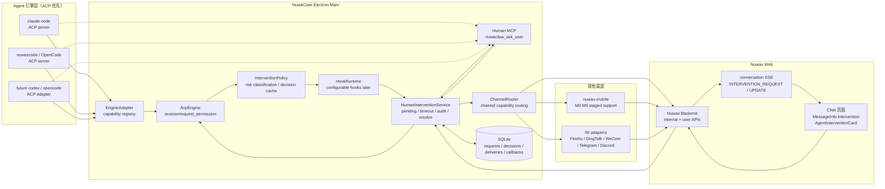
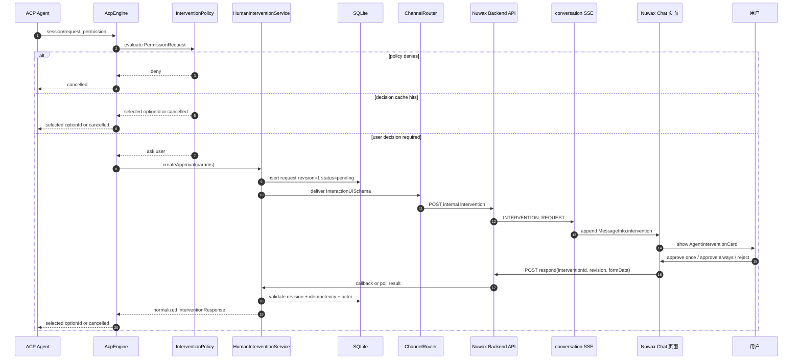
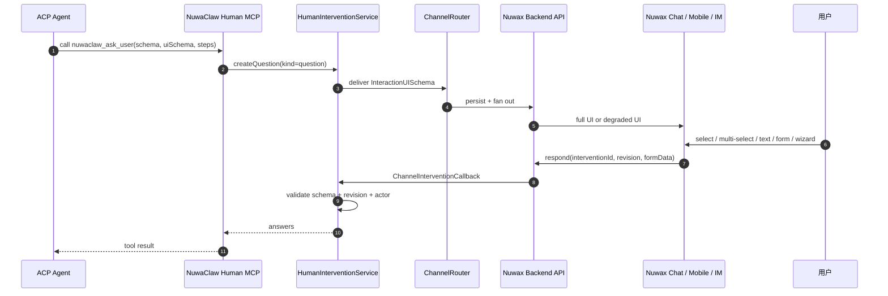
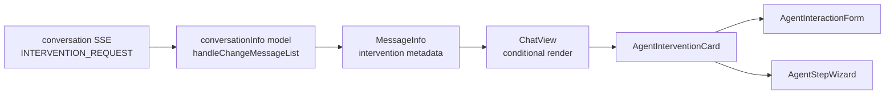
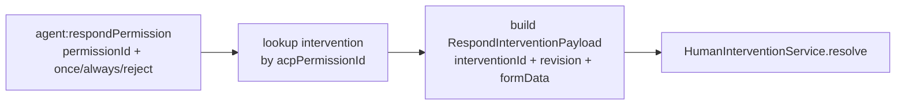
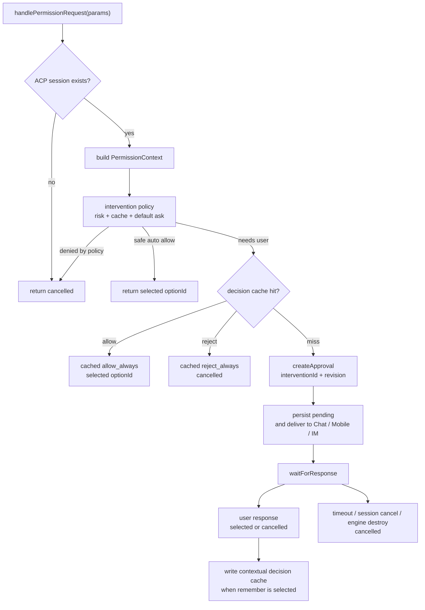
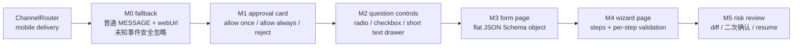
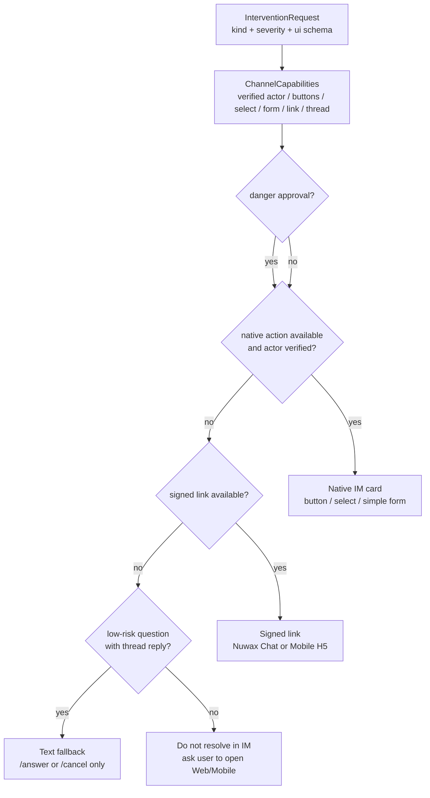
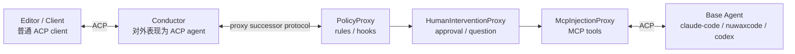

# 通用智能体 ACP Hooks 与人类介入支持方案 v3

调研日期：2026-05-11  
修订日期：2026-05-12  
状态：建议采用 v3 作为实施基线

## 0. v3 修正说明

v3 基于 `universal-agent-acp-hooks-human-intervention-v2.md` 修正以下问题：

1. **Web 前端落点确认为 Nuwax Chat 页面**：approval、ask/question、form、step/wizard 交互，落在 `/Users/apple/workspace/nuwax` 的 Chat 对应页面（`src/pages/Chat/` 与 `src/components/ChatView/`），与 AppDevChatArea 无关。
2. **结构化交互不只做 approval**：approval 可以作为 NuwaClaw 最小闭环先落地，但 UI schema 必须从第一版就覆盖单选、多选、自定义输入、普通表单和多步骤 wizard。
3. **响应链路不复用旧 `agent:respondPermission` 作为主路径**：旧 IPC 当前只接受 `permissionId + once/always/reject`，无法表达 `interventionId/revision/formData/actor/channel`。v3 新增统一 intervention respond API/IPC，旧 IPC 仅做兼容包装。
4. **`allow_always` 缓存不能只按 `optionId` 匹配**：必须加入 engine、project/session scope、tool、input digest、policy version 等上下文。
5. **移动端和 IM 纳入方案边界**：移动端 `/Users/apple/workspace/nuwax-mobile` 分阶段实现；IM 国内优先，先飞书、钉钉、企业微信，再兼容 Telegram/Discord；平台能力不足时降级。
6. **P/ACP 只作为中长期演进**：不进入 MVP 关键路径，短期仍保持普通 ACP client/server 兼容。

配套多端调用与降级文档：[`agent-intervention-channel-calling.md`](./agent-intervention-channel-calling.md)。

## 1. 决策记录

| # | 决策 | v3 结论 |
|---|------|---------|
| 1 | 协议基础 | 只接 ACP 引擎作为统一基础，Claude Code、nuwaxcode/OpenCode、未来 Codex/opencode 均经 adapter 对齐 |
| 2 | Approval 入口 | ACP `session/request_permission` 是通用 approval 入口 |
| 3 | Question 入口 | 跨引擎标准入口使用 NuwaClaw MCP 工具 `nuwaclaw_ask_user`，原生 question 能力仅做 adapter 增强 |
| 4 | Web UI 落点 | `/Users/apple/workspace/nuwax` 的 Chat 页面（`src/pages/Chat/`） |
| 5 | 消息投递 | 复用现有 conversation SSE，新增 `INTERVENTION_REQUEST` / `INTERVENTION_UPDATE` 事件类型 |
| 6 | UI 表达 | `InterventionRequest + InteractionUISchema`，表单层用 JSON Schema 子集，UI 层用 `uiSchema + steps` 扩展 |
| 7 | 等待模型 | approval 默认同步等待用户响应或超时；question 可同步等待，也可后续扩展 defer/resume |
| 8 | 响应路径 | Nuwax Chat/移动端/IM 均走统一 respond API，NuwaClaw 通过轮询或回调解锁 pending |
| 9 | 缓存策略 | `allow_always/reject_always` 按上下文 key 匹配，不只按 `optionId` |
| 10 | 移动端 | `/Users/apple/workspace/nuwax-mobile` 分 M0-M5 阶段实现 |
| 11 | IM | 国内 IM 优先：飞书、钉钉、企业微信；Telegram/Discord 后续兼容 |
| 12 | HookRuntime | 与本地沙箱解耦，只处理 agent 生命周期和策略扩展，不承载 sandbox 语义 |
| 13 | P/ACP | 作为中长期 proxy pipeline 演进参考，不承诺近期兼容 |
| 14 | 本地沙箱 | 旧 NuwaClaw 本地沙箱审批/UI/缓存方案废弃；迁移期只作为 legacy guard，不进入新 hooks 设计 |

## 2. 当前代码缺口

### 2.1 `handlePermissionRequest` 仍是伪闭环

当前 `crates/agent-electron-client/src/main/services/engines/acp/acpEngine.ts` 中 `handlePermissionRequest()` 的行为：

- `toolCall.kind === "question"` 直接 `cancelled`。
- strict sandbox 越界直接 `cancelled`。
- 其他 permission 自动选择 `allow_always`、`allow_once` 或第一个 option。

这意味着现在没有真正的人类审批闭环。

`AcpEngine.respondPermission()`、`pendingPermissions` 和 IPC `agent:respondPermission` 已存在，但 `handlePermissionRequest()` 并没有创建 pending request，也没有把请求投递到 Nuwax Chat/Mobile/IM。

### 2.2 `nuwaxcode` question 被配置阻断

当前 `OPENCODE_CONFIG_CONTENT` 中存在 `permission.question = "deny"` 一类配置，短期能避免 TUI 阻塞，但会直接阻断引擎提问能力。

v3 处理原则：

- 不依赖 OpenCode/Nuwaxcode 的原生 TUI question。
- 通过 system prompt 和 MCP 注入，引导模型调用 `nuwaclaw_ask_user`。
- 当原生 question 能通过 ACP 或 native adapter 捕获时，再映射为 `InterventionRequest(kind="question")`。

### 2.3 Chat 页面才是 Web 会话 UI 落点

`/Users/apple/workspace/nuwax` 中当前 Chat 对应页面链路：

- `src/pages/Chat/index.tsx`：Chat 页面主入口，组合 `ChatView`、会话状态、右侧展示区等。
- `src/components/ChatView/index.tsx`：单条消息渲染组件，适合识别 `messageInfo.intervention` 并渲染干预卡片。
- `src/types/interfaces/conversationInfo.ts`：定义 `MessageInfo`、`ConversationInfo`、`ChatViewProps` 等核心类型。
- `src/types/enums/agent.ts`：定义 `ConversationEventTypeEnum`，需要新增 `INTERVENTION_REQUEST` / `INTERVENTION_UPDATE`。
- `src/models/conversationInfo.ts`：处理 conversation SSE 事件并更新消息列表。
- `src/pages/Chat/components/ConversationStatus/`：会话执行状态展示，可用于 pending intervention 状态提示。

因此 intervention UI 应作为 Chat 页面里的特殊消息组件实现：`MessageInfo` 扩展 `intervention` 字段，`ChatView` 或消息列表渲染层条件渲染 `AgentInterventionCard`。不要走 AppDev 的 `<appdev-*>` markdown plugin 路线。

### 2.4 旧本地沙箱方案废弃边界

新方案上线后，NuwaClaw 只保留一条统一的人类介入链路：`HumanInterventionService + ChannelRouter + Nuwax Chat/Mobile/IM`。

废弃范围：

- 旧本地沙箱的权限弹窗、renderer 侧 `PermissionModal`、本地 `permissions.ts` 规则 UI 不再作为 approval 主路径。
- 旧本地沙箱自己的 pending permission/cache 模型不再扩展新能力。
- HookRuntime 不读取本地沙箱配置，不表达 writable roots，不把 sandbox allow/deny 作为 hook handler。

迁移期保留范围：

- 如果现有代码仍依赖本地沙箱 guard 防止明显越界写入，可在 `AcpEngine` 入口前后作为 legacy guard 暂时保留。
- legacy guard 的结果只能进入统一 `InterventionRequest` 或 fail closed，不能绕过新的人类介入链路。
- 完成迁移后，沙箱相关审批能力应从产品能力表中移除，只保留独立的系统防护或引擎自身 sandbox 配置。

## 3. 目标架构

### 3.1 总体分层



### 3.2 Approval 闭环



### 3.3 Question / Ask 闭环



## 4. 核心概念

### 4.1 HumanInterventionService

`HumanInterventionService` 是“人类介入服务”，也可以命名为 `InterventionService`。本文使用完整名称避免误解。

它不是 UI，也不是 ACP 协议本身，而是 NuwaClaw 主进程里的协调层：

- 把 ACP permission、MCP ask、native question 统一成 `InterventionRequest`。
- 创建 pending promise，等待用户响应、超时、取消或 session destroy。
- 持久化请求、响应、审计信息。
- 校验 `revision`、幂等键、操作者身份和过期时间。
- 把用户响应翻译回 ACP/MCP/native adapter 的返回格式。

### 4.2 ChannelRouter

`ChannelRouter` 负责把同一个 `InterventionRequest + InteractionUISchema` 投递到不同端：

- Nuwax Chat 页面：完整渲染基准。
- Nuwax Mobile：按 M0-M5 能力分阶段渲染。
- IM：按平台能力渲染按钮、选择器、签名链接或低风险文本命令。

ChannelRouter 不决定业务安全策略，只做能力匹配和投递记录。是否允许 IM 上直接完成审批，由 `HumanInterventionService` 根据 severity、actor、channel capability 决定。

### 4.3 HookRuntime

ACP 没有标准 hook 机制。`session/request_permission` 只能让 client 在 options 里选择或取消，不能表达完整的 “PreToolUse 修改输入 / PostToolUse 审计 / UserPromptSubmit 改写”。

v3 的分层原则：

- **hooks 与沙箱无关**：HookRuntime 不负责本地沙箱，不读取 sandbox 配置，不表达 writable roots，也不作为本地文件系统权限兜底。
- **最小闭环阶段**：不依赖完整 HookRuntime，先用 `InterventionPolicy` 完成风险分级、decision cache、默认 ask。
- **增强阶段**：HookRuntime 只增强 agent 生命周期事件，例如 `UserPromptSubmit`、`PermissionRequest`、`QuestionRequest`、`PreToolUse/PostToolUse`；本地沙箱 guard 不迁移进 HookRuntime。
- **legacy guard 独立处理**：如果迁移期仍保留旧本地沙箱 guard，它应在 HookRuntime 之外运行，并把结果归一到 `InterventionRequest` 或 fail closed。

通用事件模型：

```ts
type UniversalHookEvent =
  | "SessionStart"
  | "UserPromptSubmit"
  | "PermissionRequest"
  | "QuestionRequest"
  | "PreToolUse"
  | "PostToolUse"
  | "Stop"
  | "SessionEnd";

type HookDecision =
  | { behavior: "allow"; updatedInput?: unknown; reason?: string }
  | { behavior: "deny"; message: string }
  | { behavior: "ask"; reason?: string }
  | { behavior: "observe" };
```

能力边界：

| Event | 通用实现方式 | 可阻断 | 可改输入 | 备注 |
|---|---|---:|---:|---|
| `UserPromptSubmit` | `session/prompt` 前拦截 | 是 | 是 | 通用层最稳定 |
| `PermissionRequest` | ACP `session/request_permission` | 是 | 否 | 只能 selected/cancelled |
| `QuestionRequest` | `nuwaclaw_ask_user` MCP | 是 | 是 | 推荐跨引擎标准入口 |
| `PreToolUse` | engine native 优先 | 视引擎 | 视引擎 | ACP 通用层不完整 |
| `PostToolUse` | ACP `session/update` 观察 | 否 | 否 | 审计和后处理 |

## 5. 数据模型

### 5.1 InterventionRequest

```ts
type InterventionKind = "approval" | "question";
type InterventionStatus =
  | "pending"
  | "answered"
  | "approved"
  | "rejected"
  | "cancelled"
  | "expired"
  | "superseded";

interface InterventionRequest {
  id: string;
  revision: number;
  kind: InterventionKind;
  status: InterventionStatus;

  projectId?: string;
  sessionId: string;
  requestId?: string;
  engine: "claude-code" | "nuwaxcode" | "opencode" | "codex";
  source: "acp" | "nuwaclaw_mcp" | "engine_native";

  title: string;
  description?: string;
  severity: "info" | "warning" | "danger";

  tool?: {
    toolCallId?: string;
    name?: string;
    kind?: string;
    rawInput?: unknown;
    inputDigest?: string;
  };

  approval?: {
    acpPermissionId?: string;
    options: Array<{
      optionId: string;
      kind: "allow_once" | "allow_always" | "reject_once" | "reject_always";
      label: string;
      description?: string;
    }>;
  };

  ui: InteractionUISchema;

  timeoutMs: number;
  expiresAt?: number;
  createdAt: number;
  updatedAt: number;
}
```

### 5.2 InteractionUISchema

市场上没有一个能同时覆盖 ACP、Claude Code、OpenCode、Codex、Web 会话 UI、移动端、IM 的统一标准。v3 建议 NuwaClaw 定义自己的 `InteractionUISchema v1`：

- 数据校验使用 JSON Schema 子集。
- UI 呈现使用 `uiSchema`。
- 多步骤使用 `steps`。
- 平台降级使用 `fallback`。
- `kind` 放在 `InterventionRequest.kind`，不要让 UI schema 承担业务分类。

```ts
interface InteractionUISchema {
  version: "nuwaclaw.interaction.v1";
  presentation: "inline" | "modal" | "drawer" | "wizard";
  title: string;
  description?: string;
  severity?: "info" | "warning" | "danger";

  schema: JsonSchemaObject;
  uiSchema?: Record<string, unknown>;
  steps?: Array<{
    id: string;
    title: string;
    description?: string;
    fields: string[];
  }>;

  submitLabel?: string;
  cancelLabel?: string;
  fallback?: {
    text: string;
    webUrl?: string;
    mobileUrl?: string;
    imText?: string;
  };
}
```

控件映射：

| 交互需求 | JSON Schema 表达 | Web/Nuwax Chat 渲染 | 移动端/IM 降级 |
|---|---|---|---|
| approval | `decision` enum | Button group + risk summary | 按钮或签名链接 |
| 单选 | `string` + `enum/oneOf` | Radio / Select | 底部抽屉或 IM select |
| 多选 | `array` + `uniqueItems` + `items.enum` | Checkbox / multi-select | 移动端 checkbox drawer，IM 不支持则链接 |
| 自定义输入 | `string` | Input | 短文本 drawer，IM 仅低风险 question |
| 长文本 | `string` + `ui:widget=textarea` | TextArea | 链接页 |
| 数字 | `number/integer` | InputNumber / Slider | 输入页或链接 |
| 布尔 | `boolean` | Switch / Checkbox | 按钮或链接 |
| diff 审阅 | `x-nuwaclaw:widget=diff` | Diff viewer | 链接页 |
| step/wizard | `steps[]` | Wizard / Drawer | 移动端独立页面，IM 链接页 |

### 5.3 Approval schema 示例

```json
{
  "version": "nuwaclaw.interaction.v1",
  "presentation": "inline",
  "title": "允许执行命令？",
  "description": "Agent 请求执行 npm install。请确认是否允许。",
  "severity": "warning",
  "schema": {
    "type": "object",
    "required": ["decision"],
    "properties": {
      "decision": {
        "type": "string",
        "title": "处理方式",
        "oneOf": [
          { "const": "allow_once", "title": "允许一次" },
          { "const": "allow_always", "title": "始终允许此类操作" },
          { "const": "reject", "title": "拒绝" }
        ]
      },
      "reason": {
        "type": "string",
        "title": "原因",
        "maxLength": 500
      }
    }
  },
  "uiSchema": {
    "decision": { "ui:widget": "buttonGroup" },
    "reason": { "ui:widget": "textarea", "ui:visibleWhen": { "decision": "reject" } }
  }
}
```

### 5.4 Question / wizard schema 示例

```json
{
  "version": "nuwaclaw.interaction.v1",
  "presentation": "wizard",
  "title": "部署前确认",
  "severity": "danger",
  "schema": {
    "type": "object",
    "required": ["environment", "checks", "note"],
    "properties": {
      "environment": {
        "type": "string",
        "title": "部署环境",
        "oneOf": [
          { "const": "staging", "title": "预发" },
          { "const": "production", "title": "生产" }
        ]
      },
      "checks": {
        "type": "array",
        "title": "确认项",
        "uniqueItems": true,
        "items": {
          "type": "string",
          "enum": ["tests_passed", "backup_ready", "rollback_plan"]
        },
        "minItems": 2
      },
      "note": {
        "type": "string",
        "title": "备注",
        "maxLength": 500
      }
    }
  },
  "uiSchema": {
    "note": { "ui:widget": "textarea" }
  },
  "steps": [
    { "id": "target", "title": "目标", "fields": ["environment"] },
    { "id": "risk", "title": "检查", "fields": ["checks", "note"] }
  ]
}
```

### 5.5 InterventionResponse

```ts
type InterventionResponse =
  | {
      interventionId: string;
      revision: number;
      action: "submit";
      formData: Record<string, unknown>;
      actor: InterventionActor;
      channel: InterventionChannel;
      receivedAt: number;
    }
  | {
      interventionId: string;
      revision: number;
      action: "cancel" | "timeout";
      reason?: string;
      actor?: InterventionActor;
      channel?: InterventionChannel;
      receivedAt: number;
    };

type InterventionChannel =
  | "nuwax-web"
  | "nuwax-mobile"
  | "feishu"
  | "dingtalk"
  | "wecom"
  | "telegram"
  | "discord"
  | "electron-legacy";

interface InterventionActor {
  userId?: string;
  platformUserId?: string;
  tenantId?: string;
  displayName?: string;
}
```

## 6. 数据库表

### 6.1 `agent_intervention_requests`

```sql
CREATE TABLE agent_intervention_requests (
  id TEXT PRIMARY KEY,
  current_revision INTEGER NOT NULL DEFAULT 1,
  kind TEXT NOT NULL,
  status TEXT NOT NULL DEFAULT 'pending',

  project_id TEXT,
  session_id TEXT NOT NULL,
  request_id TEXT,
  engine TEXT NOT NULL,
  source TEXT NOT NULL,

  title TEXT NOT NULL,
  severity TEXT NOT NULL,
  request_json TEXT NOT NULL,
  ui_schema_json TEXT NOT NULL,
  response_json TEXT,

  expires_at INTEGER,
  created_at INTEGER NOT NULL,
  updated_at INTEGER NOT NULL,
  resolved_at INTEGER,
  resolved_by_channel TEXT,
  resolved_by_actor_json TEXT
);

CREATE INDEX idx_agent_intervention_session_status
ON agent_intervention_requests(session_id, status);
```

### 6.2 `agent_permission_decisions`

`allow_always/reject_always` 不得只按 `option_id` 匹配。建议缓存 key 至少包含以下字段：

```sql
CREATE TABLE agent_permission_decisions (
  id TEXT PRIMARY KEY,
  scope TEXT NOT NULL, -- session | project | global
  project_id TEXT,
  session_id TEXT,

  engine TEXT NOT NULL,
  tool_kind TEXT,
  tool_name TEXT,
  option_id TEXT NOT NULL,
  option_kind TEXT NOT NULL,
  input_digest TEXT,
  policy_version TEXT NOT NULL DEFAULT 'v1',

  decision TEXT NOT NULL, -- allow_always | reject_always
  source_intervention_id TEXT,
  created_at INTEGER NOT NULL,
  expires_at INTEGER,
  revoked_at INTEGER
);

CREATE INDEX idx_agent_permission_decisions_lookup
ON agent_permission_decisions(scope, project_id, session_id, engine, tool_kind, tool_name, option_kind, input_digest, revoked_at);
```

匹配原则：

1. 先匹配 `scope`，优先级 `session > project > global`。
2. 必须匹配 `engine`。
3. 必须匹配 `option_kind`，`option_id` 仅作为附加约束，不作为唯一安全依据。
4. 高风险工具必须匹配 `tool_kind/tool_name/input_digest`。
5. `policy_version` 变化后旧缓存默认失效。
6. `revoked_at` 非空时不得命中。

### 6.3 多端投递和回调表

多端能力必须有投递和回调记录，否则无法处理重复提交、过期提交、IM 回调重放。

```sql
CREATE TABLE agent_intervention_deliveries (
  id TEXT PRIMARY KEY,
  intervention_id TEXT NOT NULL,
  revision INTEGER NOT NULL,
  channel TEXT NOT NULL,
  target_id TEXT NOT NULL,
  platform_message_id TEXT,
  platform_thread_id TEXT,
  target_actor_json TEXT,
  signed_token_hash TEXT,
  expires_at INTEGER,
  delivered_at INTEGER NOT NULL,
  status TEXT NOT NULL DEFAULT 'sent',
  UNIQUE(intervention_id, revision, channel, target_id)
);

CREATE TABLE agent_intervention_callbacks (
  id TEXT PRIMARY KEY,
  intervention_id TEXT NOT NULL,
  revision INTEGER NOT NULL,
  channel TEXT NOT NULL,
  platform_callback_id TEXT,
  idempotency_key TEXT NOT NULL,
  actor_json TEXT,
  payload_json TEXT NOT NULL,
  accepted INTEGER NOT NULL DEFAULT 0,
  rejection_reason TEXT,
  received_at INTEGER NOT NULL,
  UNIQUE(idempotency_key)
);
```

## 7. Nuwax Chat 页面改造方案

### 7.1 SSE 事件契约

Nuwax Chat 页面当前通过 conversation SSE 更新消息列表。v3 建议在 `ConversationEventTypeEnum` 新增事件类型：

- `INTERVENTION_REQUEST`
- `INTERVENTION_UPDATE`

事件示例：

```json
{
  "eventType": "INTERVENTION_REQUEST",
  "sessionId": "session-xxx",
  "timestamp": 1770000000000,
  "data": {
    "request_id": "req-xxx",
    "interventionId": "int-xxx",
    "revision": 1,
    "kind": "approval",
    "status": "pending",
    "source": {
      "engine": "nuwaxcode",
      "protocol": "acp",
      "toolCallId": "tc-xxx"
    },
    "ui": {
      "version": "nuwaclaw.interaction.v1",
      "presentation": "inline",
      "title": "允许修改文件？",
      "severity": "warning",
      "schema": {
        "type": "object",
        "required": ["decision"],
        "properties": {
          "decision": {
            "type": "string",
            "enum": ["allow_once", "allow_always", "reject"]
          }
        }
      }
    }
  }
}
```

更新事件示例：

```json
{
  "eventType": "INTERVENTION_UPDATE",
  "sessionId": "session-xxx",
  "data": {
    "interventionId": "int-xxx",
    "revision": 1,
    "status": "approved",
    "response": {
      "decision": "allow_once"
    },
    "resolvedBy": {
      "channel": "nuwax-web",
      "displayName": "用户"
    }
  }
}
```

### 7.2 Chat 前端文件改造点

| 改动 | 文件 | 说明 |
|---|---|---|
| 类型扩展 | `/Users/apple/workspace/nuwax/src/types/interfaces/conversationInfo.ts` | `MessageInfo` 新增 `intervention?: InterventionMessageInfo` |
| 事件枚举 | `/Users/apple/workspace/nuwax/src/types/enums/agent.ts` | `ConversationEventTypeEnum` 新增 `INTERVENTION_REQUEST/UPDATE` |
| SSE 处理 | `/Users/apple/workspace/nuwax/src/models/conversationInfo.ts` | 识别 intervention 事件并构建特殊消息 |
| 页面入口 | `/Users/apple/workspace/nuwax/src/pages/Chat/index.tsx` | 保持消息列表渲染，必要时传入响应回调 |
| 消息渲染 | `/Users/apple/workspace/nuwax/src/components/ChatView/index.tsx` | 检测 `messageInfo.intervention`，优先渲染干预卡片 |
| UI 组件 | `/Users/apple/workspace/nuwax/src/pages/Chat/components/AgentInterventionCard/` | 渲染 approval/question/form |
| wizard 组件 | `/Users/apple/workspace/nuwax/src/pages/Chat/components/AgentStepWizard/` | 多步骤表单 |
| API | `/Users/apple/workspace/nuwax/src/services/agentIntervention.ts` | 新增 `respondAgentIntervention()` |

推荐渲染方式：



### 7.3 UI 状态

| 状态 | UI 行为 |
|---|---|
| `pending` | 可操作，显示剩余时间和风险摘要 |
| `submitting` | 按钮 loading，禁止重复提交 |
| `approved/rejected/answered` | 禁用控件，展示处理人、渠道、时间和结果 |
| `expired` | 禁用控件，提示已超时 |
| `cancelled` | 禁用控件，提示会话已取消或 agent 已停止 |
| `superseded` | 禁用旧卡片，引导查看最新卡片 |

高风险操作必须显示：

- 工具名和工具类型。
- 命令、路径、diff 或输入摘要。
- 审批作用域：一次、始终、拒绝并记住。
- 二次确认条件：`severity === "danger"` 或跨 workspace 写入、发布、删除、网络暴露等操作。

## 8. NuwaClaw 响应链路改造

### 8.1 不把旧 `agent:respondPermission` 作为主路径

旧 IPC 当前形态：

```ts
agent:respondPermission(sessionId, permissionId, response: "once" | "always" | "reject")
```

它不包含：

- `interventionId`
- `revision`
- `formData`
- `channel`
- `actor`
- 幂等键
- question/form/wizard 的 answers

因此 v3 新增统一响应入口：

```ts
interface RespondInterventionPayload {
  interventionId: string;
  revision: number;
  channel: InterventionChannel;
  actor?: InterventionActor;
  formData?: Record<string, unknown>;
  action: "submit" | "cancel";
  idempotencyKey?: string;
}
```

推荐接口：

- NuwaClaw IPC：`intervention:respond`
- Nuwax 后端 API：`POST /api/agent-interventions/:interventionId/respond`
- NuwaClaw internal poll：`GET /api/internal/agent/interventions/responses?since=...`
- 后续优化：Nuwax 后端 webhook 或 WebSocket 直推 NuwaClaw

旧 `agent:respondPermission` 可以保留，但只做 legacy adapter：



### 8.2 `handlePermissionRequest` 新逻辑



注意：

- `toolCall.kind === "question"` 不应简单 `cancelled`；优先映射为 `QuestionRequest` 或提示模型改用 `nuwaclaw_ask_user`。
- 迁移期如保留 legacy sandbox guard，其结果必须在 HookRuntime 之外处理，并且 fail closed。
- 没有 `allow_once` option 的高风险写入请求不应自动选 `allow_always`。

## 9. 移动端和 IM 分阶段

详细方案见 [`agent-intervention-channel-calling.md`](./agent-intervention-channel-calling.md)。本文只保留实施边界。

### 9.1 Nuwax Mobile

项目：`/Users/apple/workspace/nuwax-mobile`

阶段：



M0 必须注意：当前移动端只稳定处理普通消息、处理中、最终结果、错误等事件，不能假设未知 `intervention_request` 会显示 fallback。后端需要额外发送普通 `MESSAGE`，内容包含 `fallbackText + webUrl`。

### 9.2 IM 国内优先

优先级：

1. 飞书/Lark：交互卡片 callback，作为 IM 第一个完整闭环。
2. 钉钉：内部应用或 actionCard，能力不足时跳签名链接。
3. 企业微信：建议新增 `wecom` 平台，应用消息模板卡片优先。
4. Telegram/Discord：后续兼容。

降级原则：



安全限制：

- approval 不允许用纯文本 `/approve`、`/reject` 作为默认兜底。
- 高风险 approval 必须使用可靠按钮、签名链接或回到 Web/Mobile。
- 所有 IM callback 必须校验 `interventionId + revision + actor + channel + expiry + nonce`。

## 10. P/ACP Proxy Pipeline

ACP rust-sdk 的 [`proxying-acp.md`](https://github.com/agentclientprotocol/rust-sdk/blob/main/md/proxying-acp.md) 描述了 P/ACP（Proxying ACP）扩展思路：



v3 结论：

- 短期不暴露 P/ACP 兼容承诺。
- 内部接口可向 ACP message envelope 靠拢，方便未来拆成 in-process proxy pipeline。
- 等 approval/question/schema/多端降级闭环稳定后，再评估外部 proxy 进程。

## 11. 落地步骤

### Phase 1：NuwaClaw 现状修正与能力注册

1. 补齐 engine capabilities：是否支持 ACP permission、native question、MCP ask、tool update。
2. 标记当前 `agent:respondPermission` 为 legacy path。
3. 调整 nuwaxcode/OpenCode question 策略：不依赖 TUI question，准备 `nuwaclaw_ask_user`。
4. 为 `handlePermissionRequest()` 增加测试覆盖：不再默认 auto-approve。

### Phase 2：最小 HumanInterventionService + approval 闭环

1. 新增 `HumanInterventionService`。
2. 新增 DB 表：requests、permission decisions、deliveries、callbacks。
3. 改造 `handlePermissionRequest()`：
   - 迁移期 legacy sandbox guard 独立 fail closed，不进入 HookRuntime。
   - decision cache 上下文匹配。
   - 未命中时 create approval，等待用户响应。
4. 新增 `intervention:respond` IPC 和 internal resolve API。
5. 接入超时、session destroy、engine destroy、app quit 的统一取消。

### Phase 3：Nuwax Chat 页面 UI

1. `ConversationEventTypeEnum` 新增 `INTERVENTION_REQUEST/UPDATE`。
2. `conversationInfo` model 处理 intervention SSE。
3. `MessageInfo` 新增 `intervention` 字段。
4. `ChatView` 识别 intervention 特殊消息并渲染卡片。
5. 新增 `AgentInterventionCard`、`AgentInteractionForm`、`AgentStepWizard`。
6. `respondAgentIntervention()` 提交 `interventionId/revision/formData`。
7. 前端用 Ajv 或等价校验器校验 JSON Schema 子集。

### Phase 4：移动端 M0/M1 + IM 飞书最小闭环

1. 移动端 M0：后端额外发送普通 `MESSAGE` fallback + webUrl。
2. 移动端 M1：会话内 approval 卡片。
3. 飞书：交互卡片投递、callback 校验、卡片状态更新。
4. 复杂表单一律降级到签名链接。

### Phase 5：`nuwaclaw_ask_user` question 闭环

1. 注入 NuwaClaw Human MCP。
2. 提供 `nuwaclaw_ask_user`，输入为 JSON Schema + uiSchema + steps 子集。
3. Nuwax Chat 页面支持 question/form/wizard。
4. 移动端 M2/M3 逐步支持单选、多选、短文本、轻量表单。
5. IM 仅支持低风险 question 的简化交互，复杂问题走签名链接。

### Phase 6：HookRuntime 增强

1. 保持 HookRuntime 与本地沙箱解耦，不迁移 sandbox guard。
2. 支持 hook 配置文件作用域：managed/org、app/global、project、session。
3. 支持 builtin、command、http handler。
4. 支持 `UserPromptSubmit`、`PermissionRequest`、`QuestionRequest`。
5. 对 engine native hooks 做 adapter，而不是假设所有引擎语义一致。

### Phase 7：测试与验收

验收标准：

1. ACP approval 不再自动批准，用户未响应会超时 fail closed。
2. Nuwax Chat 页面能显示 approval、单选、多选、短文本、普通 form、wizard。
3. `allow_always` 不会因为通用 `optionId` 误放行不同工具输入。
4. 多 Tab/多设备只接受第一次有效提交，旧 revision 被拒绝。
5. 移动端 M0 不改代码也能看到 fallback 文本和链接。
6. IM 高风险 approval 无可靠身份校验时不能完成审批。
7. `nuwaclaw_ask_user` 从 MCP tool 到 UI 再到 tool result 全链路可用。

## 12. 主要风险

1. **长时间 pending**：ACP prompt request 会悬挂，需要超时、取消、恢复和 UI 状态同步。
2. **Nuwax 后端不可达**：必须记录投递失败并 fail closed，不能静默等待。
3. **多端重复提交**：必须依赖 revision 和 callback 幂等键。
4. **IM 身份冒用**：必须绑定平台 user、tenant、delivery、nonce、过期时间。
5. **复杂表单跨端不一致**：Web 是完整渲染基准，移动端和 IM 必须明确降级。
6. **引擎原生 hooks 语义不同**：HookRuntime 只定义 NuwaClaw 通用语义，原生能力由 adapter 映射。
7. **P/ACP 过早抽象**：短期不应为了 proxy pipeline 增加落地复杂度。
